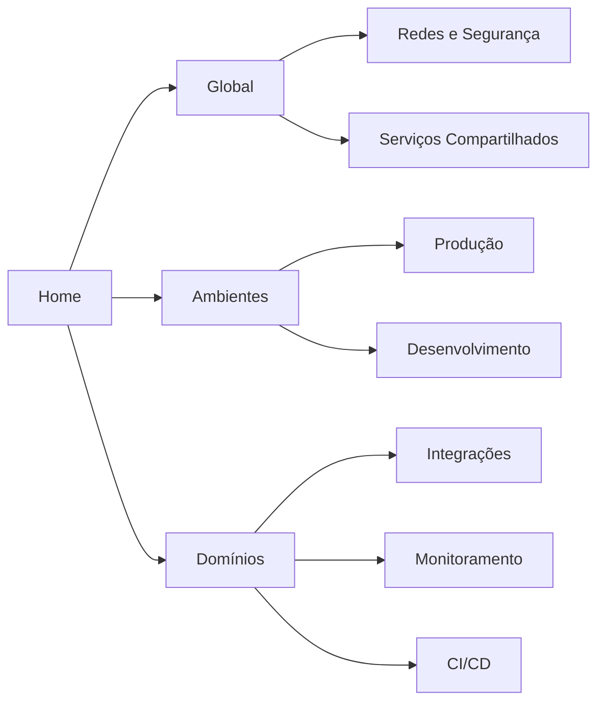

# Wiki VIP — Infraestrutura

Bem-vindo à wiki de infraestrutura da empresa. Este repositório centraliza documentação de servidores, redes, ambientes e serviços compartilhados.

## Links rápidos

| Recurso | Link |
|---------|------|
| Produção | [Visão geral Prod](ambientes/prod/README.md) |
| Desenvolvimento | [Visão geral Dev](ambientes/dev/README.md) |
| Redes e Segurança | [Documentação](global/redes-seguranca/README.md) |
| Monitoramento | [Zabbix](global/servicos-compartilhados/monitoramento-zabbix.md) |
| CI/CD | [Pipelines](global/servicos-compartilhados/cicd.md) |
| Integrações | [Node-RED / Metabase](dominios/integracoes/README.md) |

## Contatos de emergência

| Função | Contato | Horário |
|--------|---------|---------|
| Plantão Infra | _@equipe-infra — preencher_ | 24/7 |
| Redes | _@equipe-rede — preencher_ | Comercial |
| Segurança | _@equipe-seg — preencher_ | 24/7 |

**Atenção:** este repositório é **público**. Não inclua senhas, tokens ou chaves privadas.

## Mapa da documentação

## Como contribuir

Consulte o [Guia de Contribuição](/docs/CONTRIBUTING.md) para convenções de naming, estrutura de pastas e processo de PR.
