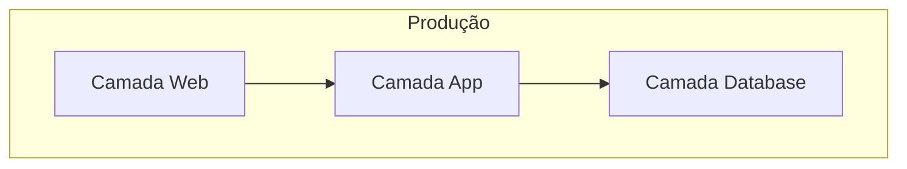

# Ambiente de Produção (Prod)

Visão geral do ambiente de produção. As fichas de servidores ficam nos domínios — esta seção agrega links por camada.

## Camadas

- [Camada Web / Frontend](camada-web.md)
- [Camada Aplicação / Backend](camada-app.md)
- [Camada Banco de Dados](camada-database.md)

## Links rápidos

| Recurso | Link |
|---------|------|
| Monitoramento | [Zabbix](../../global/servicos-compartilhados/monitoramento-zabbix.md) |
| Redes | [Redes e Segurança](../../global/redes-seguranca/README.md) |
| Integrações Prod | [Integrações](../../dominios/integracoes/prod/README.md) |

## Diagrama

