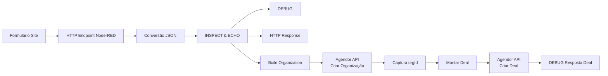

# Integração Node-RED  
# Formulário do Site → Agendor Open Deal

## 1. Visão Geral

Este fluxo do **Node-RED** é responsável por receber leads originados através do formulário do site institucional e realizar automaticamente o cadastro e abertura de negócios (**Deals**) no CRM **Agendor**.

O objetivo principal da integração é eliminar o cadastro manual de oportunidades comerciais, garantindo que os dados enviados pelo formulário sejam tratados, organizados e encaminhados automaticamente para o funil comercial.

---

## 2. Objetivos do Fluxo

O processo executa as seguintes etapas:

1. Receber uma requisição HTTP enviada pelo formulário do site.
2. Converter o JSON recebido para um objeto manipulável pelo Node-RED.
3. Registrar informações completas da requisição para auditoria e depuração.
4. Normalizar os dados recebidos do lead.
5. Criar uma organização no Agendor.
6. Recuperar o identificador (`orgId`) da organização criada.
7. Criar um negócio (**Deal**) vinculado à organização.
8. Disponibilizar logs das respostas das APIs para acompanhamento e troubleshooting.

---

# 3. Arquitetura do Fluxo

A integração é dividida em duas etapas principais:

## 3.1 Recepção e Tratamento do Lead

Responsável por:

- Receber o formulário;
- Validar o formato recebido;
- Registrar informações da requisição;
- Preparar os dados para envio ao CRM.

## 3.2 Integração com Agendor

Responsável por:

- Criar a organização;
- Associar informações de contato;
- Criar o negócio comercial;
- Vincular o Deal à organização criada.

---

## 4. Fluxo Simplificado


## 3. Grupo Node-RED

### Grupo

```json
{
  "name": "Formulário Site - Agendor Open Deal"
}
````

### Descrição

O grupo organiza todos os nós relacionados ao processo de integração entre o formulário do site e o Agendor CRM.

### Objetivos

* Centralizar a entrada de leads recebidos pelo formulário do site.
* Facilitar a manutenção e identificação dos componentes do fluxo.
* Separar visualmente esta integração das demais rotinas existentes no ambiente Node-RED.

## 4. Entrada do Formulário

### Nó: ENDPOINT SITE

**Tipo:**

~~~text
http in
~~~

### Configuração

~~~json
{
  "url": "/marketing/site",
  "method": "post"
}
~~~

### Função

Este nó cria um endpoint HTTP responsável por receber os dados enviados pelo formulário do site.

### Endpoint

~~~http
POST /marketing/site
~~~

### Exemplo de chamada

~~~http
POST https://dominio.com/marketing/site
Content-Type: application/json
~~~

### Payload esperado

~~~json
{
  "nome": "João Silva",
  "empresa": "Empresa XPTO",
  "telefone": "5511999999999",
  "email": "joao@email.com",
  "utm_source": "google",
  "utm_campaign": "campanha janeiro"
}
~~~

## 5. Conversão JSON

### Nó: JSON → OBJ

**Tipo:**

~~~text
json
~~~

### Propriedade manipulada

~~~text
msg.payload
~~~

### Objetivo

Transformar o conteúdo recebido de uma string JSON para um objeto JavaScript manipulável pelos próximos nós do fluxo.

### Antes

~~~javascript
msg.payload = "{ \"nome\":\"João\" }"
~~~

### Depois

~~~javascript
msg.payload = {
  "nome": "João"
}
~~~

### Resultado

Esta conversão permite que os nós **Function** seguintes possam acessar e manipular os dados recebidos diretamente através das propriedades do objeto `msg.payload`.

## 6. Inspeção e Echo da Requisição

### Nó: INSPECT & ECHO

**Tipo:**

~~~text
function
~~~

### Objetivo

Criar uma estrutura padronizada de log contendo as principais informações da requisição recebida pelo endpoint.

### Código

~~~javascript
msg.payload = {
  ts,
  method,
  url,
  path,
  query,
  headers,
  ip,
  body
}
~~~

### Estrutura gerada

Exemplo:

~~~json
{
  "ts": "2026-07-13T18:00:00Z",
  "method": "POST",
  "url": "/marketing/site",
  "path": "/marketing/site",
  "query": {},
  "headers": {
    "content-type": "application/json"
  },
  "ip": "192.168.1.20",
  "body": {
    "nome": "João"
  }
}
~~~

## Finalidades

Este nó possui três objetivos principais:

### 1. Auditoria

Permite identificar:

- Quando a requisição chegou.
- Qual endpoint foi chamado.
- A origem da chamada.

### 2. Debug

Facilita a investigação de problemas durante o processamento do formulário.

Exemplo:

> "Cliente enviou formulário, mas não criou negócio."

Com esse log é possível verificar:

- A requisição chegou ao Node-RED?
- Qual payload foi recebido?
- Quais campos foram enviados vazios?

### 3. Resposta HTTP

O mesmo conteúdo gerado por este nó pode ser utilizado posteriormente para responder a requisição HTTP recebida pelo formulário.

## 7. DEBUG FULL

### Nó: DEBUG FULL

**Configuração:**

~~~json
{
  "complete": true
}
~~~

### Função

Exibe o objeto completo da mensagem recebida pelo Node-RED:

~~~text
msg
~~~

Incluindo:

- Headers da requisição.
- Payload recebido.
- Propriedades internas.
- Informações de contexto.

### Uso

Este nó deve ser utilizado somente para **troubleshooting** e investigação de problemas durante o desenvolvimento ou manutenção do fluxo.

---

## 8. RESPONSE OK

### Nó: http response

### Função

Responsável por devolver uma resposta HTTP **200 OK** para o sistema que realizou a chamada do endpoint.

### Exemplo de resposta

~~~json
{
  "status": "ok"
}
~~~

### Importante

Este retorno acontece antes do processamento de criação no Agendor.

Essa abordagem evita timeout no formulário do site caso o processamento do CRM demore ou alguma integração externa tenha maior tempo de resposta.

---

## 9. Construção da Organização Agendor

### Nó: Build Org/Deal (from LP)

Este é o principal nó de tratamento dos dados recebidos pelo formulário.

### Responsabilidades

- Limpar e normalizar os dados recebidos.
- Interpretar os campos enviados pelo formulário.
- Criar o nome da organização.
- Montar o payload no formato esperado pelo Agendor.
- Preparar os dados para criação da Organização e Deal.

---

## 10. Funções auxiliares

### onlyDigits()

Remove todos os caracteres não numéricos de uma string.

### Exemplo

**Entrada:**

~~~text
(11) 99999-9999
~~~

**Saída:**

~~~text
11999999999
~~~

---

### cleanPhone()

Remove o código internacional brasileiro (`55`) de números de telefone.

### Exemplo

**Entrada:**

~~~text
5511999999999
~~~

**Saída:**

~~~text
11999999999
~~~

---

### parseURL()

Extrai informações estruturadas a partir de uma URL recebida.

### Exemplo

**Entrada:**

~~~text
https://google.com/campanha/a
~~~

**Resultado:**

~~~json
{
  "domain": "google.com",
  "path": "/campanha/a",
  "full": "https://google.com/campanha/a"
}
~~~

## 11. Configurações Agendor

O fluxo possui configurações fixas utilizadas durante a criação da Organização e do Deal no Agendor.

### Configurações

| Configuração | Descrição | Valor |
|---|---|---|
| TOKEN | Token de autenticação da API | `XXXXX` |
| FUNNEL_ID | Funil comercial utilizado | `816257` |
| DEAL_STAGE | Etapa inicial do negócio | `3393694` |
| PRODUCT_ID | Produto relacionado | `1260645` |
| LEAD_ORIGIN | Origem do lead | `2452072` |

---

### TOKEN

Token utilizado para autenticação na API do Agendor.

Formato de envio:

~~~http
Authorization: Token XXXXX
~~~

---

### FUNNEL_ID

Identificador do funil comercial utilizado para criação do Deal.

~~~text
816257
~~~

---

### DEAL_STAGE

Identificador da etapa inicial do negócio.

~~~text
3393694
~~~

---

### PRODUCT_ID

Produto relacionado ao negócio criado.

~~~text
1260645
~~~

---

### LEAD_ORIGIN

Origem atribuída ao lead dentro do Agendor.

~~~text
2452072
~~~

---

# 12. Tratamento dos dados recebidos

O fluxo aceita dois formatos diferentes de entrada de dados.

---

## Formato 1 - Payload original

Formato padrão enviado pelo formulário do site.

### Exemplo

~~~json
{
  "nome": "Maria",
  "telefone": "11999999999",
  "email": "maria@email.com"
}
~~~

---

## Formato 2 - Linha normalizada

Caso exista:

~~~javascript
row = msg.payload[0]
~~~

O fluxo interpreta os dados através de posições específicas.

| Posição | Campo |
|---|---|
| A | Nome |
| B | Telefone |
| C | Email |
| D | Origem |
| E | Caminho |
| J | Código |
| K | Formulário |
| N | URL |
| O | Empresa |

Essa compatibilidade permite que o mesmo fluxo processe dados vindos diretamente do formulário ou de estruturas previamente normalizadas.

## 13. Regra de Nome da Organização

### Regra

O fluxo cria o nome final da organização utilizando a variável:

~~~text
EMPRESA_FINAL
~~~

O objetivo é padronizar o nome das organizações criadas no Agendor e reduzir duplicidades.

---

### Caso 1

**Empresa:**

~~~text
XPTO
~~~

**Pessoa:**

~~~text
João
~~~

**Resultado:**

~~~text
XPTO (João)
~~~

---

### Caso 2

**Empresa:**

~~~text
João
~~~

**Pessoa:**

~~~text
João
~~~

**Resultado:**

~~~text
João
~~~

---

### Objetivo

Evitar a criação de organizações duplicadas no CRM quando o nome da empresa e o nome do contato forem iguais ou semelhantes.

---

# 14. Contexto temporário do Lead

O fluxo salva temporariamente as informações tratadas do lead no objeto:

~~~javascript
msg._lpctx
~~~

### Estrutura

~~~json
{
  "nome": "João",
  "empresa": "XPTO (João)",
  "origem": "google.com",
  "formulario": "Contato",
  "url": "https://site.com",
  "form": {}
}
~~~

### Função

Este objeto mantém os dados normalizados do lead durante o processamento do fluxo.

As informações armazenadas serão utilizadas posteriormente durante a criação do Deal no Agendor.

---

# 15. Payload Organização Agendor

## Endpoint

~~~http
POST https://api.agendor.com.br/v3/organizations
~~~

## Payload enviado

~~~json
{
  "name": "XPTO (João)",
  "contact": {
    "email": "joao@email.com",
    "work": "11999999999"
  },
  "leadOrigin": 2452072,
  "products": [
    1260645
  ],
  "allowToAllUsers": true
}
~~~

### Objetivo

Este payload é utilizado para criar uma nova Organização no Agendor associada aos dados recebidos do formulário.

## 16. Criação da Organização

### Nó: Agendor ► POST /v3/organizations

Este nó realiza o envio dos dados da empresa para o CRM Agendor, criando uma nova Organização.

### Endpoint

~~~http
POST https://api.agendor.com.br/v3/organizations
~~~

### Retorno esperado

~~~json
{
  "id": 123456,
  "name": "XPTO"
}
~~~

O campo `id` retornado será utilizado posteriormente para vincular o Deal à Organização criada.

---

# 17. Captura do ID e criação do Deal

### Nó: Pega orgId e monta Deal

Após a criação da Organização, o fluxo extrai o identificador retornado pelo Agendor.

### Extração do ID

Exemplo de retorno:

~~~json
{
  "id": 123456
}
~~~

O valor será armazenado como:

~~~text
orgId = 123456
~~~

### Fluxo de relacionamento

~~~text
Organization 123456
        |
        |
        v
       Deal
~~~

O Deal será criado vinculado à Organização recém-criada.

---

# 18. Título do Deal

### Regra

O título do negócio segue o padrão:

~~~text
Site - Empresa - Nome (Origem)
~~~

### Exemplo

~~~text
Site - XPTO (João) - João (google.com)
~~~

Esse padrão facilita a identificação da origem e do contato diretamente no CRM.

---

# 19. Payload do Deal

## Endpoint

~~~http
POST /organizations/{id}/deals
~~~

### Exemplo de payload

~~~json
{
  "title": "Site - XPTO - João (google)",
  "dealStatusText": "ongoing",
  "funnel": 816257,
  "dealStage": 3393694,
  "allowToAllUsers": true
}
~~~

### Objetivo

Criar o negócio comercial vinculado à Organização criada anteriormente.

---

# 20. Campos personalizados

O Deal recebe campos adicionais para armazenamento de informações comerciais.

### Estrutura

~~~json
{
  "qual_o_grau_de_urgencia": null,
  "quantidade_de_usuarios": null,
  "dor_principal": null,
  "temperatura_do_lead": null,
  "campanha_origem": "google"
}
~~~

### Observação

Esses campos podem ser preenchidos ou atualizados posteriormente pela equipe comercial durante o processo de atendimento do lead.

---

# 21. Logs disponíveis

O fluxo disponibiliza logs de retorno das chamadas realizadas no Agendor.

---

## RESP /organizations

Exibe o retorno da criação da Organização.

### Exemplo

~~~json
{
  "id": 123456
}
~~~

---

## RESP /deals

Exibe o retorno da criação do negócio.

### Exemplo

~~~json
{
  "id": 78910,
  "title": "Site - XPTO"
}
~~~

Esses logs auxiliam no acompanhamento da execução do fluxo e na investigação de possíveis falhas.

# 22. Fluxo completo de negócio

O fluxo abaixo representa o processo completo desde o envio do formulário pelo cliente até a criação da Organização e do Deal no Agendor.

## Diagrama de sequência

~~~mermaid
sequenceDiagram
    participant Cliente
    participant NodeRED
    participant Agendor

    Cliente->>NodeRED: Envia formulário
    NodeRED->>NodeRED: Normaliza dados

    NodeRED->>Agendor: Cria Organization

    Agendor-->>NodeRED: Retorna orgId

    NodeRED->>Agendor: Cria Deal vinculado

    Agendor-->>NodeRED: Retorna Deal criado

    NodeRED-->>Cliente: HTTP 200 OK
~~~