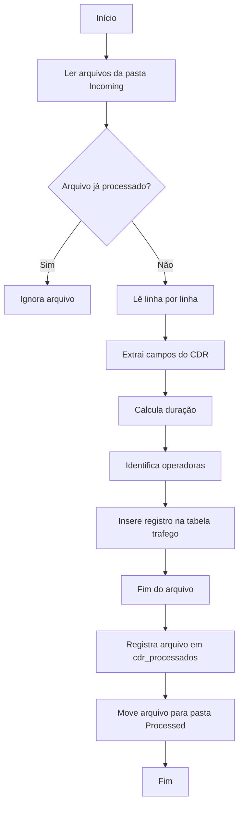

# Parser de CDRs - Importação de Arquivos para o Banco de Dados

## Visão Geral

O script `parser.js` é responsável por realizar a importação dos arquivos CDR gerados pela plataforma de telefonia para o banco de dados.

Seu funcionamento consiste em:

- Ler todos os arquivos `.cdr` de um diretório de entrada.
- Processar cada registro do arquivo.
- Extrair informações relevantes da chamada.
- Calcular a duração da ligação.
- Identificar as operadoras de origem e destino.
- Gravar os dados na tabela `trafego`.
- Registrar que o arquivo foi processado.
- Mover o arquivo para a pasta de processados.

---

# Fluxo Geral



---

# Dependências

O script utiliza os seguintes módulos:

| Biblioteca | Finalidade |
|------------|------------|
| fs | Manipulação de arquivos |
| path | Manipulação de caminhos |
| readline | Leitura linha a linha dos arquivos |
| mysql2/promise | Comunicação com o MySQL utilizando Promises |

Importação das dependências:

```javascript
const fs = require('fs');
const path = require('path');
const readline = require('readline');
const mysql = require('mysql2/promise');
```

---

# Configuração

## Diretórios

O script trabalha com dois diretórios.

### Entrada

Local onde os arquivos CDR são disponibilizados.

Exemplo:

```text
/opt/scripts/data/cdrs/incoming
```

### Processados

Após o processamento, os arquivos são movidos para esta pasta.

Exemplo:

```text
/opt/scripts/data/cdrs/processed
```

---

## Configuração do Banco

Exemplo:

```javascript
const dbConfig = {
    host: "localhost",
    user: "<usuario>",
    password: "<senha>",
    database: "<banco>"
};
```

---

# Função extrairOperadoras()

## Objetivo

Extrair o código da operadora presente dentro do registro bruto da chamada (`registro_chamada`).

Assinatura:

```javascript
async function extrairOperadoras(registroChamada, connection)
```

Retorno:

```javascript
{
    operadoraOrigem,
    operadoraDestino
}
```

---

## Funcionamento

Dentro do campo `registro_chamada` existem informações codificadas semelhantes a:

```text
A:12345678901234567890
B:98765432109876543210
```

O script utiliza expressões regulares para localizar os blocos:

```javascript
/A:([0-9]{20})/

/B:([0-9]{20})/
```

Após localizar os blocos:

- captura os 20 caracteres
- extrai apenas os últimos 5
- consulta a tabela `operadoras`

Consulta executada:

```sql
SELECT nome
FROM operadoras
WHERE codigo = ?
LIMIT 1;
```

Resultado:

```text
Código: 01234

↓

Operadora: Vivo
```

---

# Função processFile()

## Objetivo

Processar um arquivo CDR completo.

Assinatura:

```javascript
async function processFile(filePath, connection)
```

---

## Leitura do Arquivo

O arquivo é aberto utilizando Stream.

```javascript
fs.createReadStream(...)
```

Em seguida é lido linha por linha utilizando:

```javascript
readline.createInterface(...)
```

Essa abordagem evita carregar arquivos grandes inteiramente na memória.

---

## Separação dos Campos

Cada linha do CDR possui seus campos separados por ponto e vírgula.

Exemplo:

```text
campo1;campo2;campo3;campo4;...
```

Separação:

```javascript
const campos = line.split(';');
```

Cada posição do vetor representa um campo específico do CDR.

Exemplo:

| Índice | Informação |
|---------|------------|
| 0 | ID da chamada |
| 10 | Data tentativa |
| 12 | Data início |
| 14 | Data fim |
| 21 | Número origem |
| 24 | Número destino |
| 26 | IP origem |
| 27 | IP destino |
| 42 | IP externo |
| 52 | Registro completo da chamada |

---

## Cálculo da Duração

A duração é calculada através da diferença entre:

- Data de início
- Data de fim

```javascript
duracaoSegundos =
Math.floor(
(dataFim - dataInicio)/1000
)
```

Resultado:

```text
09:00:00

↓

09:02:30

↓

150 segundos
```

---

## Extração das Operadoras

Após obter o campo `registro_chamada`, o script executa:

```javascript
await extrairOperadoras(...)
```

Retornando:

```javascript
operadoraOrigem

operadoraDestino
```

---

## Montagem do Objeto

Os dados são organizados em um único objeto:

```javascript
const registro = {

    id_chamada,
    data_tentativa,
    data_inicio,
    data_fim,
    numero_origem,
    numero_destino,
    ip_origem,
    ip_destino,
    ip_externo_origem,
    registro_chamada,
    operadora_origem,
    operadora_destino,
    duracao_segundos,
    raw_cdr

}
```

Esse objeto representa exatamente o registro que será salvo na tabela `trafego`.

---

## Inserção no Banco

O SQL é montado dinamicamente.

Exemplo:

```sql
INSERT INTO trafego (...)

VALUES (...);
```

Os valores são enviados utilizando parâmetros (`?`), evitando concatenação direta no SQL.

---

# Função main()

## Objetivo

Controlar todo o processo de importação.

---

## Etapa 1

Conectar ao banco.

```javascript
mysql.createConnection(...)
```

---

## Etapa 2

Listar todos os arquivos `.cdr`.

```javascript
fs.readdirSync(...)
```

---

## Etapa 3

Para cada arquivo, verificar se já foi processado.

Consulta:

```sql
SELECT COUNT(*)
FROM cdr_processados
WHERE nome_arquivo = ?;
```

Se existir:

```text
Arquivo ignorado
```

Caso contrário:

```text
Arquivo processado
```

---

## Etapa 4

Executar:

```javascript
processFile(...)
```

---

## Etapa 5

Registrar o arquivo como processado.

```sql
INSERT INTO cdr_processados
(
nome_arquivo
)
VALUES
(?);
```

---

## Etapa 6

Mover o arquivo.

Antes:

```text
incoming/
    arquivo.cdr
```

Depois:

```text
processed/
    arquivo.cdr
```

A movimentação é feita utilizando:

```javascript
fs.renameSync(...)
```

---

## Etapa 7

Encerrar a conexão.

```javascript
connection.end()
```

---

# Estrutura Geral

```text
main()

│

├── conecta ao banco

│

├── lista arquivos

│

├── verifica se já foram processados

│

├── processFile()

│      │
│      ├── lê linha
│      ├── separa campos
│      ├── calcula duração
│      ├── extrai operadoras
│      ├── monta objeto
│      └── INSERT trafego

│

├── registra arquivo processado

│

├── move arquivo

│

└── encerra conexão
```

---

# Tabelas Utilizadas

| Tabela | Finalidade |
|---------|------------|
| `trafego` | Armazena todos os registros importados dos arquivos CDR |
| `operadoras` | Realiza a tradução do código da operadora para seu nome |
| `cdr_processados` | Controla quais arquivos já foram importados |

---

# Tratamento de Erros

O script possui tratamento de exceções (`try/catch`) durante:

- Extração das operadoras.
- Processamento de cada linha.
- Execução do processo principal.

Erros encontrados durante o processamento de uma linha são registrados no console, permitindo que as demais linhas do arquivo continuem sendo importadas.

---

# Resumo do Processo

1. O script conecta ao banco de dados.
2. Lista todos os arquivos `.cdr` da pasta de entrada.
3. Verifica se cada arquivo já foi processado.
4. Lê o arquivo linha por linha.
5. Extrai os campos de interesse.
6. Calcula a duração da chamada.
7. Identifica as operadoras de origem e destino.
8. Monta o objeto contendo os dados da chamada.
9. Insere o registro na tabela `trafego`.
10. Registra o arquivo como processado.
11. Move o arquivo para a pasta de processados.
12. Encerra a conexão com o banco de dados.