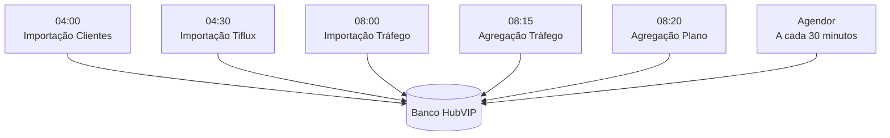
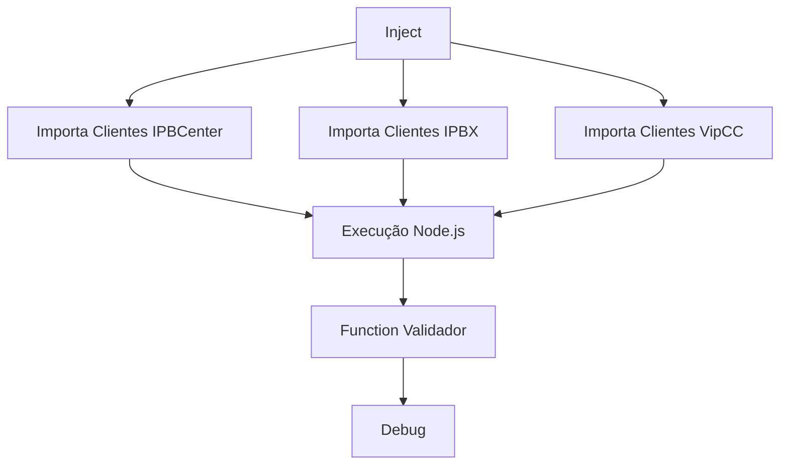
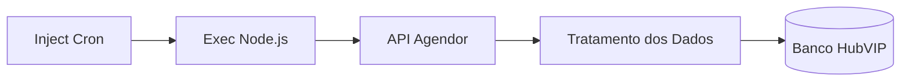
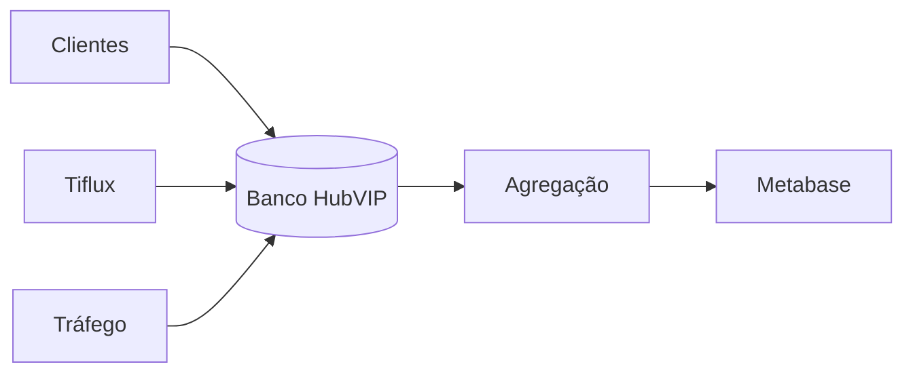

# 📖 Estrutura da Documentação - ROTINAS HUB

## 1. Visão Geral

A aba **ROTINAS HUB** é responsável pela execução automática das rotinas de sincronização entre sistemas externos e o banco de dados do HubVIP.

Todas as tarefas são executadas através de scripts **Node.js**, disparados por agendamentos configurados em nodes **Inject** do Node-RED.

Esse processo permite manter o **Data Warehouse** atualizado sem necessidade de intervenção manual, garantindo que os dados estejam disponíveis para consultas, dashboards e análises operacionais.

---

# 2. Arquitetura Geral

O fluxo geral da aba **ROTINAS HUB** é composto por diferentes processos automáticos executados em horários específicos.



---

# 3. Fluxo: Importa Clientes

## Objetivo

Atualizar diariamente a tabela de clientes do HubVIP utilizando dados provenientes das seguintes plataformas:

- IPBCenter;
- IPBX;
- VipCC.

O processo executa scripts Node.js responsáveis pela coleta, tratamento e atualização das informações no banco de dados.

---

## Agendamento

Executado diariamente às:

```text
04:00
```

---

## Fluxo



---

# Scripts Executados

| Script | Finalidade |
|--------|------------|
| `importa_clientes_ipbcenter.js` | Importa clientes do IPBCenter |
| `importa_clientes_ipbx.js` | Importa clientes do IPBX |
| `importa_clientes_vipcc.js` | Importa clientes do VipCC |

---

# Nodes Utilizados

## Inject

O node **Inject** é responsável por iniciar automaticamente a rotina através de um agendamento configurado em formato Cron.

Exemplo:

```text
00 04 * * *
```

Executa diariamente às 04:00.

---

## Exec

O node **Exec** executa processos externos ao Node-RED.

Neste fluxo ele é responsável por executar os scripts Node.js utilizados na importação dos clientes.

Exemplo:

```bash
node /opt/scripts/js/importa_clientes_ipbx.js
```

---

## Function

O node **Function** executa pequenos trechos de código JavaScript dentro do fluxo.

Neste processo ele é utilizado para validar o término da execução do script e liberar a continuidade da rotina.

Exemplo:

```javascript
flow.set('running', false);

return msg;
```

---

## Debug

O node **Debug** exibe informações de saída no painel do Node-RED.

Sua utilização permite:

- acompanhar a execução dos scripts;
- identificar erros;
- validar retornos das rotinas;
- auxiliar na manutenção do fluxo.

# 4. Fluxo: Importa Tráfego Júpiter

## Objetivo

Realizar a importação diária dos registros de tráfego provenientes do sistema **Júpiter** para o banco de dados do HubVIP.

Esse processo é responsável por coletar os dados de utilização dos clientes, permitindo posteriormente a geração de análises, relatórios e indicadores através do Metabase.

---

## Agendamento

Executado diariamente às:

```text
08:00
```

---

## Scripts Executados

| Script | Finalidade |
|--------|------------|
| `importa_trafego_jupiter_licenciados.js` | Importa os registros de tráfego dos clientes licenciados, processando os dados referentes aos contratos e ambientes que possuem licenciamento ativo. |
| `importa_trafego_jupiter_geral.js` | Importa os registros gerais de tráfego do sistema Júpiter, contemplando informações de utilização independentemente do tipo de cliente ou licença. |

---

## Funcionamento

O fluxo executa os scripts Node.js responsáveis pela coleta dos dados no sistema Júpiter e armazenamento das informações no banco de dados do HubVIP.

O processo permite manter a base de tráfego atualizada para as etapas posteriores de agregação e análise.

---

# 5. Fluxo: Agrega Tráfego

## Objetivo

Consolidar os dados importados do sistema Júpiter, gerando informações agregadas para utilização em dashboards, relatórios e consultas analíticas no Metabase.

---

## Agendamento

Executado diariamente às:

```text
08:15
```

---

## Script Executado

```text
agrega_trafego_jupiter.js
```

---

## Funcionamento

O script realiza o processamento dos registros brutos de tráfego importados anteriormente e gera tabelas agregadas no banco de dados.

Essas tabelas possuem estrutura otimizada para consultas analíticas, reduzindo o tempo de resposta dos dashboards e consultas realizadas pelo Metabase.

O fluxo de agregação evita que relatórios precisem processar grandes volumes de dados transacionais diretamente.

---

# 6. Fluxo: Agrega Plano Full

## Objetivo

Executar a agregação específica dos dados relacionados ao **Plano Full**.

O processo organiza e consolida as informações necessárias para análises e acompanhamento dos clientes que utilizam essa modalidade de plano.

---

## Agendamento

Executado diariamente às:

```text
08:20
```

---

## Script Executado

```text
agrega_plano_full.js
```

---

## Funcionamento

O script realiza o processamento dos dados relacionados ao Plano Full, preparando as informações para consultas internas, relatórios e dashboards.

A rotina garante que as informações estejam atualizadas após a execução das importações e demais processos de consolidação.

---

# 7. Fluxo: Importação Tiflux

## Objetivo

Processar diariamente os dados exportados pelo sistema **Tiflux**, realizando a leitura do arquivo TSV recebido e armazenando as informações no banco de dados do HubVIP.

---

## Agendamento

Executado diariamente às:

```text
04:30
```

---

## Script Executado

```text
import_tiflux_tickets.js
```

---

# Etapas do Processamento

## 1. Leitura do Arquivo TSV

O script realiza a leitura do arquivo exportado pelo Tiflux em formato:

```text
TSV (Tab Separated Values)
```

Durante essa etapa são carregados os registros de tickets e demais informações disponíveis no arquivo.

---

## 2. Tratamento dos Dados

Após a leitura, os registros passam por etapas de tratamento, incluindo:

- validação das informações recebidas;
- ajustes de formato;
- normalização dos dados;
- preparação dos registros para inserção no banco.

---

## 3. Gravação no Banco de Dados

Após o tratamento, os dados processados são inseridos nas tabelas responsáveis pelo armazenamento das informações do Tiflux.

Essa etapa garante que os tickets importados estejam disponíveis para consultas e análises.

---

## 4. Atualização das Tabelas

Após a inserção dos dados, o processo realiza a atualização das estruturas utilizadas pelo HubVIP.

Essa etapa garante que dashboards e consultas do Metabase utilizem informações atualizadas provenientes do Tiflux.

# 8. Fluxo: Integração Agendor

## Objetivo

O fluxo **Agendor** é responsável por manter sincronizadas as informações do CRM Agendor com o banco de dados do HubVIP.

A rotina realiza importações periódicas dos principais dados utilizados pelo CRM, permitindo que informações de atividades, usuários, pessoas, empresas e negociações estejam disponíveis para consultas internas, relatórios e análises.

---

## Frequência de Execução

A rotina é executada automaticamente a cada:

```text
30 minutos
```

Durante cada execução, os scripts Node.js responsáveis pela sincronização são acionados sequencialmente.

---

# Scripts Executados

| Script | Finalidade |
|--------|------------|
| `import_agendor_atividades.js` | Importa as atividades cadastradas no Agendor, permitindo acompanhar interações, tarefas e históricos relacionados aos negócios. |
| `import_agendor_usuarios.js` | Importa os usuários cadastrados no Agendor, mantendo sincronizadas as informações dos responsáveis pelas atividades e negociações. |
| `import_agendor_pessoas.js` | Importa os contatos/pessoas cadastrados no CRM, mantendo a base de relacionamento atualizada. |
| `import_agendor_empresas.js` | Importa as empresas cadastradas no Agendor, sincronizando informações das organizações relacionadas aos negócios. |
| `import_agendor_negocios.js` | Importa os negócios/oportunidades comerciais, mantendo atualizadas as informações utilizadas pelo HubVIP. |

---

# Funcionamento

O fluxo executa os scripts de integração responsáveis por consultar a API do Agendor, tratar os dados retornados e armazenar as informações no banco de dados do HubVIP.

A execução frequente permite manter o ambiente atualizado com as alterações realizadas pelos usuários diretamente no CRM.

O processo segue o fluxo:



---

# 9. Componentes Utilizados

A aba **ROTINAS HUB** utiliza componentes padrões do Node-RED para controlar os agendamentos, execução dos scripts, tratamento dos retornos e monitoramento das rotinas.

---

# Inject

## Objetivo

O node **Inject** é responsável por iniciar automaticamente uma rotina dentro do Node-RED.

Neste projeto, ele é utilizado principalmente para disparar scripts em horários específicos através de expressões Cron.

---

## Funcionamento do Cron

O formato utilizado pelo Node-RED segue a estrutura:

```text
segundo minuto hora dia mês dia-da-semana
```

Exemplo:

```text
0 0 4 * * *
```

Significado:

| Campo | Valor | Descrição |
|-------|-------|-----------|
| Segundo | 0 | Executa no segundo zero |
| Minuto | 0 | Executa no minuto zero |
| Hora | 4 | Às 04:00 |
| Dia | * | Todos os dias |
| Mês | * | Todos os meses |
| Semana | * | Todos os dias da semana |

Resultado:

```text
Executa diariamente às 04:00
```

---

## Exemplos de Agendamento

### Importação de Clientes

```text
0 0 4 * * *
```

Executa:

```text
Todos os dias às 04:00
```

---

### Importação Agendor

```text
A cada 30 minutos
```

Executa:

```text
00:00
00:30
01:00
01:30
...
```

---

# Exec

## Objetivo

O node **Exec** permite executar processos externos ao Node-RED.

No ambiente do HubVIP, ele é utilizado para executar scripts desenvolvidos em **Node.js**.

---

## Exemplo

```bash
node /opt/scripts/js/import_agendor_negocios.js
```

Esse comando inicia o script responsável pela importação dos negócios do Agendor.

---

## Funcionamento

O processo ocorre da seguinte forma:

1. Node-RED dispara o node Exec;
2. O sistema operacional inicia o processo Node.js;
3. O script executa sua lógica;
4. O resultado retorna para o fluxo;
5. Os próximos nodes continuam o processamento.

---

# Function

## Objetivo

O node **Function** permite executar códigos JavaScript dentro do próprio fluxo do Node-RED.

Neste projeto ele é utilizado principalmente para controle de estado da execução das rotinas.

---

## Código Utilizado

```javascript
flow.set('running', false);

return msg;
```

---

## Explicação

### Linha 1

```javascript
flow.set('running', false);
```

Remove o estado de execução ativa da rotina.

A variável:

```text
running
```

é utilizada para indicar se determinado processo ainda está em andamento.

Ao definir:

```text
running = false
```

o fluxo informa que o processamento terminou e novas execuções podem ser liberadas.

---

### Linha 2

```javascript
return msg;
```

Retorna a mensagem recebida para o próximo node do fluxo.

Sem esse retorno, o fluxo seria interrompido nesse ponto.

---

## Quando é chamado

Normalmente esse node é executado após a conclusão de um script iniciado pelo node **Exec**, garantindo que o controle de execução seja atualizado.

---

# Debug

## Objetivo

O node **Debug** é utilizado para monitoramento e acompanhamento das rotinas executadas no Node-RED.

---

## Utilizações

Permite:

- visualizar retornos dos scripts;
- identificar erros de execução;
- validar dados recebidos;
- acompanhar o comportamento dos fluxos;
- auxiliar na manutenção.

---

# 10. Ordem de Execução

A execução das principais rotinas segue o seguinte calendário:

| Horário | Processo |
|---------|----------|
| 04:00 | Importação de Clientes |
| 04:30 | Importação Tiflux |
| 08:00 | Importação Tráfego Júpiter |
| 08:15 | Agregação Tráfego |
| 08:20 | Agregação Plano Full |
| A cada 30 minutos | Integração Agendor |

---

# 11. Dependências

O relacionamento entre os processos pode ser representado pelo seguinte fluxo:



---

# 12. Estrutura dos Scripts

Todos os scripts executados pelas rotinas automáticas encontram-se armazenados no diretório:

```text
/opt/scripts/js
```

---

## Principais Scripts

| Script | Tecnologia | Local |
|--------|------------|-------|
| `importa_clientes_ipbx.js` | Node.js | `/opt/scripts/js` |
| `agrega_trafego_jupiter.js` | Node.js | `/opt/scripts/js` |
| `import_agendor_negocios.js` | Node.js | `/opt/scripts/js` |

---

## Organização

A estrutura mantém todos os scripts de automação centralizados em um único diretório, facilitando:

- manutenção;
- versionamento;
- execução manual;
- auditoria dos processos.