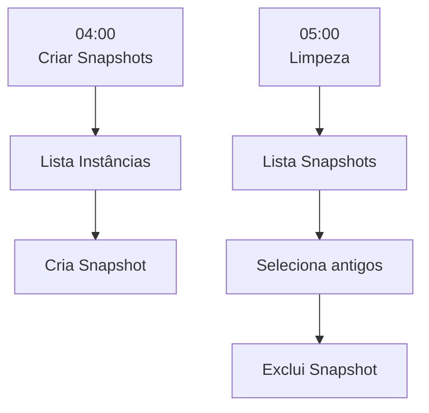
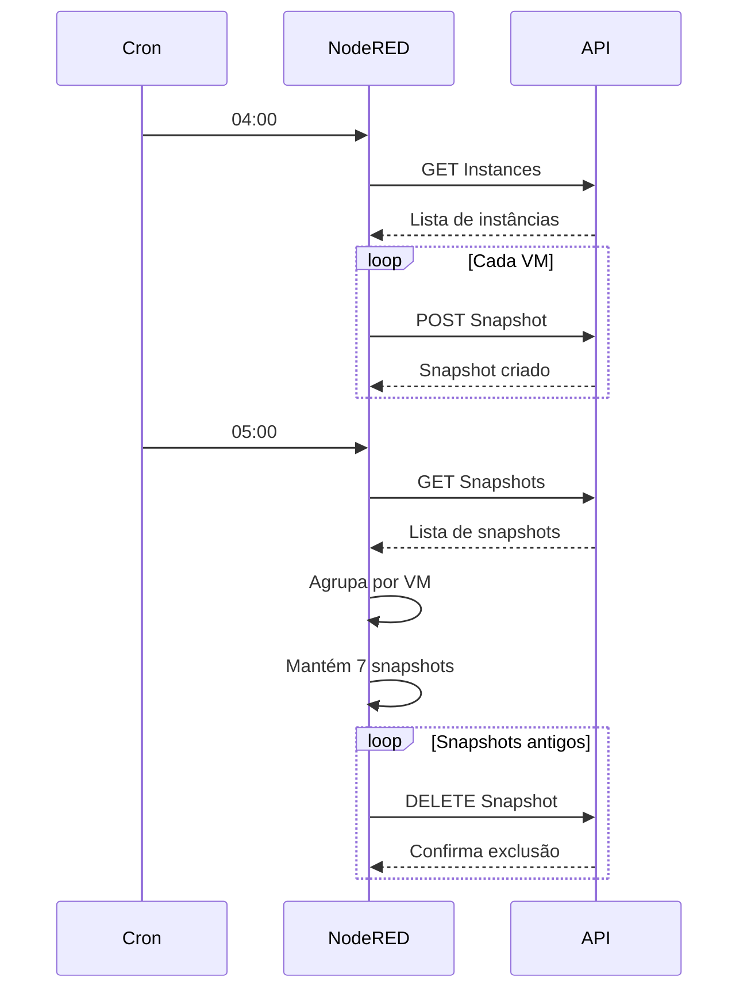

# Gerenciamento Automático de Snapshots - Magalu Cloud

## Visão Geral

A aba **SNAPSHOTS MAGALU** é responsável por automatizar o ciclo de vida dos snapshots das máquinas virtuais hospedadas na Magalu Cloud.

As rotinas implementadas possuem os seguintes objetivos:

- Criar snapshots diários de todas as instâncias;
- Manter um histórico de backups;
- Excluir automaticamente snapshots antigos;
- Disponibilizar fluxos auxiliares para testes e validações da API.

Todo o processo utiliza exclusivamente a API REST da Magalu Cloud.

---

# Arquitetura Geral



---

# Componentes do Fluxo

| Fluxo | Objetivo |
|--------|----------|
| Criação de Snapshots | Criar backup diário das VMs |
| Limpeza de Snapshots | Manter apenas os 7 backups mais recentes |
| Testes | Validar chamadas da API |
| Webhook | Endpoint para testes externos |

---

# Fluxo 1 - Criação Automática de Snapshots

## Objetivo

Criar automaticamente um snapshot para cada instância existente na Magalu Cloud.

---

## Agendamento

O node **Cron Plus** executa diariamente às:

**Horário**

```text
04:00
```

**Expressão Cron**

```text
0 0 4 * * *
```

---

## Fluxograma


---

## Etapa 1 - Listagem das Instâncias

### Node

`lista instancias`

### Requisição

```text
GET /compute/v1/instances
```

### Retorno esperado

```json
{
  "instances": [
    {
      "id": "...",
      "name": "Servidor01"
    }
  ]
}
```
## Etapa 2 - Filtragem

### Node

`apenas o necessario`

Este node **Function** reduz o payload retornado pela API, mantendo somente os campos necessários para as próximas etapas do fluxo.

### Dados Mantidos

```javascript
{
    id,
    name
}
```

Essa filtragem reduz o volume de dados trafegados durante o restante do processamento, tornando o fluxo mais eficiente e simples de manipular.

---

# Etapa 3 - Split

### Funcionamento

O node **Split** transforma uma lista de instâncias em mensagens individuais.

### Entrada

```json
[
    "VM1",
    "VM2",
    "VM3"
]
```

### Processamento

```text
VM1
 |
VM2
 |
VM3
```

Após o Split, cada máquina virtual segue individualmente pelo fluxo, permitindo que seja criado um snapshot separado para cada instância.

---

# Etapa 4 - Preparação do POST

### Node

`prepara POST`

Este node é responsável por montar dinamicamente o corpo da requisição utilizada na criação do snapshot.

### Payload Gerado

```json
{
    "instance": {
        "id": "<ID DA VM>"
    },
    "name": "<NOME DA VM>-2026-07-13"
}
```

O nome do snapshot é criado automaticamente utilizando:

- Nome da máquina virtual;
- Data atual da execução.

### Exemplo

```text
hubvip-2026-07-13
```

---

# Etapa 5 - Criação

### Node

`cria snapshots`

Este node executa a chamada da API responsável pela criação do snapshot.

### Requisição

```text
POST /compute/v1/snapshots
```

A requisição é executada individualmente para cada instância encontrada na etapa de listagem.

# Fluxo 2 - Limpeza Automática

## Objetivo

Evitar o crescimento ilimitado do armazenamento utilizado pelos snapshots.

A rotina executa uma política automática de retenção, mantendo apenas:

```text
7 snapshots
```

para cada instância existente na Magalu Cloud.

---

# Agendamento

Executado diariamente às:

```text
05:00
```

## Expressão Cron

```text
0 0 5 * * *
```

---

# Fluxograma


---

# Etapa 1 - Listagem

## Node

`lista snapshots`

## Requisição

```text
GET /compute/v1/snapshots
```

Este node realiza a consulta de todos os snapshots existentes na conta Magalu Cloud.

---

# Etapa 2 - Seleção dos Snapshots

## Node

`mais q 7 pra deletar`

Este node contém o principal algoritmo responsável pela política de retenção dos backups.

O processo é dividido em três etapas:

---

## 1. Agrupamento

Os snapshots são agrupados utilizando o campo:

```text
instance.id
```

Dessa forma, cada máquina virtual possui seu próprio conjunto de backups.

### Exemplo

```text
Servidor A

├── Snapshot 1
├── Snapshot 2
├── Snapshot 3
└── ...
```

---

## 2. Ordenação

Após o agrupamento, os snapshots são ordenados utilizando o campo:

```text
created_at
```

A ordenação ocorre do snapshot:

```text
mais novo
    ↓
mais antigo
```

---

## 3. Retenção dos 7 mais recentes

Após a ordenação, o fluxo mantém somente os sete primeiros registros.

É utilizado:

```javascript
slice(7)
```

Todos os snapshots encontrados após a sétima posição são adicionados à lista de exclusão.

---

# Exemplo de Retenção

## Antes

```text
15 snapshots
```

Lista completa:

```text
1
2
3
4
5
6
7
8
9
10
11
12
13
14
15
```

---

## Depois

### Mantidos

```text
1
2
3
4
5
6
7
```

### Excluídos

```text
8
9
10
11
12
13
14
15
```

---

O resultado final garante que cada máquina virtual mantenha somente os **7 backups mais recentes**, evitando consumo desnecessário de armazenamento.

# Etapa 3 - Split

## Funcionamento

O node **Split** transforma uma lista de snapshots em mensagens individuais.

### Entrada

```json
[
    "snapshot1",
    "snapshot2",
    "snapshot3"
]
```

### Processamento

```text
snapshot1
    |
snapshot2
    |
snapshot3
```

Cada snapshot passa a ser processado individualmente pelas próximas etapas do fluxo.

---

# Etapa 4 - Preparação da Exclusão

## Node

`prepara request`

Este node é responsável por montar dinamicamente a URL utilizada na exclusão do snapshot selecionado.

## Requisição Gerada

```text
DELETE /compute/v1/snapshots/{id}
```

O identificador do snapshot é substituído dinamicamente pelo `id` retornado pela API na etapa de seleção.

### Exemplo

```text
DELETE /compute/v1/snapshots/abc123
```

---

# Etapa 5 - Exclusão

## Node

`deleta snapshot`

Este node executa a exclusão definitiva dos snapshots selecionados.

## Requisição

```text
DELETE /compute/v1/snapshots/{id}
```

A chamada DELETE é executada individualmente para cada snapshot identificado pelo algoritmo de retenção.

---

# Fluxo de Testes

A aba possui diversos nodes auxiliares destinados exclusivamente para testes, validações e simulações do comportamento da API.

---

# Mock Snapshots

## Node

`mock snapshots`

Este node gera uma lista simulada de snapshots.

## Objetivo

Permitir testar toda a lógica de seleção e exclusão de snapshots sem realizar chamadas reais para a API da Magalu Cloud.

---

# Teste de Listagem

Existe um fluxo manual destinado à validação da consulta de instâncias.

## Requisição

```text
GET /compute/v1/instances
```

O retorno da API pode ser visualizado diretamente através do node Debug.

---

# Webhook

## Endpoint

```text
POST /teste
```

## Retorno esperado

```text
HTTP 201
```

Este endpoint é utilizado para validar integrações externas e chamadas HTTP durante a fase de desenvolvimento e testes.

---

# APIs Utilizadas

## Listar Instâncias

```text
GET /compute/v1/instances
```

---

## Criar Snapshot

```text
POST /compute/v1/snapshots
```

---

## Listar Snapshots

```text
GET /compute/v1/snapshots
```

---

## Excluir Snapshot

```text
DELETE /compute/v1/snapshots/{id}
```

---

## Autenticação

Todas as chamadas para a API utilizam autenticação através do cabeçalho:

```text
x-api-key
```

---

# Sequência Completa



---

# Troubleshooting

| Problema | Possível causa | Verificação |
|----------|----------------|-------------|
| Snapshot não é criado | API Key inválida | Validar o cabeçalho `x-api-key` |
| Nenhuma instância encontrada | Ambiente sem VMs ou falha na API | Testar `GET /compute/v1/instances` manualmente |
| Snapshot não é excluído | ID inválido ou permissão insuficiente | Conferir a URL montada no node `prepara request` |
| Execução não ocorre no horário esperado | Expressão Cron incorreta ou fuso horário | Validar a configuração do node Cron Plus |

---

# Considerações Finais

O fluxo implementa uma política automática de retenção de backups para as máquinas virtuais hospedadas na Magalu Cloud.

As principais funcionalidades são:

- Criação diária de snapshots;
- Retenção dos 7 backups mais recentes por instância;
- Exclusão automática dos snapshots excedentes;
- Utilização de fluxos auxiliares para testes e validação da API;
- Automação completa sem necessidade de intervenção manual.

Como melhoria futura, recomenda-se armazenar a API Key em uma variável de ambiente ou em um nó de configuração do Node-RED, evitando sua replicação em múltiplos nodes HTTP e aumentando a segurança da solução.