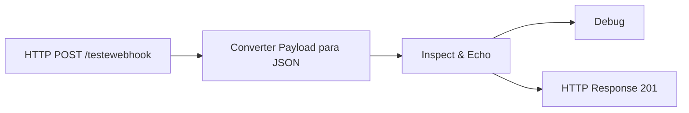

# Testes ► WebHooks

## Objetivo

Este fluxo disponibiliza um endpoint HTTP para testes de integração e inspeção de requisições recebidas.

Seu principal objetivo é facilitar a validação de chamadas provenientes de sistemas externos, permitindo visualizar integralmente o conteúdo recebido antes da implementação de qualquer regra de negócio.

O endpoint atua como um **Echo Webhook**, retornando ao cliente exatamente as informações recebidas, juntamente com alguns metadados da requisição.

---

# Informações Gerais

| Item | Valor |
|------|-------|
| Fluxo | Testes ► WebHooks |
| Endpoint | `/testewebhook` |
| Método | `POST` |
| Resposta | `HTTP 201` |
| Finalidade | Testes e depuração de integrações |

---

# Fluxograma



---

# Funcionamento

Quando uma requisição é enviada para o endpoint `/testewebhook`, o fluxo executa as seguintes etapas:

1. Recebe a requisição HTTP.
2. Converte automaticamente o corpo da requisição para um objeto JSON.
3. Monta um objeto contendo:
   - Data e hora da requisição;
   - Método HTTP;
   - URL acessada;
   - Caminho da requisição;
   - Query Parameters;
   - Headers;
   - Endereço IP do cliente;
   - Payload recebido.
4. Exibe todas essas informações no painel **Debug** do Node-RED.
5. Retorna o mesmo objeto como resposta HTTP ao cliente.

---

# Estrutura do Fluxo

## 1. HTTP In

| Propriedade | Valor |
|-------------|-------|
| Tipo | HTTP In |
| Método | POST |
| URL | `/testewebhook` |

Responsável por disponibilizar o endpoint para recebimento das requisições.

## 2. JSON ► obj

| Propriedade | Valor |
|-------------|-------|
| Tipo | JSON |

Converte automaticamente o conteúdo recebido para um objeto JavaScript.

```javascript
msg.payload
```

## 3. Inspect & Echo (Function)

Este nó cria um objeto padronizado contendo todas as informações úteis para análise da requisição.

| Campo | Descrição |
|--------|-----------|
| ts | Data e hora da requisição (ISO 8601) |
| method | Método HTTP |
| url | URL acessada |
| path | Caminho da requisição |
| query | Query Parameters |
| headers | Todos os cabeçalhos HTTP |
| ip | Endereço IP do cliente |
| body | Payload recebido |

Exemplo:

```json
{
  "ts": "2026-07-06T13:18:52.912Z",
  "method": "POST",
  "url": "/testewebhook",
  "path": "/testewebhook",
  "query": {},
  "headers": {
    "content-type": "application/json"
  },
  "ip": "192.168.0.15",
  "body": {
    "nome": "Caio",
    "empresa": "VIP Solutions"
  }
}
```

## 4. Debug

Envia todo o objeto para o painel **Debug** do Node-RED.

## 5. HTTP Response

- **Status HTTP:** `201`
- **Body:** Objeto gerado pelo nó **Inspect & Echo**

---

# Entrada Esperada

```json
{
  "nome": "Caio",
  "email": "caio@empresa.com.br",
  "telefone": "47999999999"
}
```

# Resposta

```json
{
  "ts": "...",
  "method": "POST",
  "url": "/testewebhook",
  "path": "/testewebhook",
  "query": {},
  "headers": {},
  "ip": "192.168.0.15",
  "body": {
    "nome": "Caio",
    "email": "caio@empresa.com.br",
    "telefone": "47999999999"
  }
}
```

---

# Casos de Uso

- Testar integrações entre sistemas.
- Validar Webhooks enviados por plataformas externas.
- Conferir payloads recebidos.
- Verificar cabeçalhos HTTP.
- Identificar problemas de serialização JSON.
- Confirmar parâmetros enviados na URL.
- Identificar o endereço IP do remetente.

---

# Observações

- Não realiza validação dos dados recebidos.
- Não grava informações em banco de dados.
- Não possui autenticação.
- Não executa regras de negócio.
- Recomendado para desenvolvimento e homologação.

---

# Dependências

Nenhuma.

---

# Endpoints

| Método | Endpoint | Descrição |
|---------|----------|-----------|
| POST | `/testewebhook` | Recebe a requisição, registra as informações no Debug e devolve um Echo da requisição. |
