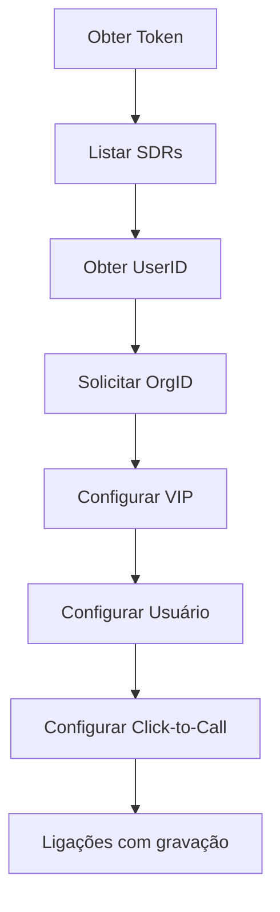

# Integração Exact Sales

## Visão Geral

Este documento descreve o processo de integração entre o **Exact Sales** e o **VIP**, contemplando todas as etapas necessárias para configuração e funcionamento da comunicação entre as plataformas.

A integração envolve:

- obtenção do Token de API;
- identificação do UserID dos usuários;
- configuração da integração no VIP;
- configuração dos usuários;
- habilitação do recurso de clique para discagem (**Click-to-Call**);
- funcionamento das gravações de chamadas.

---

# Pré-requisitos

Antes de iniciar a configuração da integração, certifique-se de possuir:

- Acesso administrativo ao Exact Sales;
- Acesso administrativo ao VIP;
- **OrgID** fornecido pela Exact;
- Collection do Postman para testes de API (opcional).

---

# 1. Obtendo o Token da API

## Localização

No painel administrativo do **Exact Sales**, acesse:

```text
Configurações
    └── Integrações
```

Localize a seção referente às integrações via API.

---

## Token da API

Copie o token disponibilizado pelo Exact Sales.

Esse token será utilizado como autenticação em todas as chamadas realizadas contra a API do Exact.

Exemplo:

```text
Authorization: Bearer <TOKEN_API>
```

> **Importante:** mantenha o token protegido. Ele possui permissão para acessar informações da organização no Exact Sales.

---

## Evidência

📷 **Inserir imagem da tela de Integrações**

---

# 2. Obtendo o UserID

## Objetivo

O **UserID** é o identificador único de cada usuário/vendedor dentro do Exact Sales.

Esse identificador será utilizado posteriormente na configuração dos usuários dentro do VIP.

---

# Consulta de Usuários

Utilize o Token da API obtido anteriormente para realizar a consulta dos usuários cadastrados.

## Requisição

```text
Listar SDRs
```

---

## Autenticação

O Token deve ser informado no Header da requisição.

Exemplo:

```http
Authorization: Bearer <TOKEN_API>
```

---

## Retorno Esperado

A API retornará informações dos usuários cadastrados.

Exemplo:

```json
{
    "id": 12345,
    "name": "Usuário"
}
```

---

## Identificação do UserID

O campo:

```json
"id"
```

corresponde ao **UserID** do usuário dentro do Exact Sales.

Exemplo:

```text
UserID = 12345
```

---

## Múltiplos Usuários

Caso existam vários vendedores cadastrados no Exact Sales, cada usuário possuirá um identificador diferente.

Exemplo:

```text
Usuário A
ID: 12345

Usuário B
ID: 12346

Usuário C
ID: 12347
```

Cada UserID deverá ser associado corretamente ao respectivo usuário no VIP.

---

## Evidência

📷 **Inserir imagem da resposta da API**

# 3. Configuração no VIP

## Objetivo

Após obter o **Token da API**, **UserID** e **OrgID**, é necessário realizar a configuração da integração dentro do ambiente VIP.

---

## Dados da Integração

No cadastro da integração, preencha os campos conforme abaixo:

| Campo | Valor |
|-------|-------|
| Token | Token da API obtido no Exact Sales |
| UserID | ID do usuário obtido através da API de SDRs |
| OrgID | Identificador da organização fornecido pela Exact |
| URL | `https://api.exactspotter.com/api/v2/call` |
| Bina | Opcional |

---

## Observações

- O **OrgID** deve ser solicitado diretamente para a Exact Sales.
- A URL da API deve ser sempre:

```text
https://api.exactspotter.com/api/v2/call
```

- O campo **Bina** deve ser preenchido somente quando houver necessidade de utilizar uma DDR específica por vendedor.

---

## Evidência

📷 **Inserir imagem da configuração do VIP**

---

# 4. Configuração do Usuário

## Objetivo

Associar corretamente o usuário do Exact Sales ao recurso de telefonia utilizado no VIP.

---

## Configuração no Exact Sales

Acesse:

```text
Equipe
    └── Editar usuário
```

Localize o campo:

```text
Telefone 1
```

---

## Preenchimento do Telefone

O valor informado depende do cenário utilizado pelo vendedor:

### Usuário utilizando fila de atendimento

Informar:

```text
Número do Agente
```

---

### Usuário utilizando ramal direto

Informar:

```text
Ramal do usuário
```

---

## Evidência

📷 **Inserir imagem da configuração do usuário**

---

# 5. Configuração do Click-to-Call

## Objetivo

Habilitar o recurso de clique sobre o telefone do cliente dentro do Exact Sales, permitindo iniciar uma chamada automaticamente pelo softphone.

---

## Localização

No Exact Sales, acesse:

```text
Configurações
    └── Gerenciar Configurações Avançadas
        └── Outros
```

---

## Campo

Preencher:

```text
Customização do Link de Telefone
```

---

## Valor

Informar:

```text
tel:{tel}
```

---

## Funcionamento

Após essa configuração, ao clicar no número de telefone de um cliente dentro do Exact Sales, o sistema irá abrir automaticamente o softphone configurado no ambiente VIP.

---

## Evidência

📷 **Inserir imagem da configuração**

---

# Funcionamento da Gravação

Após a realização de uma ligação através da integração:

- a gravação da chamada ficará anexada ao card do cliente;
- o histórico da ligação poderá ser consultado diretamente pelo usuário;
- as informações da chamada permanecerão vinculadas ao registro do cliente no Exact Sales.

---

# Limitações

A integração atualmente suporta somente:

```text
Softphone
```

Para utilização com:

```text
Webphone
```

é necessário contratar o serviço diretamente com a Exact Sales.

---

# Fluxo da Integração

