# Projeto Nexus – Integração Avançada com Funil de Vendas

## 1. Introdução

Este documento descreve o funcionamento e o processo de implantação da nova integração de telefonia do CRM **Funil de Vendas**, utilizando tecnologia **WebPhone** com conexão via **WebSocket Secure (WSS)**.

É importante destacar que a integração atual do Funil de Vendas **não será descontinuada**. A nova solução coexistirá com a versão existente, sendo utilizada conforme a necessidade de cada cliente.

---

## Diferenças entre as versões

### Funil de Vendas – Versão Atual

A versão atualmente utilizada possui uma integração básica de telefonia ao CRM, oferecendo os recursos essenciais para operação.

#### Características

- Utiliza o WebPhone padrão fornecido pela Vip.
- Integração simples de telefonia dentro do CRM.
- Recursos básicos de chamadas.

---

### Projeto Nexus – Nova Integração

O Projeto Nexus amplia significativamente as funcionalidades do CRM por meio de um WebPhone avançado e da integração com Inteligência Artificial.

#### Características

- WebPhone avançado desenvolvido pela equipe do Funil de Vendas.
- Integração nativa com Inteligência Artificial.
- Recursos avançados de apoio ao processo comercial.

#### Recursos disponíveis

- Transcrição automática de chamadas.
- Análise de conversas.
- Insights comerciais.
- Mentorias automatizadas.
- Diagnóstico avançado de vendas.
- Assistência em tempo real ao operador.

---

# 2. Processo Administrativo

A implantação do Projeto Nexus **não altera os processos administrativos** atualmente utilizados.

Todas as etapas continuam sendo executadas normalmente:

- Cadastro da empresa.
- Processo de faturamento.
- Solicitação de números.
- Criação de ramais.

## Importante

A mudança ocorre exclusivamente na integração técnica entre o CRM e a plataforma de telefonia.

Os processos administrativos existentes permanecem inalterados.

# 3. Criação do Ramal

A criação do ramal segue o procedimento padrão da plataforma **Vip**.

Após criar o ramal, acesse o menu:

~~~text
Cadastro de Ramais
    └── Configurações Avançadas
~~~

## Configuração

Aplicar os seguintes parâmetros:

| Parâmetro | Configuração |
|-----------|--------------|
| WebPhone | Sim |
| CRM - URL | `https://netuno.vipsolutions.com.br/nodered/vip/funil/cod_emp+ramal` |

## Configuração da URL

No final da URL deve ser informado o identificador composto por:

~~~text
Código da Empresa + Número do Ramal
~~~

## Exemplo

| Campo | Valor |
|-------|------:|
| Empresa | 101 |
| Ramal | 1040 |

### Identificador gerado

~~~text
1011040
~~~

### URL final

~~~text
https://netuno.vipsolutions.com.br/nodered/vip/funil/1011040
~~~

## Importante

O identificador informado na URL deve corresponder exatamente ao código da empresa concatenado com o número do ramal, sem espaços ou caracteres adicionais. Essa identificação será utilizada pelo fluxo de integração para associar corretamente os eventos ao respectivo ramal.

# 4. Configurações de Áudio e Rede

Recomenda-se manter as seguintes configurações durante a criação do ramal.

| Configuração | Valor |
|--------------|-------|
| Codecs | `ulaw`, `alaw`, `g729` |
| DTMF | `rfc2833` |
| NAT | Sim |
| Limite de canais simultâneos | 1 |

## Observação

O limite de **1 canal simultâneo** garante que cada ramal opere com apenas uma chamada por vez, evitando conflitos de sessão e problemas relacionados ao registro SIP.

---

# 5. Funcionamento do WebPhone

O WebPhone utilizado no **Projeto Nexus** **não é desenvolvido pela Vip**.

Seu desenvolvimento e manutenção são de responsabilidade da equipe do **Funil de Vendas**.

Dessa forma, a responsabilidade da Vip limita-se ao fornecimento das informações necessárias para o registro e autenticação do ramal.

## Informações fornecidas pela Vip

A Vip disponibiliza os seguintes dados para configuração do WebPhone:

- Credenciais SIP.
- Endereço do servidor SIP.
- Parâmetros de conexão WebSocket (WSS).

## Importante

A Vip fornece apenas os dados necessários para o registro do ramal na plataforma de telefonia.

Todo o funcionamento da interface WebPhone, bem como suas funcionalidades e integração com o CRM, são de responsabilidade da equipe do **Funil de Vendas**.

# 6. Teste do WebPhone

Os ramais utilizados no **Projeto Nexus** são ramais **SIP sobre WebSocket (WSS)** convencionais.

Isso significa que podem ser testados utilizando qualquer cliente SIP compatível com esse protocolo, independentemente do CRM.

## Ferramenta recomendada

Uma das ferramentas mais práticas para validação é o cliente Web **JsSIP Tryit**.

~~~text
https://tryit.jssip.net
~~~

Essa ferramenta permite realizar testes diretamente pelo navegador, sem necessidade de instalar qualquer software.

## Recursos disponíveis

Com essa ferramenta é possível:

- Registrar o ramal.
- Efetuar chamadas.
- Receber chamadas.
- Validar a autenticação SIP.

## Objetivo

Antes de iniciar a integração com o CRM, recomenda-se validar o correto funcionamento do ramal utilizando um cliente SIP compatível com WebSocket.

Isso permite confirmar que as credenciais e os parâmetros de conexão estão configurados corretamente.

---

# 7. Fluxo de Processamento das Informações

O processamento das informações de chamadas é realizado através do **Node-RED**, que atua como uma camada intermediária entre a plataforma Vip e a infraestrutura de Inteligência Artificial do Projeto Nexus.

## Objetivo

Os dados enviados originalmente pelo sistema Vip não estão totalmente adequados para consumo pela IA do Nexus.

Por esse motivo, o Node-RED realiza o tratamento e a normalização dessas informações antes de encaminhá-las para o backend responsável pelo processamento.

## Funções do Node-RED

O fluxo executa as seguintes atividades:

- Receber eventos provenientes do CRM e da plataforma de telefonia.
- Ajustar parâmetros do payload recebido.
- Tratar informações relacionadas às chamadas.
- Corrigir formatos de dados.
- Encaminhar as informações para o sistema de Inteligência Artificial.

## Ajustes realizados

Um dos tratamentos realizados pelo fluxo consiste na adequação da URL da gravação da chamada.

Esse ajuste é necessário para permitir:

- Download do arquivo de áudio.
- Processamento pela Inteligência Artificial.
- Transcrição automática da ligação.

## Importante

O Node-RED não substitui o sistema de telefonia nem a Inteligência Artificial.

Sua função é atuar como um **middleware**, garantindo que os dados sejam transformados e enviados no formato esperado pelo backend do Projeto Nexus.

# 8. Recuperação de Arquivo de Gravação

Foi disponibilizado um endpoint para a equipe de desenvolvimento do **Funil de Vendas** que permite localizar o arquivo físico da gravação da chamada no servidor.

## Endpoint

~~~text
https://funil.vipsolutions.com.br/services/call/USERFIELD
~~~

## Parâmetro

O parâmetro **`USERFIELD`** deve conter a identificação única da gravação da chamada.

### Exemplo

~~~text
https://funil.vipsolutions.com.br/services/call/123456789
~~~

Ao informar o identificador da gravação, o endpoint retorna o arquivo de áudio correspondente.

## Importante

Existem dois processos distintos durante o fluxo de integração.

### 1. Gravação da chamada

Responsável por armazenar o áudio da ligação.

**Executado por:**

- Interface da plataforma Vip.

### 2. Envio do áudio para a Inteligência Artificial

Responsável por encaminhar o áudio para processamento pelo Projeto Nexus.

**Executado por:**

- Fluxo do Node-RED.

## Observação

Esses processos são independentes e possuem responsabilidades diferentes.

A existência da gravação da chamada não implica, necessariamente, que o áudio tenha sido enviado para a Inteligência Artificial.

---

# 9. Parâmetros de Configuração do WebPhone

A seguir é apresentado um exemplo de configuração de um ramal WebPhone utilizado no Projeto Nexus.

## Exemplo

| Parâmetro | Valor |
|-----------|-------|
| Ramal | `1141000` |
| Senha | `ViP@fU3!L#wP` |
| SIP URI | `sip:1141000@funil.vipsolutions.com.br` |
| WebSocket URI | `wss://funil.vipsolutions.com.br:8089/ws` |
| Via Transport | `WSS` ou `Auto` |
| Server | `funil.vipsolutions.com.br` |
| Authorization User | `1141000` |

## Observação

Os valores apresentados possuem finalidade ilustrativa e servem como referência para a configuração do WebPhone.

Cada cliente deverá utilizar os parâmetros correspondentes ao seu ambiente de implantação.

# 10. Explicação Técnica dos Parâmetros

A seguir é apresentada a descrição técnica dos parâmetros utilizados na configuração do WebPhone.

---

## Senha

A senha é o parâmetro utilizado na autenticação SIP durante o processo de registro do ramal no servidor.

Durante a operação **SIP REGISTER**, o servidor realiza um desafio de autenticação conhecido como **SIP Digest Authentication**, no qual o cliente deve fornecer as seguintes informações:

- Usuário.
- Senha.
- Realm.
- Hash de autenticação.

A senha é utilizada para gerar o **hash MD5** exigido pelo protocolo SIP, garantindo que apenas clientes autorizados consigam registrar o ramal.

---

## SIP URI

### Exemplo

~~~text
sip:1141000@funil.vipsolutions.com.br
~~~

**SIP URI** significa **Session Initiation Protocol Uniform Resource Identifier**.

Seu funcionamento é semelhante ao de um endereço de e-mail, identificando um ramal dentro de um servidor SIP.

Estrutura:

~~~text
ramal@servidor
~~~

### Componentes

| Parte | Significado |
|--------|-------------|
| `1141000` | Identificação do ramal |
| `funil.vipsolutions.com.br` | Servidor SIP responsável |

### Finalidade

O SIP URI é utilizado para:

- Registrar o ramal.
- Identificar chamadas.
- Realizar o roteamento das ligações.

---

## WebSocket URI

### Exemplo

~~~text
wss://funil.vipsolutions.com.br:8089/ws
~~~

O **WebSocket URI** define o canal de transporte utilizado para comunicação SIP através de **WebSocket Secure (WSS)**.

### Componentes

| Parte | Significado |
|--------|-------------|
| `wss` | WebSocket Secure (criptografado via TLS) |
| `funil.vipsolutions.com.br` | Servidor SIP |
| `8089` | Porta de conexão |
| `/ws` | Endpoint WebSocket |

Esse canal permite que aplicações Web (JavaScript) se comuniquem diretamente com o servidor SIP.

### Comparação

O SIP tradicional utiliza protocolos como:

- UDP.
- TCP.
- TLS.

Já o WebPhone do Projeto Nexus utiliza:

- SIP sobre WebSocket (**RFC 7118**).

---

## Via Transport

Define qual protocolo será utilizado para transportar os pacotes SIP.

### Valores suportados

| Opção | Descrição |
|--------|-----------|
| `WSS` | Força a utilização de WebSocket Secure. |
| `Auto` | Permite que o cliente escolha automaticamente o transporte. |

### Recomendação

Para aplicações WebPhone recomenda-se utilizar:

~~~text
WSS (WebSocket Secure)
~~~

---

## Server

### Exemplo

~~~text
funil.vipsolutions.com.br
~~~

O parâmetro **Server** define o servidor SIP responsável pelo registro e roteamento das chamadas.

Esse servidor desempenha diversas funções dentro da infraestrutura de telefonia, incluindo:

- Registrar ramais.
- Controlar sessões SIP.
- Gerenciar chamadas.
- Encaminhar chamadas entre ramais.

## Observação

Na arquitetura SIP, esse servidor atua simultaneamente como:

- SIP Registrar.
- SIP Proxy.

---

## Authorization User

### Exemplo

~~~text
1141000
~~~

O parâmetro **Authorization User** define o usuário utilizado durante o processo de autenticação SIP.

Embora esse valor nem sempre precise ser igual ao número do ramal, neste projeto foi adotada essa padronização para facilitar a administração e a configuração dos clientes.

Esse campo é utilizado especificamente durante o processo de **SIP Digest Authentication**, permitindo que o servidor valide a identidade do cliente antes de concluir o registro do ramal.

## Resumo dos parâmetros

| Parâmetro | Finalidade |
|-----------|------------|
| **Senha** | Autenticação SIP através de Digest Authentication. |
| **SIP URI** | Identificação do ramal no servidor SIP. |
| **WebSocket URI** | Canal de comunicação SIP via WebSocket Secure. |
| **Via Transport** | Define o protocolo de transporte utilizado pelo SIP. |
| **Server** | Servidor responsável pelo registro e roteamento das chamadas. |
| **Authorization User** | Usuário utilizado durante a autenticação SIP. |

# 11. Configuração do Fluxo no Node-RED para Integração com IA Nexus

## 11.1 Visão Geral

Para que os dados das chamadas e suas respectivas gravações sejam enviados corretamente para a Inteligência Artificial do Nexus, é necessário realizar a configuração do fluxo responsável no Node-RED.

O Node-RED atua como middleware de integração, realizando a comunicação entre o servidor de telefonia, os eventos gerados pelo CRM e a infraestrutura da IA Nexus.

Cada ramal WebPhone possuirá uma URL exclusiva fornecida pela equipe do Funil de Vendas.

Essa URL representa o endpoint de ingestão da IA responsável por receber os dados da chamada, processar a gravação e iniciar os processos de análise e transcrição.

---

# 11.2 Arquitetura do Fluxo

Dentro da arquitetura atual, o Node-RED possui três responsabilidades principais:

1. Recepção dos eventos originados pelo CRM e servidor de telefonia.
2. Tratamento e normalização dos dados recebidos.
3. Encaminhamento das informações para o endpoint da IA Nexus.

O fluxo existente no ambiente Node-RED já possui toda a lógica necessária para integração, incluindo:

- Interpretação do payload recebido.
- Validação das informações da chamada.
- Tratamento e normalização dos dados.
- Ajuste dos parâmetros necessários.
- Geração da URL da gravação.
- Montagem do payload no formato esperado pela IA Nexus.
- Envio das informações através de requisição HTTP.
- Tratamento dos retornos da API.

Por esse motivo, **não deve ser criado um novo fluxo do zero**.

A recomendação é replicar o fluxo existente e realizar somente os ajustes específicos referentes ao novo ramal.

---

# 11.3 Replicação do Fluxo Existente

## Acesso ao Fluxo

Para iniciar a configuração:

1. Acesse o Node-RED Editor.

2. Navegue até a área:

```
Funil de Vendas
```

3. Localize o último fluxo funcional utilizado para integração com o Nexus.

Esse fluxo já contém todos os componentes necessários:

- Nós de processamento.
- Funções de transformação.
- Requisição HTTP para envio dos dados.
- Tratamento das gravações.
- Estrutura de comunicação com a IA.

---

## Procedimento de Cópia

Realize a cópia completa do fluxo existente.

Todos os nós devem ser copiados, garantindo que nenhuma etapa da integração seja removida.

Após realizar a cópia:

1. Cole o fluxo abaixo dos fluxos existentes.

2. Reorganize visualmente os nós mantendo a padronização do workspace.

3. Verifique se todas as conexões entre os nós foram preservadas corretamente.

A padronização visual facilita a manutenção futura e evita confusão entre integrações de diferentes ramais.

---

# 11.4 Configuração do Nó de Entrada (Webhook)

Após realizar a cópia do fluxo, o primeiro ajuste deve ser realizado no nó responsável pelo recebimento dos eventos.

Esse nó representa o endpoint Webhook utilizado pelo servidor VIP para enviar os eventos das chamadas ao Node-RED.

---

## Alteração do Nome do Nó

O nome do nó deverá seguir o padrão:

```
COD_EMPRESA + RAMAL - WSSCRM
```

Onde:

| Campo | Descrição |
|---|---|
| COD_EMPRESA | Código identificador da empresa no sistema VIP |
| RAMAL | Número do ramal WebPhone configurado |
| WSSCRM | Identificação fixa do endpoint de integração |

---

## Exemplo de Configuração

Dados:

```
Empresa: 101

Ramal: 1040
```

Nome do nó:

```
1011040 - WSSCRM
```

---

## Validação do Webhook

Após alterar o nome do nó, valide os seguintes pontos:

- O endpoint HTTP permanece igual ao utilizado pelo fluxo original.
- As conexões entre os nós permanecem corretas.
- Não existem referências apontando para o Webhook antigo.
- O novo ramal está associado ao fluxo correto.

A configuração incorreta do nó de entrada impedirá que os eventos das chamadas sejam recebidos pelo Node-RED.

---

# 11.5 Configuração dos Parâmetros do Ramal

Após a replicação do fluxo, devem ser revisados os parâmetros específicos do novo ramal.

Os campos normalmente envolvidos são:

| Parâmetro | Descrição |
|---|---|
| Código da Empresa | Identificador da empresa dentro do ambiente VIP |
| Ramal | Número do WebPhone integrado |
| URL da IA Nexus | Endpoint exclusivo fornecido pelo Funil de Vendas |
| Identificador da integração | Código utilizado para rastreamento da chamada |
| Dados da gravação | Informações utilizadas para disponibilizar o áudio para análise |

Esses parâmetros devem ser substituídos conforme os dados fornecidos para o novo cliente ou ramal.

---

# 11.6 Teste da Integração

Após finalizar a configuração, deve ser realizado um teste completo da integração.

## Processo de validação:

1. Realizar uma chamada utilizando o ramal configurado.

2. Confirmar o recebimento do evento no Node-RED.

3. Validar se o payload foi processado corretamente.

4. Verificar se a gravação foi localizada e enviada.

5. Confirmar o recebimento da chamada pela IA Nexus.

6. Validar se a análise e transcrição foram iniciadas corretamente.

---

## Pontos de verificação

Durante o teste, validar:

- O Webhook recebeu o evento.
- Os dados da chamada foram preenchidos corretamente.
- A URL da gravação foi gerada corretamente.
- A requisição HTTP para a IA retornou sucesso.
- Não existem erros nos nós de processamento.

---

# 11.7 Boas Práticas

Para manter a organização do ambiente Node-RED:

- Nunca alterar diretamente um fluxo já existente em produção.
- Sempre realizar uma cópia antes de modificar integrações.
- Manter o padrão de nomenclatura dos nós.
- Documentar novos ramais adicionados.
- Evitar duplicação de lógica quando uma alteração puder ser aplicada ao fluxo principal.
- Manter os nós organizados visualmente para facilitar manutenção.

A replicação controlada dos fluxos garante padronização, reduz riscos operacionais e facilita o suporte das integrações futuras.

# 11.4 Configuração da URL do Webhook

Dentro da configuração do nó Webhook existe o campo **URL**, responsável por definir o endpoint que será chamado pelo servidor VIP para envio dos eventos ao Node-RED.

Essa URL deve seguir obrigatoriamente o padrão definido pelo ambiente, sendo finalizada pelo identificador composto por:

```
CODIGO_EMPRESA + RAMAL
```

O identificador deve ser informado exatamente conforme o cadastro do ramal, sem espaços ou caracteres adicionais.

---

## Exemplo de configuração correta

```
https://netuno.vipsolutions.com.br/nodered/vip/funil/1011040
```

Onde:

| Informação | Valor |
|---|---|
| Código da Empresa | 101 |
| Ramal | 1040 |
| Identificador final | 1011040 |

---

## Regras importantes

Ao configurar a URL do Webhook, valide os seguintes pontos:

- Não utilizar espaços na URL.
- Não adicionar barras adicionais no final do endereço.
- Garantir que o identificador final corresponde exatamente ao ramal configurado.
- Validar se o código da empresa está correto.
- Manter o mesmo padrão utilizado nos demais fluxos existentes.

A identificação final da URL é utilizada internamente pelo fluxo para associar os eventos recebidos ao ramal correto.

Uma configuração incorreta pode fazer com que os eventos sejam recebidos pelo Node-RED, porém vinculados ao ramal errado ou não sejam processados pela integração.

---

# 11.5 Configuração do Nó de Requisição HTTP

Dentro do fluxo existe um nó responsável por encaminhar os dados tratados para o backend da Inteligência Artificial Nexus.

Esse nó normalmente é identificado como:

```
HTTP Request
```

ou:

```
Requisição HTTP
```

Esse componente executa uma chamada HTTP enviando os dados processados pelo Node-RED para o endpoint disponibilizado pela equipe do Funil de Vendas.

---

## Alteração necessária

Acesse a configuração do nó e altere o campo:

```
URL
```

Informe o endpoint específico fornecido para o ramal que está sendo configurado.

---

## Exemplo de configuração

```
https://ssvbezrfohbqhfryvamw.supabase.co/functions/v1/sip-webhook?c=37272&u=58760
```

---

## Validação

Após configurar a URL do endpoint da IA Nexus, valide:

- Se o endereço foi informado exatamente conforme fornecido.
- Se não existem espaços ou caracteres extras.
- Se os parâmetros enviados na URL correspondem ao ramal correto.
- Se o método HTTP permanece igual ao fluxo original.
- Se os headers e formato do payload não foram alterados.

A alteração incorreta desse endpoint impedirá que os dados das chamadas e gravações sejam recebidos pela IA Nexus.

# 11.6 Estrutura da URL do Endpoint da IA Nexus

O endpoint configurado no nó **HTTP Request** pertence à infraestrutura backend da IA Nexus, hospedada no Supabase.

Esse endpoint é responsável por receber os dados enviados pelo Node-RED e iniciar o processamento da chamada, incluindo análise do áudio, transcrição e geração dos insights.

A URL possui parâmetros responsáveis por identificar a empresa e o usuário associado à chamada.

---

## Parâmetros da URL

| Parâmetro | Função |
|---|---|
| `c` | Identificador do cliente/empresa dentro da plataforma Nexus |
| `u` | Identificador do usuário/ramal responsável pela chamada |

---

## Exemplo

```
https://ssvbezrfohbqhfryvamw.supabase.co/functions/v1/sip-webhook?c=37272&u=58760
```

Neste exemplo:

| Parâmetro | Valor |
|---|---|
| `c` | 37272 |
| `u` | 58760 |

---

Esses parâmetros permitem que a plataforma Nexus associe corretamente os dados recebidos ao usuário correspondente.

A associação correta garante que os seguintes dados sejam vinculados ao usuário correto:

- Gravações.
- Transcrições.
- Análises realizadas pela IA.
- Relatórios e indicadores.

Uma configuração incorreta dos parâmetros pode resultar em chamadas processadas para o usuário errado ou em falhas de associação dentro da plataforma.

---

# 11.7 Fluxo de Dados Após Configuração

Após concluir todas as configurações, o fluxo de comunicação entre o servidor VIP, Node-RED e IA Nexus ocorrerá conforme o processo abaixo:

```mermaid
flowchart LR

A[Servidor VIP] -->|Evento de chamada| B[Webhook Node-RED]

B --> C[Processamento Node-RED]

C --> D[Preparação do Payload]

D --> E[HTTP Request]

E -->|Envio dos dados| F[Backend IA Nexus]

F --> G[Download do áudio]

G --> H[Transcrição da chamada]

H --> I[Análise por Inteligência Artificial]

I --> J[Disponibilização dos insights no CRM]
```



---

## Etapas do Processo

### 1. Geração do evento de chamada

O servidor VIP identifica uma chamada realizada pelo ramal configurado e gera o evento contendo as informações necessárias para integração.

---

### 2. Recepção pelo Webhook Node-RED

O evento é enviado para o endpoint Webhook configurado no Node-RED.

O Webhook recebe os dados iniciais da chamada e inicia o processamento do fluxo.

---

### 3. Processamento pelo Node-RED

O fluxo Node-RED realiza as seguintes operações:

- Processa os dados recebidos.
- Valida as informações da chamada.
- Ajusta parâmetros necessários.
- Corrige e monta a URL da gravação.
- Prepara o payload no formato esperado pelo backend da IA Nexus.

---

### 4. Envio para a IA Nexus

Após o tratamento das informações, o Node-RED executa uma requisição HTTP para o endpoint configurado da IA Nexus.

Nesta etapa são enviados:

- Dados da chamada.
- Identificação do usuário.
- Informações da gravação.
- Metadados necessários para processamento.

---

### 5. Processamento no Backend Nexus

O backend da IA Nexus realiza:

- Download do áudio da chamada.
- Processamento da gravação.
- Transcrição automática.
- Análise utilizando inteligência artificial.
- Geração de insights.

Após o processamento, as informações ficam disponíveis para consulta dentro do CRM ou plataforma integrada.

# 11.8 Boas Práticas de Implementação

Durante a replicação e configuração dos fluxos no Node-RED, algumas práticas devem ser seguidas para garantir a estabilidade da integração e facilitar futuras manutenções.

Recomenda-se:

- Manter o padrão de nomenclatura utilizado nos nós do Node-RED.
- Evitar alterações desnecessárias na lógica interna do fluxo.
- Modificar somente os parâmetros específicos do novo ramal.
- Alterar apenas os campos relacionados à URL do Webhook e endpoint da IA Nexus.
- Validar se o endpoint da IA responde corretamente após a configuração.
- Manter o fluxo organizado visualmente dentro do workspace.

Alterações na lógica interna podem comprometer o funcionamento da integração, pois o fluxo existente já possui tratamento específico para recebimento, transformação e envio dos dados.

---

## Teste Após Implantação

Após concluir a configuração de um novo ramal, deve ser realizado um teste completo de chamada.

Durante a validação, verificar:

- Recepção correta do evento pelo Webhook do Node-RED.
- Execução completa do fluxo sem erros.
- Processamento correto dos dados recebidos.
- Envio da requisição HTTP para o endpoint da IA Nexus.
- Recebimento e ingestão do áudio pela plataforma de Inteligência Artificial.
- Associação correta da chamada ao usuário correspondente.

A validação após implantação garante que todos os componentes da integração estão funcionando corretamente antes da utilização em ambiente produtivo.

---

# 12. Conclusão

A integração WebPhone do projeto Nexus utiliza uma arquitetura moderna baseada em:

- SIP para comunicação de telefonia.
- WebSocket Secure (WSS) para comunicação segura em tempo real.
- Node-RED como camada de middleware e processamento de eventos.
- Integração com Inteligência Artificial para análise das chamadas.

Essa arquitetura permite ampliar as funcionalidades do CRM Funil de Vendas, adicionando recursos avançados como:

- Transcrição automática de chamadas.
- Análise inteligente das conversas.
- Geração de insights para operadores e gestores.
- Apoio à tomada de decisão comercial.
- Melhoria no acompanhamento da qualidade dos atendimentos.

A utilização do Node-RED como camada intermediária permite maior flexibilidade na integração, possibilitando a evolução contínua da solução sem necessidade de alterações estruturais no ambiente de telefonia ou CRM.