# Manual Técnico de Integração - Kommo CRM × VIP Solutions

# 1. Objetivo

Este documento descreve o funcionamento da integração entre o **Kommo CRM** e a plataforma **VIP Solutions Phone**.

São detalhados neste documento:

- Arquitetura da comunicação.
- Modelo de autenticação.
- Endpoints utilizados.
- Fluxo operacional.
- Configurações necessárias para habilitar o recurso **Click to Call**.

A integração permite que os usuários realizem chamadas diretamente através do Kommo CRM, além de registrar automaticamente as informações relacionadas à ligação.

Os dados registrados incluem:

- Duração da chamada.
- Status da ligação.
- Informações do contato relacionado.
- Identificação do usuário responsável.
- Gravação do áudio da chamada.

---

# 2. Visão Geral da Integração

A integração entre Kommo CRM e VIP Solutions é baseada exclusivamente na API REST disponibilizada pelo Kommo CRM.

Diferentemente de arquiteturas baseadas em Webhooks, onde o CRM envia eventos para sistemas externos, nesta integração a plataforma VIP Solutions atua como **cliente consumidor da API do Kommo**.

A comunicação ocorre através de chamadas autenticadas realizadas pela VIP Solutions, permitindo consultar informações do CRM e registrar os eventos telefônicos diretamente na plataforma.

---

# 2.1 Modelo de Comunicação

A arquitetura funciona da seguinte forma:

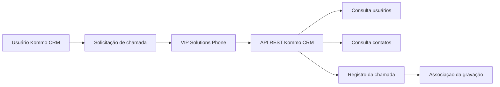

---

# 2.2 Responsabilidades dos Sistemas

| Sistema | Responsabilidade |
|---|---|
| Kommo CRM | Disponibilizar API REST para consulta e registro de informações |
| VIP Solutions Phone | Executar chamadas, processar eventos telefônicos e consumir a API do Kommo |
| Plataforma de Telefonia | Realizar a comunicação SIP e processamento das chamadas |
| Armazenamento de gravações | Disponibilizar o áudio para associação ao CRM |

---

# 2.3 Funcionalidades Implementadas

A integração disponibiliza as seguintes funcionalidades:

## Consulta de usuários cadastrados

Permite que a VIP Solutions identifique os usuários existentes no Kommo CRM e realize o vínculo correto entre:

- Usuário do CRM.
- Ramal telefônico.
- Operador responsável pela chamada.

---

## Consulta de contatos através do número telefônico

A plataforma realiza consultas no Kommo CRM utilizando o telefone do contato.

Esse processo permite localizar automaticamente o registro relacionado à chamada.

---

## Notificação de ligações

A VIP Solutions registra os eventos telefônicos no Kommo CRM, informando dados como:

- Origem da chamada.
- Destino.
- Usuário responsável.
- Data e horário.
- Status da ligação.
- Duração.

---

## Registro completo das chamadas

Após o encerramento da ligação, as informações são enviadas para o CRM permitindo manter o histórico de comunicação com o cliente.

---

## Associação automática da gravação

A gravação da chamada é vinculada automaticamente ao registro correspondente dentro do Kommo CRM.

Esse processo permite que os usuários consultem o histórico completo da interação diretamente no ambiente do CRM.

---

# 2.4 Características Técnicas

| Característica | Valor |
|---|---|
| Modelo de integração | API REST |
| Comunicação | Bidirecional |
| Autenticação | API autenticada |
| Formato de dados | JSON |
| Protocolo | HTTPS |
| Origem das chamadas API | VIP Solutions |
| Registro de eventos | Kommo CRM API |
| Recurso principal | Click to Call |

---

# 2.5 Fluxo Geral da Integração

O funcionamento geral ocorre da seguinte forma:

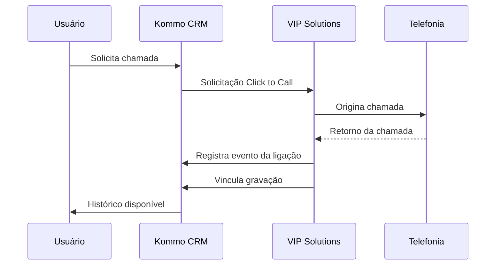

---

A integração permite que o Kommo CRM funcione como ponto central de operação comercial, enquanto a VIP Solutions realiza todo o processamento de telefonia e sincronização dos dados da chamada.

# 3. Arquitetura da Integração

A integração entre Kommo CRM e VIP Solutions Phone funciona através de uma comunicação baseada em API REST, onde a plataforma VIP Solutions realiza as consultas e registros necessários diretamente na API do Kommo.

O fluxo completo envolve a interação entre o operador, CRM, plataforma de telefonia e registro das informações da chamada.

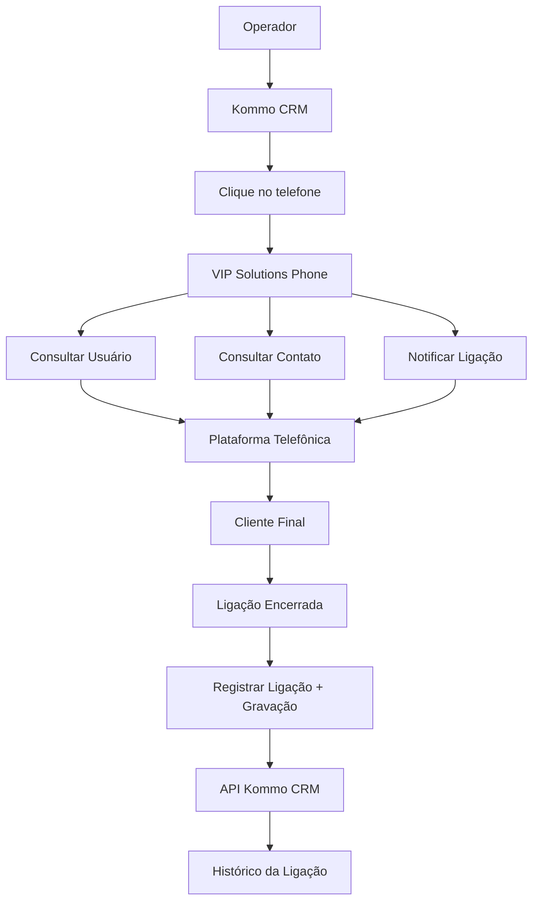

---

# 4. Fluxo Geral da Integração

O funcionamento da integração ocorre através de seis etapas principais:

1. Configuração inicial.
2. Solicitação da ligação.
3. Consulta do contato.
4. Notificação da chamada.
5. Registro da ligação.
6. Associação da gravação.

---

# 4.1 Etapa 1 – Configuração Inicial

Antes da utilização da integração, é necessário realizar a configuração das credenciais de acesso ao Kommo CRM.

O processo envolve:

1. O administrador gera um **Token de Acesso** dentro do Kommo CRM.

2. É obtido o **User ID** correspondente ao operador que utilizará a integração.

3. Essas informações são cadastradas na configuração do **VIP Solutions Phone**.

Os dados utilizados permitem que a plataforma VIP Solutions realize chamadas autenticadas na API do Kommo.

---

# 4.2 Etapa 2 – Início da Ligação

O fluxo inicia quando o operador solicita uma chamada diretamente pelo CRM.

Processo:

```
Operador
   ↓
Clica no telefone do contato
   ↓
Kommo CRM
   ↓
VIP Solutions Phone
   ↓
Originação da chamada
```

O VIP Solutions recebe a solicitação e inicia a chamada utilizando o ramal configurado para aquele operador.

---

# 4.3 Etapa 3 – Consulta do Contato

Durante o processamento da chamada, a plataforma VIP Solutions pode consultar o Kommo CRM utilizando o número telefônico informado.

Objetivo:

- Localizar automaticamente o contato relacionado.
- Identificar o registro correto dentro do CRM.
- Associar posteriormente a ligação ao histórico do cliente.

A consulta permite evitar registros duplicados e garante que a chamada seja vinculada ao contato correto.

---

# 4.4 Etapa 4 – Notificação da Ligação

Durante o andamento da chamada, a VIP Solutions informa ao Kommo CRM que existe uma ligação em processamento.

Essa notificação permite que o CRM disponibilize ao usuário informações relacionadas ao atendimento.

Podem ser informados dados como:

- Identificação do operador.
- Número chamado.
- Status da chamada.
- Identificador da ligação.

---

# 4.5 Etapa 5 – Registro da Ligação

Após o encerramento da chamada, a VIP Solutions registra todas as informações da ligação utilizando a API do Kommo CRM.

Os dados enviados incluem:

| Campo | Descrição |
|---|---|
| Telefone | Número envolvido na chamada |
| Direção da ligação | Entrada ou saída |
| Duração | Tempo total da chamada |
| Status | Resultado final da ligação |
| Identificador único | Referência técnica da chamada |
| Origem | Sistema ou operador responsável |
| Link da gravação | Endereço para acesso ao áudio |

---

# 4.6 Etapa 6 – Associação da Gravação

Após receber o registro da chamada, o Kommo CRM utiliza o link da gravação informado pela VIP Solutions para acessar o arquivo de áudio.

Fluxo:

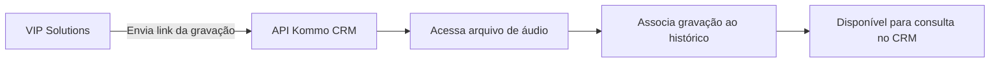

O processo permite que o usuário visualize o histórico completo da interação, incluindo:

- Dados da ligação.
- Informações do atendimento.
- Gravação de áudio.

A gravação permanece vinculada ao contato correto dentro do Kommo CRM, garantindo rastreabilidade completa da comunicação telefônica.

# 5. Autenticação

Todas as chamadas realizadas pela integração com a API do Kommo CRM utilizam autenticação através de **Bearer Token**.

O token deve ser enviado no cabeçalho HTTP (**Header**) de todas as requisições realizadas pela VIP Solutions.

---

## 5.1 Formato da Autenticação

Exemplo:

```http
Authorization: Bearer {TOKEN}
```

Onde:

```
{TOKEN}
```

representa o token de acesso gerado no ambiente administrativo do Kommo CRM.

---

## 5.2 Finalidade do Token

O Token de acesso é responsável por identificar e autorizar a comunicação entre a VIP Solutions e o Kommo CRM.

Esse token está associado a:

- Conta do Kommo CRM.
- Usuário responsável pela integração.
- Permissões disponíveis para acesso à API.
- Domínio da organização.

---

## 5.3 Regras de Utilização

O Token:

- Deve ser enviado em todas as requisições para a API.
- Não deve ser compartilhado publicamente.
- Deve ser armazenado em local seguro.
- Deve possuir as permissões necessárias para execução das operações da integração.

A ausência ou invalidação do token fará com que as requisições sejam rejeitadas pela API do Kommo.

---

# 6. Configuração da Integração

Para configurar o **VIP Solutions Phone** com o Kommo CRM, são necessários os seguintes dados:

| Campo | Origem | Utilização |
|---|---|---|
| Token | Gerado no Kommo CRM | Autenticação das requisições API |
| User ID | Obtido através da API do Kommo | Identificação do operador |
| Ramal | Configurado no VIP Solutions Phone | Originação das chamadas |

---

## 6.1 Fluxo de Configuração

A configuração segue o fluxo:

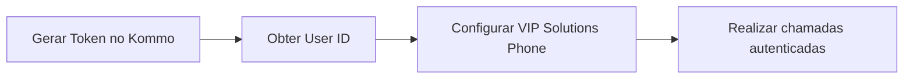

---

# 7. Obtenção do Token

O Token de acesso deve ser gerado diretamente dentro do painel administrativo do Kommo CRM.

---

## Passo 1

Acessar o ambiente administrativo do:

```
Kommo CRM
```

---

## Passo 2

Navegar até:

```
Configurações → API / Integrações
```

---

## Passo 3

Gerar um novo Token de acesso.

Durante a geração, o Kommo disponibilizará o valor que será utilizado pela integração.

---

## Passo 4

Copiar o Token e armazená-lo em local seguro.

Esse Token será utilizado pelo **VIP Solutions Phone** para autenticar todas as chamadas realizadas contra a API do Kommo CRM.

---

# 7.1 Validação da Configuração

Após cadastrar o Token no VIP Solutions Phone, recomenda-se validar:

- Se a autenticação está sendo aceita pela API.
- Se o usuário configurado possui permissões adequadas.
- Se as consultas de usuários e contatos retornam dados corretamente.
- Se o registro de chamadas está sendo criado no CRM.

Uma configuração incorreta do Token impedirá qualquer comunicação entre a VIP Solutions e o Kommo CRM.

# 8. Consulta dos Usuários

A consulta de usuários é utilizada pela VIP Solutions para obter a lista de usuários cadastrados no Kommo CRM.

Esse processo permite identificar o **User ID** de cada operador, informação necessária para associar corretamente as chamadas realizadas ao usuário correspondente.

---

# 8.1 Endpoint

**Método HTTP:**

```
GET
```

**Endpoint:**

```
/api/v4/users
```

**URL completa:**

```
https://nomedocliente.kommo.com/api/v4/users
```

---

# 8.2 Parâmetros Utilizados

| Parâmetro | Valor | Descrição |
|---|---|---|
| with | id | Retorna o identificador dos usuários |
| limit | 250 | Quantidade máxima de registros retornados |

---

# 8.3 Objetivo

O endpoint retorna todos os usuários cadastrados dentro do ambiente Kommo CRM.

Entre as informações retornadas está o:

```
User ID
```

Esse identificador é utilizado posteriormente na configuração da integração e no registro das chamadas.

---

# 8.4 Fluxo de Consulta

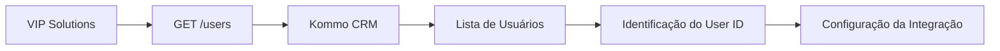

---

# 9. Consulta de Contatos

A consulta de contatos permite que a VIP Solutions localize automaticamente registros existentes no Kommo CRM utilizando apenas o número telefônico.

Esse processo ocorre durante o fluxo da chamada e permite identificar o registro correto antes do lançamento da atividade telefônica.

---

# 9.1 Endpoint

**Método HTTP:**

```
GET
```

**Endpoint:**

```
/api/v2/search/by_phone
```

---

## Exemplo

```
https://nomedocliente.kommo.com/api/v2/search/by_phone?phone=11999999999
```

---

# 9.2 Objetivo

Localizar automaticamente informações relacionadas ao número informado.

A consulta pode identificar:

- Contato.
- Lead.
- Empresa.
- Cadastro existente.

Essa identificação permite que a chamada seja associada ao registro correto dentro do CRM.

---

# 9.3 Parâmetros

| Campo | Descrição |
|---|---|
| phone | Número telefônico utilizado na busca |

---

## Exemplo de chamada

```http
GET /api/v2/search/by_phone?phone=11999999999
```

---

# 10. Notificação de Ligação

O endpoint de notificação é utilizado para registrar um evento telefônico dentro do Kommo CRM.

Após a chamada ser iniciada ou processada pela VIP Solutions, esse endpoint permite informar ao CRM que existe uma interação telefônica associada a determinado usuário.

---

# 10.1 Endpoint

**Método HTTP:**

```
POST
```

**Endpoint:**

```
/api/v2/events
```

---

# 10.2 Payload

Exemplo:

```json
{
  "add": [
    {
      "type": "phone_call",
      "phone_number": "11938065710",
      "users": [
        11434979
      ]
    }
  ]
}
```

---

# 10.3 Descrição dos Campos

## type

**Tipo:**

```
String
```

**Descrição:**

Define o tipo do evento registrado no Kommo.

Valor utilizado pela integração:

```json
{
  "type": "phone_call"
}
```

Representa um evento de ligação telefônica.

---

## phone_number

**Tipo:**

```
String
```

**Descrição:**

Número telefônico envolvido na ligação.

Exemplo:

```json
{
  "phone_number": "11938065710"
}
```

---

## users

**Tipo:**

```
Array
```

**Descrição:**

Lista contendo os identificadores dos usuários associados ao evento.

O valor informado corresponde ao:

```
User ID
```

do operador responsável pela chamada.

Exemplo:

```json
{
  "users": [
    11434979
  ]
}
```

Esse campo informa ao Kommo CRM qual usuário deve ser associado à ligação registrada.

---

# 10.4 Fluxo da Notificação

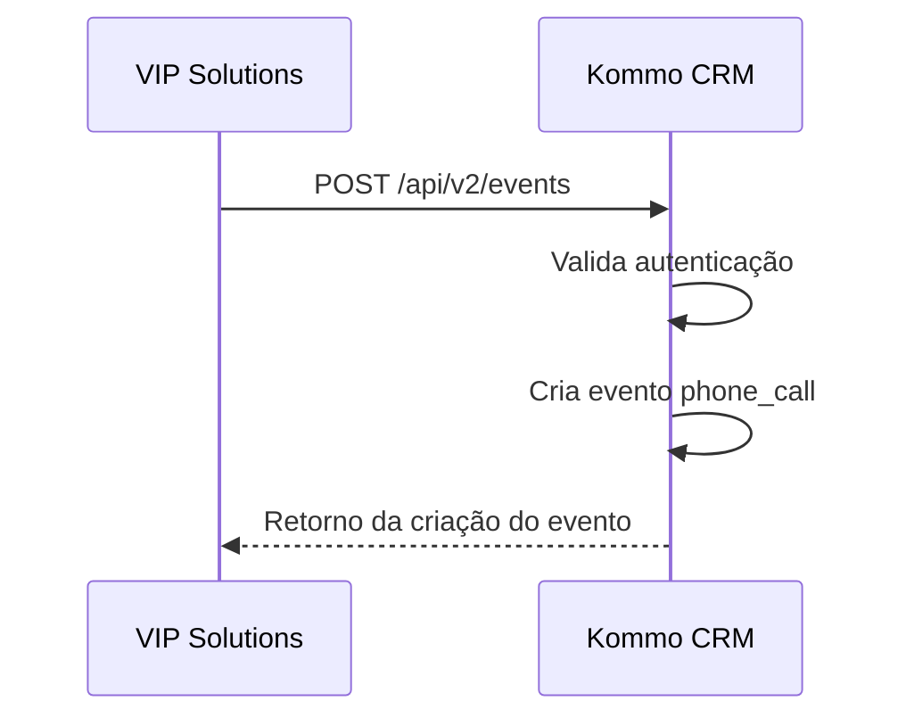

---

O registro do evento permite que o Kommo mantenha o histórico das interações telefônicas realizadas pelos operadores através da integração.

# 11. Registro da Ligação

Após o encerramento da chamada, a VIP Solutions registra a ligação completa no Kommo CRM através da API de chamadas.

Esse processo é responsável por enviar ao CRM todas as informações necessárias para manter o histórico telefônico do cliente, incluindo dados operacionais e referência para a gravação do áudio.

---

# 11.1 Endpoint

**Método HTTP:**

```
POST
```

**Endpoint:**

```
/api/v4/calls
```

---

# 11.2 Objetivo

Registrar uma ligação finalizada dentro do Kommo CRM.

O registro permite armazenar:

- Número telefônico.
- Direção da chamada.
- Duração.
- Usuário responsável.
- Origem da ligação.
- Status final.
- Link da gravação.

---

# 11.3 Payload

Exemplo:

```json
[
  {
    "phone": "11938065710",
    "direction": "outbound",
    "uniq": "11452541.115654",
    "duration": 144,
    "source": "Vip IPBX",
    "call_status": 4,
    "link": "https://callcenter.vipsolutions.com.br/services/record/20240628_091337_1149990287_1001973_1719576812",
    "created_at": 1720468709,
    "created_by": 11235431
  }
]
```

---

# 12. Descrição dos Campos

## phone

**Tipo:**

```
String
```

**Descrição:**

Número telefônico envolvido na chamada.

Exemplo:

```json
{
  "phone": "11938065710"
}
```

Esse campo permite relacionar a ligação ao contato correspondente dentro do CRM.

---

## direction

**Tipo:**

```
String
```

**Descrição:**

Define a direção da chamada.

Valores normalmente utilizados:

```
outbound
```

ou

```
inbound
```

Exemplo:

```json
{
  "direction": "outbound"
}
```

Onde:

| Valor | Descrição |
|---|---|
| outbound | Chamada originada pelo operador |
| inbound | Chamada recebida pelo operador |

---

## uniq

**Tipo:**

```
String
```

**Descrição:**

Identificador único da ligação.

Esse campo é utilizado para:

- Rastreamento técnico.
- Correlação dos eventos da chamada.
- Identificação única dentro da plataforma telefônica.

Exemplo:

```json
{
  "uniq": "11452541.115654"
}
```

---

## duration

**Tipo:**

```
Integer
```

**Descrição:**

Tempo total da ligação em segundos.

Exemplo:

```json
{
  "duration": 144
}
```

Representa:

```
144 segundos
```

---

## source

**Tipo:**

```
String
```

**Descrição:**

Identifica a origem da chamada.

Exemplo:

```json
{
  "source": "Vip IPBX"
}
```

Esse valor indica que a ligação foi originada pela plataforma VIP Solutions.

---

## call_status

**Tipo:**

```
Integer
```

**Descrição:**

Código correspondente ao resultado final da chamada.

Na Collection analisada foi utilizado:

```json
{
  "call_status": 4
}
```

O significado dos demais códigos possíveis depende da documentação oficial do Kommo CRM.

---

## link

**Tipo:**

```
String
```

**Descrição:**

URL utilizada pelo Kommo CRM para acessar a gravação da chamada.

Exemplo:

```json
{
  "link": "https://callcenter.vipsolutions.com.br/services/record/{id}"
}
```

Esse campo não contém o arquivo de áudio diretamente.

Ele disponibiliza uma referência para que o CRM possa acessar a gravação posteriormente.

---

# 12.1 Fluxo da Gravação

O processo de associação do áudio ocorre da seguinte forma:

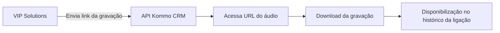

---

## created_at

**Tipo:**

```
Integer
```

**Descrição:**

Timestamp Unix correspondente ao momento de criação do registro da chamada.

Exemplo:

```json
{
  "created_at": 1720468709
}
```

Esse valor representa a data e hora da criação no formato Unix Timestamp.

---

## created_by

**Tipo:**

```
Integer
```

**Descrição:**

Identificador do usuário responsável pela ligação.

Esse valor corresponde ao:

```
User ID
```

previamente configurado na integração.

Exemplo:

```json
{
  "created_by": 11235431
}
```

Esse campo permite que o Kommo associe a chamada ao operador correto.

---

# 12.2 Fluxo Completo do Registro da Chamada

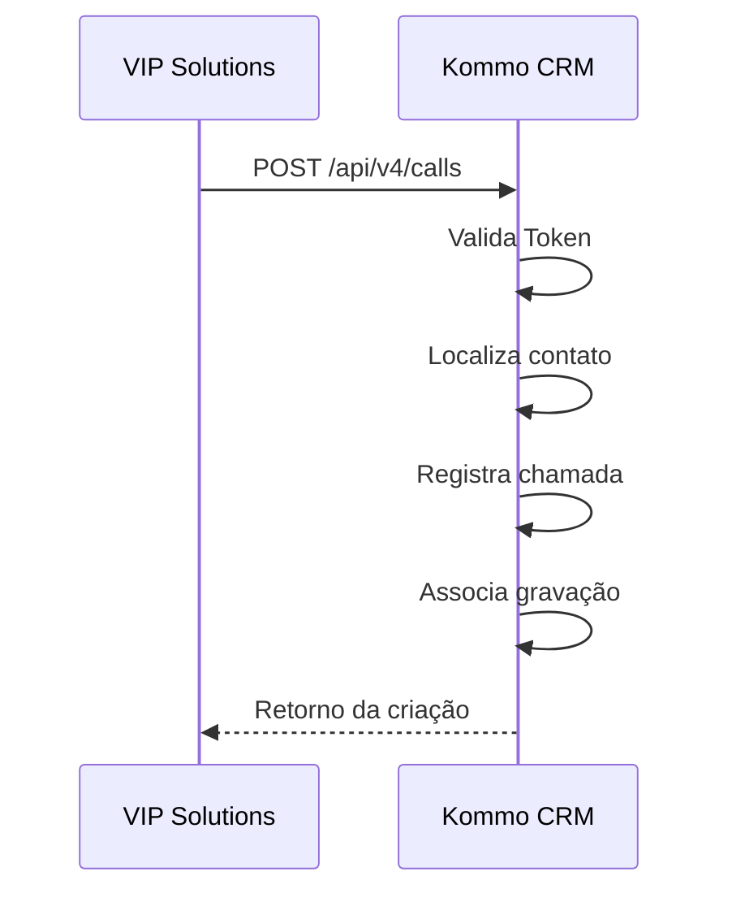

---

Após esse processo, a ligação fica registrada no histórico do cliente dentro do Kommo CRM, contendo os dados operacionais e a referência para reprodução da gravação.

# 13. Fluxo de Registro da Gravação

Após o encerramento da ligação, a gravação é associada ao histórico do cliente através de um fluxo baseado em referência por URL.

O processo ocorre da seguinte forma:

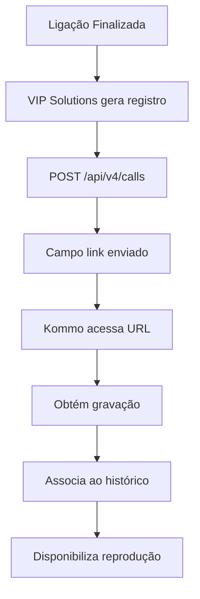

---

## Funcionamento da Gravação

A gravação **não é enviada diretamente dentro da requisição da API**.

O processo funciona através do envio de uma referência:

```
VIP Solutions
      ↓
Envia URL da gravação
      ↓
Kommo CRM
      ↓
Acessa conteúdo disponibilizado
      ↓
Disponibiliza reprodução no histórico
```

O Kommo CRM recebe apenas o endereço informado no campo:

```
link
```

e realiza posteriormente o acesso ao conteúdo disponibilizado pela VIP Solutions.

---

# 14. Fluxo Completo da Integração

O fluxo completo da integração envolve desde a configuração inicial até o registro final da chamada no CRM.

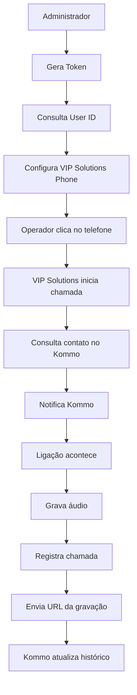

---

## Descrição das Etapas

### 1. Configuração inicial

O administrador realiza a preparação da integração:

- Geração do Token de acesso.
- Obtenção do User ID dos operadores.
- Cadastro das informações no VIP Solutions Phone.

---

### 2. Originação da chamada

O operador inicia uma ligação diretamente pelo Kommo CRM.

A solicitação é enviada para a plataforma VIP Solutions, que realiza a origem da chamada utilizando o ramal configurado.

---

### 3. Identificação do contato

A VIP Solutions consulta o Kommo utilizando o número telefônico para localizar o contato correspondente.

---

### 4. Registro dos eventos

Durante o processo da chamada, a VIP Solutions comunica o Kommo CRM sobre os eventos relacionados à ligação.

---

### 5. Finalização e gravação

Após o encerramento:

- A chamada é processada.
- O áudio é armazenado.
- A ligação é registrada através da API.
- A URL da gravação é enviada ao CRM.

---

### 6. Atualização do histórico

O Kommo CRM atualiza o histórico do cliente contendo:

- Registro da chamada.
- Usuário responsável.
- Dados operacionais.
- Link da gravação.

---

# 15. Características Técnicas

| Característica | Valor |
|---|---|
| Arquitetura | REST API |
| Comunicação | HTTPS |
| Autenticação | Bearer Token |
| Formato de dados | JSON |
| Registro de chamadas | API v4 |
| Consulta de usuários | API v4 |
| Consulta de contatos | API v2 |
| Eventos de telefonia | API v2 |
| Registro da gravação | URL disponibilizada pela VIP Solutions |
| Tipo de integração | API Cliente |
| Comunicação | Síncrona |

---

# 16. Considerações de Segurança

A integração utiliza um Token de acesso para autenticação das chamadas realizadas contra a API do Kommo CRM.

Para garantir a segurança da comunicação, recomenda-se:

- Armazenar o Token de acesso em local seguro.
- Evitar compartilhamento do Token entre usuários.
- Restringir o acesso às configurações da integração.
- Realizar renovação periódica do Token conforme política interna de segurança.
- Gerar um novo Token imediatamente em caso de suspeita de comprometimento.

O Token possui permissões associadas ao ambiente Kommo e deve ser tratado como uma credencial de acesso à API.

---

# 17. Conclusão

A integração entre o **Kommo CRM** e o **VIP Solutions Phone** permite centralizar a operação de telefonia dentro do ambiente CRM.

Através dessa integração, os usuários conseguem:

- Realizar chamadas diretamente pelo Kommo CRM utilizando o recurso **Click to Call**.
- Identificar automaticamente contatos relacionados ao número telefônico.
- Registrar chamadas realizadas.
- Associar ligações aos operadores responsáveis.
- Disponibilizar gravações dentro do histórico do cliente.

Toda a comunicação é realizada através da API oficial do Kommo CRM utilizando autenticação por **Bearer Token**, seguindo uma arquitetura baseada em serviços REST.

Esse modelo garante uma integração padronizada, segura e escalável entre a plataforma de telefonia VIP Solutions e o ambiente comercial do Kommo CRM.