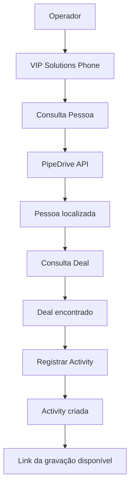
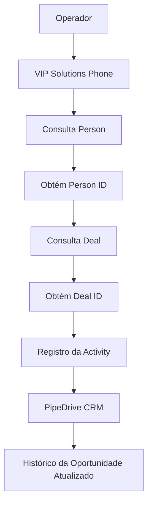
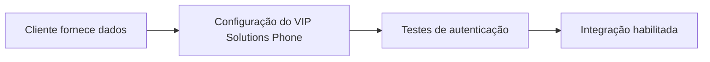
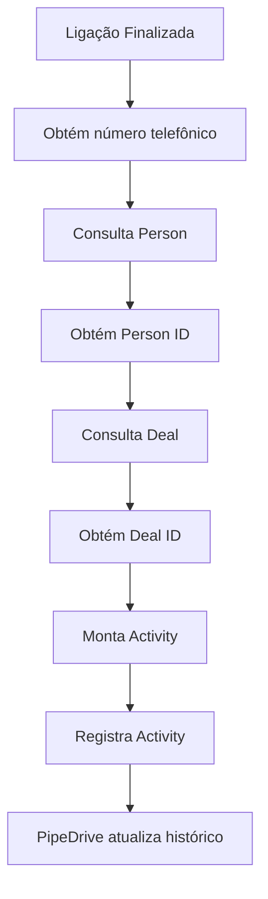
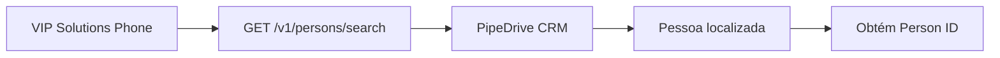
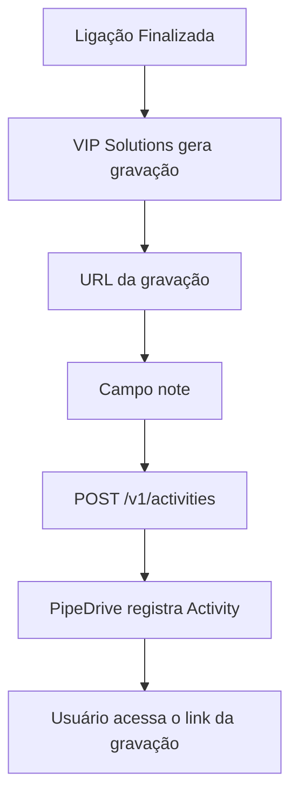
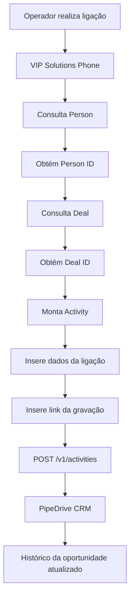

# Manual Técnico de Integração - PipeDrive CRM × VIP Solutions

# 1. Objetivo

Este documento descreve o funcionamento da integração entre o **PipeDrive CRM** e a plataforma **VIP Solutions Phone**, detalhando a arquitetura da comunicação, os endpoints utilizados, o processo de autenticação, o fluxo operacional e o registro automático das ligações realizadas pelos operadores.

A integração permite que todas as chamadas realizadas através do VIP Solutions Phone sejam registradas automaticamente como **Atividades (Activities)** dentro do PipeDrive, associadas à oportunidade (**Deal**) correspondente ao cliente.

Além do registro da ligação, a integração também disponibiliza o link da gravação da chamada diretamente na atividade criada.

---

# 2. Visão Geral da Integração

A integração é baseada exclusivamente na **API REST** disponibilizada pelo PipeDrive.

Diferentemente de outros CRMs que possuem recursos específicos para gerenciamento de chamadas telefônicas, o PipeDrive registra as interações telefônicas utilizando o módulo de **Activities**.

Para que uma ligação seja registrada corretamente, a VIP Solutions precisa identificar previamente a oportunidade (Deal) relacionada ao cliente.

Para isso, a plataforma executa uma sequência de consultas antes do registro da chamada.

---

# 2.1 Fluxo Resumido

A integração segue o seguinte processo:

1. Localizar a pessoa através do número telefônico.
2. Identificar a oportunidade (Deal) vinculada à pessoa.
3. Registrar a ligação como uma Activity.

---

# 2.2 Arquitetura da Integração



---

# 2.3 Funcionamento Geral

A plataforma VIP Solutions atua como cliente da API REST do PipeDrive, realizando consultas e registros diretamente no CRM.

O processo é composto pelas seguintes etapas:

1. Recebimento das informações da chamada.
2. Consulta da pessoa utilizando o número telefônico.
3. Identificação da oportunidade vinculada ao contato.
4. Registro da chamada como uma Activity.
5. Inclusão do link da gravação na atividade criada.

Todo o processamento é realizado automaticamente, sem necessidade de intervenção do operador.

---

# 2.4 Componentes da Integração

| Componente | Responsabilidade |
|---|---|
| VIP Solutions Phone | Processamento das chamadas e comunicação com o CRM |
| API REST PipeDrive | Consulta de pessoas, oportunidades e criação de atividades |
| Pessoa (Person) | Contato localizado pelo número telefônico |
| Deal | Oportunidade comercial vinculada ao contato |
| Activity | Registro da ligação no CRM |
| Gravação | Link disponibilizado na atividade criada |

---

# 2.5 Características da Integração

| Característica | Valor |
|---|---|
| Modelo de integração | API REST |
| Comunicação | HTTPS |
| Formato de dados | JSON |
| Registro das chamadas | Activities |
| Associação da ligação | Deal |
| Pesquisa inicial | Pessoa por telefone |
| Autenticação | API Token |
| Tipo de comunicação | Cliente API |

---

A utilização da API REST permite que todas as ligações realizadas através da plataforma VIP Solutions sejam registradas automaticamente no PipeDrive, mantendo o histórico comercial atualizado e vinculado às oportunidades corretas.

# 3. Arquitetura da Integração

A integração entre o **VIP Solutions Phone** e o **PipeDrive CRM** é baseada em uma sequência de consultas à API REST do PipeDrive para localizar os registros necessários antes da criação da atividade referente à ligação.

Como o PipeDrive registra chamadas utilizando o módulo de **Activities**, a plataforma precisa identificar primeiro a pessoa (**Person**) e, em seguida, a oportunidade (**Deal**) relacionada ao contato.

Somente após essas etapas a Activity é criada.



---

# 3.1 Fluxo Operacional

O processo de integração ocorre conforme as etapas abaixo:

1. O operador realiza ou recebe uma ligação através do VIP Solutions Phone.

2. A plataforma consulta a API do PipeDrive utilizando o número telefônico da chamada.

3. O PipeDrive retorna o **Person ID** correspondente ao contato localizado.

4. Utilizando o **Person ID**, a VIP Solutions consulta as oportunidades (**Deals**) vinculadas ao contato.

5. Após identificar o **Deal ID**, a plataforma registra a ligação como uma **Activity**.

6. A Activity é vinculada automaticamente à oportunidade correspondente.

7. O histórico da oportunidade passa a exibir a nova interação telefônica juntamente com o link da gravação.

---

# 3.2 Componentes Envolvidos

| Componente | Responsabilidade |
|---|---|
| Operador | Realiza ou recebe a ligação |
| VIP Solutions Phone | Processa a chamada e consome a API do PipeDrive |
| API REST PipeDrive | Consulta pessoas, oportunidades e registra atividades |
| Person | Identificação do contato através do telefone |
| Deal | Oportunidade vinculada ao contato |
| Activity | Registro da chamada no histórico comercial |

---

# 4. Pré-requisitos

Antes da configuração da integração, é necessário obter junto ao cliente as informações necessárias para autenticação e comunicação com o PipeDrive.

Esses dados serão utilizados durante a configuração do **VIP Solutions Phone**.

| Informação | Descrição |
|---|---|
| URL do PipeDrive | Endereço da instância do cliente (Ex.: `https://empresa.pipedrive.com`) |
| API Token | Token pessoal utilizado para autenticação na API |
| Código da Empresa VIP | Identificador interno da empresa na plataforma VIP Solutions |
| Ramal | Número do ramal telefônico do operador |

---

# 4.1 Finalidade das Informações

## URL do PipeDrive

Identifica a instância do PipeDrive que será utilizada pela integração.

Exemplo:

```
https://empresa.pipedrive.com
```

Essa URL é utilizada como base para todas as chamadas da API REST.

---

## API Token

Token utilizado para autenticar todas as requisições realizadas pela VIP Solutions.

Esse token deve possuir permissões suficientes para:

- Consultar pessoas.
- Consultar oportunidades.
- Criar Activities.

---

## Código da Empresa VIP

Identificador interno utilizado pela plataforma VIP Solutions para associar a configuração ao ambiente correto do cliente.

---

## Ramal

Número do ramal utilizado pelo operador para realização e recebimento das chamadas.

Esse ramal será associado aos registros criados no CRM.

---

# 4.2 Fluxo de Configuração



---

Após a configuração dos parâmetros, a plataforma VIP Solutions estará apta a consultar informações no PipeDrive e registrar automaticamente as ligações realizadas pelos operadores.

# 5. Obtenção do API Token

A autenticação da integração entre o **PipeDrive CRM** e o **VIP Solutions Phone** é realizada através de um **Personal API Token**.

Esse token é utilizado em todas as requisições enviadas para a API REST do PipeDrive e identifica o usuário responsável pelas operações realizadas pela integração.

---

# 5.1 Passo a Passo

## Passo 1

Acesse o ambiente do **PipeDrive CRM** utilizando uma conta com permissão para acessar as configurações pessoais.

---

## Passo 2

No menu do sistema, navegue até:

```text
Configurações → Preferências Pessoais → API
```

---

## Passo 3

Localize o campo referente ao **Personal API Token**.

Copie o valor apresentado e armazene-o em local seguro.

Esse token será utilizado durante a configuração do **VIP Solutions Phone**.

---

# 5.2 Finalidade do API Token

O Personal API Token é responsável por autenticar todas as chamadas realizadas pela integração.

Ele identifica:

- A conta do PipeDrive.
- O usuário proprietário das atividades criadas.
- As permissões disponíveis para acesso à API.

Todas as Activities registradas pela integração serão atribuídas ao usuário associado ao token utilizado.

---

# 5.3 Recomendações de Segurança

Para garantir a segurança da integração, recomenda-se:

- Armazenar o token em local seguro.
- Não compartilhar o token com outros usuários.
- Revogar e gerar um novo token em caso de suspeita de comprometimento.
- Utilizar um usuário específico para integrações, quando aplicável.

---

# 6. Fluxo Geral da Integração

Após o encerramento de uma ligação, a plataforma **VIP Solutions Phone** executa automaticamente uma sequência de consultas na API do PipeDrive até registrar a chamada como uma **Activity**.

O objetivo é localizar o contato e a oportunidade correta antes da criação do registro da ligação.

---

# 6.1 Fluxo Operacional



---

# 6.2 Descrição das Etapas

## 1. Ligação Finalizada

Após o encerramento da chamada, a plataforma inicia automaticamente o processo de sincronização com o PipeDrive.

---

## 2. Identificação do Número Telefônico

O número utilizado na ligação é extraído para servir como chave de pesquisa no CRM.

---

## 3. Consulta da Pessoa (Person)

A API do PipeDrive é consultada para localizar o contato correspondente ao número telefônico.

Como resultado, é obtido o identificador único do contato (**Person ID**).

---

## 4. Consulta da Oportunidade (Deal)

Utilizando o **Person ID**, a plataforma consulta as oportunidades vinculadas ao contato.

O resultado dessa etapa é o **Deal ID**, utilizado para associar corretamente a Activity.

---

## 5. Montagem da Activity

Com todas as informações obtidas, a VIP Solutions monta o payload contendo os dados da ligação, incluindo:

- Identificação do contato.
- Oportunidade vinculada.
- Data e horário da chamada.
- Duração.
- Status.
- Link da gravação.

---

## 6. Registro da Activity

O payload é enviado para a API REST do PipeDrive, que cria automaticamente uma nova Activity vinculada ao Deal correspondente.

---

## 7. Atualização do Histórico

Após o processamento da requisição, o histórico da oportunidade é atualizado, permitindo que os usuários visualizem:

- Registro da ligação.
- Informações da chamada.
- Link para acesso à gravação.

---

# 6.3 Resultado Final

Ao término do processo, toda a interação telefônica fica registrada automaticamente no PipeDrive, mantendo o histórico comercial atualizado e vinculado à oportunidade correta, sem necessidade de intervenção manual do operador.

# 7. Consulta da Pessoa (Person)

Antes de registrar uma ligação no PipeDrive, a plataforma VIP Solutions precisa identificar qual contato está relacionado ao número telefônico envolvido na chamada.

Essa identificação é realizada através da pesquisa de pessoas (**Persons**) utilizando o número de telefone.

---

# 7.1 Objetivo

Localizar a pessoa cadastrada no PipeDrive correspondente ao número telefônico utilizado na ligação.

O resultado dessa consulta fornece o **Person ID**, que será utilizado nas etapas seguintes da integração.

---

# 7.2 Endpoint

**Método HTTP:**

```text
GET
```

**Endpoint:**

```text
/v1/persons/search
```

**Exemplo de URL:**

```text
https://empresa.pipedrive.com/v1/persons/search
```

---

# 7.3 Parâmetros

| Campo | Descrição |
|---|---|
| api_token | Token utilizado para autenticação na API |
| term | Número telefônico utilizado na pesquisa |
| fields | Campo onde será realizada a busca (`phone`) |

---

## Exemplo de Requisição

```http
GET /v1/persons/search
    ?api_token=TOKEN
    &term=11938065710
    &fields=phone
```

---

# 7.4 Resultado Esperado

A API retorna os dados da pessoa cadastrada que possui o número telefônico informado.

Entre as informações retornadas está o identificador único da pessoa:

```
Person ID
```

Exemplo:

```text
Person ID = 5719
```

Esse identificador será utilizado para localizar as oportunidades (Deals) vinculadas ao contato.

---

# 7.5 Fluxo da Consulta



---

# 8. Consulta da Oportunidade (Deal)

Após localizar a pessoa correspondente ao número telefônico, a plataforma consulta as oportunidades comerciais vinculadas a esse contato.

Essa etapa permite identificar em qual **Deal** a ligação deverá ser registrada.

---

# 8.1 Objetivo

Localizar a oportunidade (Deal) associada ao **Person ID** obtido na etapa anterior.

O resultado da consulta fornece o **Deal ID**, utilizado durante a criação da Activity.

---

# 8.2 Endpoint

**Método HTTP:**

```text
GET
```

**Endpoint:**

```text
/v1/persons/{person_id}/deals
```

---

## Exemplo

```http
GET /v1/persons/5719/deals
```

---

# 8.3 Parâmetros

| Campo | Descrição |
|---|---|
| api_token | Token utilizado para autenticação |
| status | Filtro aplicado às oportunidades |

---

## Valores mais utilizados para `status`

| Valor | Descrição |
|---|---|
| open | Retorna apenas oportunidades abertas |
| all_not_deleted | Retorna todas as oportunidades não excluídas |

Nesta integração é utilizado o filtro:

```text
status=all_not_deleted
```

Esse parâmetro garante que todas as oportunidades válidas do contato possam ser consultadas.

---

## Exemplo de Requisição

```http
GET /v1/persons/5719/deals
    ?api_token=TOKEN
    &status=all_not_deleted
```

---

# 8.4 Resultado Esperado

A API retorna todas as oportunidades vinculadas ao contato localizado.

Entre os dados retornados está o identificador único da oportunidade:

```
Deal ID
```

Exemplo:

```text
Deal ID = 5914
```

Esse identificador será utilizado na criação da Activity para garantir que a ligação fique registrada na oportunidade correta.

---

# 8.5 Fluxo da Consulta

```mermaid
flowchart LR

A[Person ID] --> B[GET /v1/persons/{person_id}/deals]

B --> C[PipeDrive CRM]

C --> D[Lista de Deals]

D --> E[Seleciona Deal ID]
```

---

Ao final dessa etapa, a VIP Solutions possui todas as informações necessárias para registrar automaticamente a ligação como uma Activity vinculada à oportunidade correta dentro do PipeDrive CRM.

# 9. Registro da Ligação

Após identificar a pessoa (**Person**) e a oportunidade (**Deal**) correspondente, a VIP Solutions registra automaticamente a ligação no PipeDrive como uma **Activity**.

Essa Activity passa a fazer parte do histórico da oportunidade, permitindo que os usuários consultem posteriormente todas as informações relacionadas à chamada.

---

# 9.1 Objetivo

Registrar automaticamente a ligação no histórico da oportunidade (**Deal**) correspondente.

O registro contém informações operacionais da chamada e o link para acesso à gravação disponibilizada pela VIP Solutions.

---

# 9.2 Endpoint

**Método HTTP:**

```text
POST
```

**Endpoint:**

```text
/v1/activities
```

**Exemplo de URL:**

```text
https://empresa.pipedrive.com/v1/activities
```

---

# 9.3 Formato da Requisição

Diferentemente de outras APIs que utilizam JSON como padrão, a criação da Activity no PipeDrive é realizada utilizando o formato:

```text
Content-Type:
application/x-www-form-urlencoded
```

Todos os parâmetros são enviados como pares **chave=valor** no corpo da requisição.

---

# 9.4 Campos Utilizados

## due_date

**Descrição:**

Data em que a ligação foi realizada.

Exemplo:

```text
2026-07-15
```

---

## due_time

**Descrição:**

Horário da ligação.

Exemplo:

```text
14:32
```

---

## duration

**Descrição:**

Tempo total da chamada.

O valor normalmente é informado no formato esperado pela API do PipeDrive.

Exemplo:

```text
00:03:15
```

---

## deal_id

**Descrição:**

Identificador da oportunidade obtido durante a etapa de consulta dos Deals.

Exemplo:

```text
5914
```

Este campo é responsável por vincular a Activity ao negócio correto dentro do CRM.

---

## type

**Descrição:**

Tipo da atividade registrada.

Valor utilizado pela integração:

```text
Call
```

Esse valor identifica a Activity como uma ligação telefônica.

---

## done

**Descrição:**

Indica se a atividade já foi concluída.

Valor utilizado:

```text
1
```

Onde:

| Valor | Significado |
|---|---|
| 1 | Atividade concluída |
| 0 | Atividade pendente |

Como o registro ocorre após o encerramento da chamada, a integração envia sempre a Activity como concluída.

---

## subject

**Descrição:**

Título apresentado na Activity dentro do PipeDrive.

Exemplo:

```text
Ligou
```

Esse texto será exibido na lista de atividades da oportunidade.

---

## note

**Descrição:**

Campo destinado às observações da ligação.

A integração envia informações adicionais utilizando **HTML simples**, permitindo melhor formatação na visualização da Activity.

Exemplo:

```html
<p>Destino: 11938065710</p>

<p>
Endereço da Gravação:
https://callcenter.vipsolutions.com.br/services/record/20231020_122249_2958_103_11938065710_1697815364
</p>
```

O conteúdo HTML é interpretado e renderizado automaticamente pelo PipeDrive.

---

# 9.5 Fluxo do Registro


---

# 9.6 Informações Registradas

Ao final do processo, a Activity criada no PipeDrive contém informações como:

- Data da ligação.
- Horário.
- Duração.
- Oportunidade vinculada.
- Tipo da atividade.
- Status de conclusão.
- Observações da chamada.
- Link para acesso à gravação.

---

# 9.7 Associação da Gravação

A gravação **não é enviada como arquivo** para o PipeDrive.

A integração registra apenas a URL disponibilizada pela VIP Solutions dentro do campo **note**.

Quando o usuário acessa a Activity, o endereço da gravação fica disponível para consulta, permitindo abrir ou copiar o link conforme necessário.

Esse modelo simplifica a integração, reduz o volume de dados trafegados e mantém a gravação armazenada na infraestrutura da VIP Solutions.

# 10. Registro da Gravação

A integração entre o **PipeDrive CRM** e o **VIP Solutions Phone** utiliza um modelo baseado em referência para disponibilização das gravações.

Diferentemente de outras integrações, o arquivo de áudio **não é enviado** para o PipeDrive.

A Activity criada no CRM contém apenas uma URL pública apontando para a gravação hospedada na infraestrutura da VIP Solutions.

---

# 10.1 Fluxo da Gravação



---

# 10.2 Funcionamento

Após o encerramento da ligação:

1. A plataforma VIP Solutions gera a gravação da chamada.
2. É criada uma URL pública para acesso ao arquivo de áudio.
3. Essa URL é inserida no campo **note** da Activity.
4. A Activity é registrada no PipeDrive.
5. O usuário pode acessar o link diretamente pelo histórico da oportunidade.

---

# 10.3 Diferença em Relação a Outras Integrações

Nesta integração, o PipeDrive **não realiza o download automático da gravação**.

O CRM apenas armazena a referência para o arquivo.

A responsabilidade pelo armazenamento e disponibilidade da gravação permanece com a plataforma VIP Solutions.

---

# 10.4 Benefícios da Abordagem

Esse modelo apresenta algumas vantagens:

- Redução do volume de dados enviados à API.
- Menor tempo de processamento das requisições.
- Armazenamento centralizado das gravações.
- Simplicidade na integração com o CRM.

---

# 11. Fluxo Completo da Integração

O fluxo completo da integração pode ser representado da seguinte forma:



---

# 11.1 Descrição das Etapas

## 1. Realização da Ligação

O operador realiza ou recebe uma chamada utilizando o VIP Solutions Phone.

---

## 2. Identificação do Contato

A plataforma consulta a API do PipeDrive utilizando o número telefônico para localizar a pessoa correspondente.

---

## 3. Localização da Oportunidade

Após identificar o contato, é realizada a consulta das oportunidades vinculadas para obtenção do **Deal ID**.

---

## 4. Montagem da Activity

Com todas as informações necessárias disponíveis, a VIP Solutions monta os dados da Activity contendo:

- Data da ligação.
- Horário.
- Duração.
- Oportunidade.
- Tipo da atividade.
- Observações.
- Link da gravação.

---

## 5. Registro no PipeDrive

A Activity é enviada para a API do PipeDrive e vinculada ao **Deal** correspondente.

---

## 6. Atualização do Histórico

Ao final do processo, a oportunidade passa a exibir automaticamente o registro completo da ligação.

---

# 12. Características Técnicas

| Característica | Valor |
|---|---|
| Arquitetura | REST API |
| Comunicação | HTTPS |
| Autenticação | API Token |
| Formato da Activity | `application/x-www-form-urlencoded` |
| Consulta de Pessoas | API v1 |
| Consulta de Oportunidades | API v1 |
| Registro de Atividades | API v1 |
| Registro da gravação | Link HTML na Activity |
| Associação da ligação | Deal ID |
| Identificação do cliente | Person ID |

---

# 12.1 Resumo Técnico

A integração utiliza exclusivamente a API REST do PipeDrive para localizar contatos, identificar oportunidades e registrar automaticamente as ligações como Activities.

O relacionamento entre os registros ocorre através dos identificadores retornados pelas consultas (`Person ID` e `Deal ID`), enquanto a gravação permanece hospedada na infraestrutura da VIP Solutions, sendo disponibilizada ao usuário por meio de um link inserido na Activity.

Essa abordagem mantém o histórico comercial atualizado sem a necessidade de armazenamento do arquivo de áudio pelo PipeDrive, reduzindo o volume de dados trafegados e simplificando a integração entre os sistemas.

# 13. Considerações de Segurança

A integração utiliza um **API Token** para autenticação das chamadas realizadas à API REST do PipeDrive.

Como essa credencial concede acesso aos recursos do CRM em nome de um usuário, recomenda-se adotar boas práticas de segurança durante sua utilização.

---

## Recomendações

- Armazenar o **API Token** em local seguro.
- Utilizar, sempre que possível, um **API Token individual para cada usuário** responsável pela integração.
- Não compartilhar o Token entre diferentes usuários ou ambientes.
- Restringir o acesso às configurações da integração apenas a administradores autorizados.
- Gerar um novo Token imediatamente em caso de suspeita de comprometimento da credencial.
- Atualizar a configuração do **VIP Solutions Phone** sempre que houver substituição do Token.

---

## Segurança da Gravação

As gravações das chamadas permanecem armazenadas na infraestrutura da **VIP Solutions**.

O PipeDrive registra apenas a URL de acesso ao áudio dentro da Activity.

Por esse motivo, recomenda-se que o acesso às gravações siga a política de segurança adotada pela plataforma VIP Solutions, garantindo que apenas usuários autorizados possam visualizar ou reproduzir os arquivos.

---

## Comunicação Segura

Toda a comunicação entre a plataforma VIP Solutions e o PipeDrive ocorre utilizando:

- Protocolo HTTPS.
- API REST oficial do PipeDrive.
- Autenticação por API Token.

Esse modelo protege a confidencialidade e a integridade das informações transmitidas entre os sistemas.

---

# 14. Conclusão

A integração entre o **PipeDrive CRM** e o **VIP Solutions Phone** automatiza o registro das ligações realizadas pelos operadores utilizando exclusivamente a API oficial do PipeDrive.

O processo inicia com a identificação do contato através do número telefônico, seguida da localização da oportunidade (**Deal**) correspondente e da criação de uma **Activity** vinculada ao histórico comercial do cliente.

Além das informações operacionais da chamada, a integração registra o endereço da gravação disponibilizada pela VIP Solutions, permitindo que os usuários acessem o áudio diretamente pela Activity criada.

Essa arquitetura centraliza o histórico de interações telefônicas dentro do PipeDrive, reduz a necessidade de registros manuais e mantém as oportunidades sempre atualizadas com informações relevantes para o acompanhamento comercial.