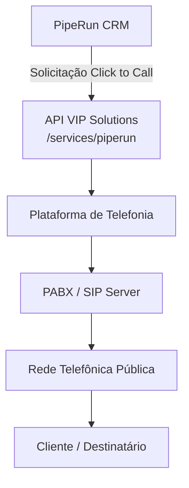
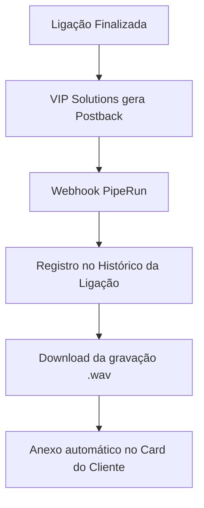
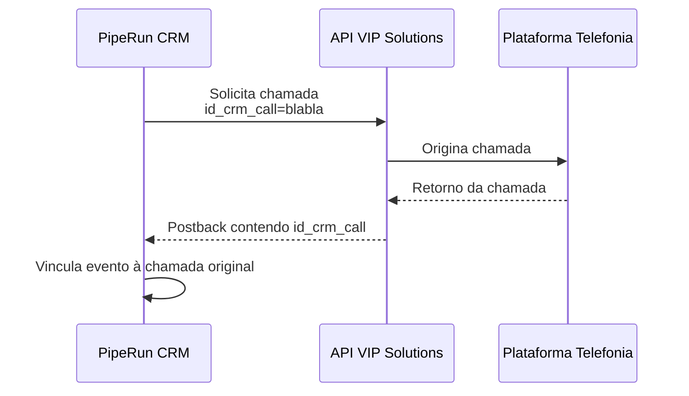
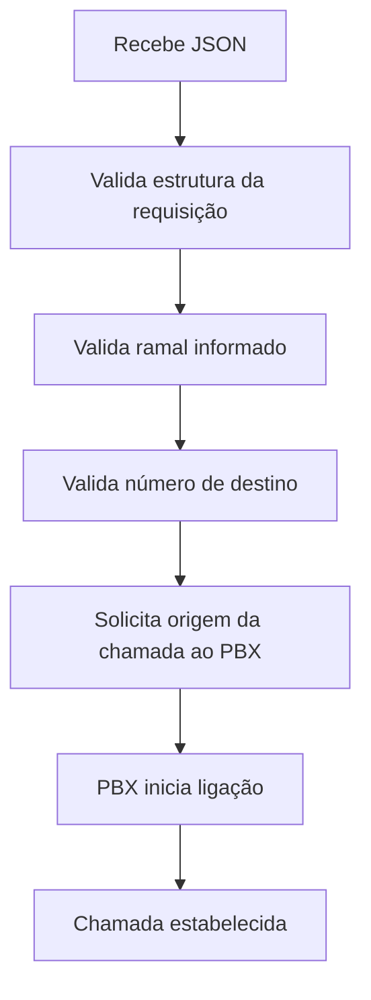
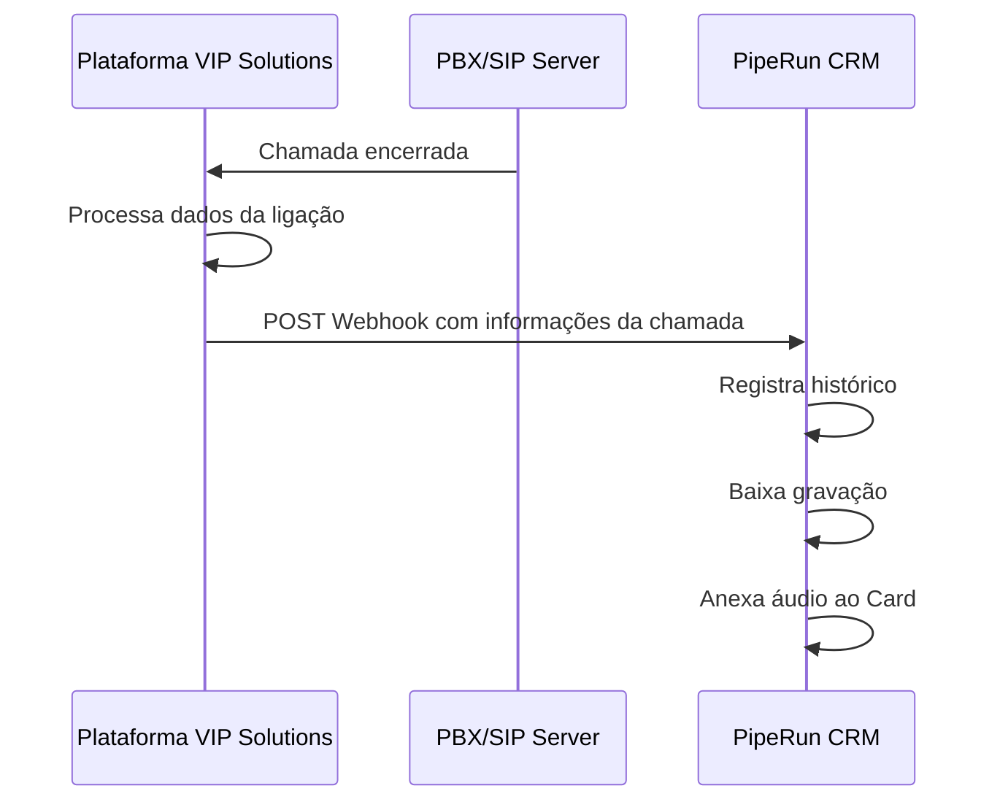
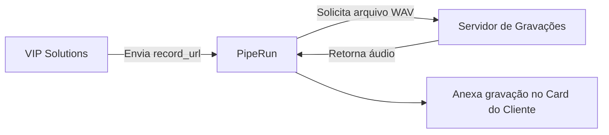
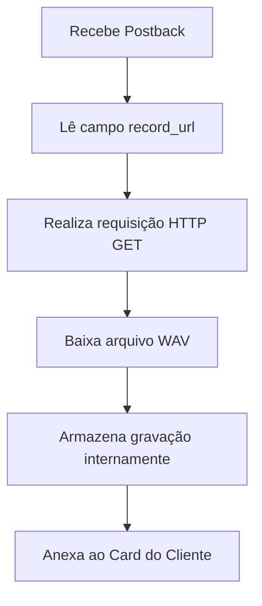

# Integração PipeRun CRM × VIP Solutions (Click to Call e Postback)

# 1. Objetivo

Esta integração tem como finalidade permitir a comunicação entre o CRM PipeRun e a plataforma de telefonia da VIP Solutions.

A comunicação ocorre de forma bidirecional, permitindo:

- O PipeRun solicitar a realização de chamadas através do recurso **Click to Call**.
- A plataforma VIP Solutions informar ao PipeRun os dados da ligação após seu encerramento através de um **Postback**.

Além do registro da chamada no CRM, o PipeRun realiza automaticamente o download do arquivo de áudio da gravação (`.wav`) e realiza o vínculo do arquivo ao card correspondente do cliente.

---

# 2. Arquitetura da Integração

A integração é composta por duas etapas principais:

1. Solicitação da chamada pelo PipeRun.
2. Retorno das informações da chamada pela VIP Solutions após o encerramento.

---

## 2.1 Fluxo de Originação da Chamada (Click to Call)



### Descrição do fluxo

1. O usuário inicia uma chamada através do CRM PipeRun utilizando a funcionalidade **Click to Call**.

2. O PipeRun envia uma requisição para a API da VIP Solutions:

```
/services/piperun
```

3. A VIP Solutions recebe a solicitação e encaminha a chamada para a infraestrutura de telefonia.

4. O PABX/SIP Server realiza a conexão com a rede telefônica pública.

5. A chamada é estabelecida entre o operador e o cliente destinatário.

---

# 2.2 Fluxo de Retorno (Postback)

Após o encerramento da ligação, ocorre o envio das informações da chamada para o CRM.



---

## Descrição do fluxo

1. A chamada é encerrada na plataforma de telefonia.

2. A VIP Solutions processa os dados da ligação e gera um evento de retorno (**Postback**).

3. O Postback é enviado para o Webhook disponibilizado pelo PipeRun.

4. O PipeRun registra automaticamente o histórico da chamada contendo as informações recebidas.

5. O CRM utiliza o link da gravação enviado pela VIP Solutions para realizar o download do arquivo de áudio.

6. O arquivo `.wav` é anexado automaticamente ao card do cliente relacionado à ligação.

---

# 3. Componentes da Integração

| Componente | Responsabilidade |
|---|---|
| PipeRun CRM | Interface utilizada pelo operador para iniciar chamadas e consultar históricos |
| API VIP Solutions | Recebe solicitações Click to Call e integra com a telefonia |
| Plataforma VIP Solutions | Gerenciamento da chamada e geração dos eventos |
| PABX / SIP Server | Controle da comunicação telefônica |
| Webhook PipeRun | Recebe informações da chamada finalizada |
| Gravação `.wav` | Arquivo de áudio anexado ao histórico do cliente |

---

# 4. Resumo da Comunicação

## Sentido 1 - PipeRun → VIP Solutions

Responsável pela criação da chamada.

Fluxo:

```
PipeRun CRM
    ↓
Click to Call
    ↓
API VIP Solutions
    ↓
Telefonia
    ↓
Cliente
```

---

## Sentido 2 - VIP Solutions → PipeRun

Responsável pelo retorno das informações e gravação.

Fluxo:

```
Ligação encerrada
    ↓
VIP Solutions
    ↓
Postback
    ↓
Webhook PipeRun
    ↓
Histórico da ligação
    ↓
Download da gravação
    ↓
Anexo no Card
```

---

# 5. Resultado da Integração

Com a integração concluída, o usuário consegue:

- Realizar chamadas diretamente pelo PipeRun.
- Registrar automaticamente as ligações realizadas.
- Consultar histórico de chamadas dentro do CRM.
- Acessar gravações vinculadas ao cliente.
- Manter todo o histórico de comunicação centralizado no card do cliente.

A integração elimina a necessidade de registros manuais e garante rastreabilidade completa das interações telefônicas.

# 3. Fluxo Geral da Integração

O funcionamento da integração entre PipeRun CRM e VIP Solutions ocorre através de quatro etapas principais:

1. Solicitação da ligação.
2. Processamento da chamada pela plataforma de telefonia.
3. Encerramento e envio do evento de retorno.
4. Processamento das informações pelo PipeRun.

---

# 3.1 Etapa 1 – Solicitação da Ligação (Click to Call)

O processo inicia quando o usuário solicita uma chamada diretamente pelo CRM PipeRun.

Fluxo:

```
Usuário
   ↓
Botão Ligar no PipeRun
   ↓
Requisição HTTP POST
   ↓
API VIP Solutions
```

## Processo executado

1. O usuário acessa o card do cliente dentro do PipeRun.

2. O usuário seleciona a opção:

```
Ligar
```

3. O PipeRun realiza uma requisição HTTP utilizando o método:

```
POST
```

para a API da VIP Solutions.

A requisição contém as informações necessárias para iniciar a chamada, incluindo:

- Ramal responsável pela ligação.
- Número de destino.
- Identificadores do cliente.
- Informações de contexto da chamada.

---

# 3.2 Etapa 2 – Processamento da Ligação

Após receber a solicitação, a plataforma VIP Solutions inicia o processamento da chamada.

Fluxo:

```
API VIP Solutions
        ↓
Validação dos dados
        ↓
Solicitação ao PABX
        ↓
Originação da chamada
        ↓
Cliente atendido
```

## Processos realizados pela VIP Solutions

A plataforma executa as seguintes validações:

- Recebimento da solicitação de chamada.
- Validação do ramal informado.
- Validação do número de destino.
- Verificação das permissões necessárias.
- Solicitação da origem da chamada ao PABX.
- Estabelecimento da conexão telefônica.

Após a validação, o PABX realiza a chamada utilizando a infraestrutura SIP configurada.

---

# 3.3 Etapa 3 – Encerramento da Chamada e Postback

Após o encerramento da ligação, a plataforma VIP Solutions gera automaticamente um evento contendo os dados da chamada.

Fluxo:

```
Ligação encerrada
        ↓
Processamento da chamada
        ↓
Geração do Postback
        ↓
Webhook PipeRun
```

## Informações enviadas no Postback

O evento enviado ao PipeRun contém informações como:

- Data e hora de início da chamada.
- Data e hora de encerramento.
- Duração da ligação.
- Custo da chamada.
- Identificadores da chamada.
- Ramal utilizado.
- Número de destino.
- URL da gravação de áudio.

Essas informações são enviadas automaticamente para o Webhook disponibilizado pelo PipeRun.

---

# 3.4 Etapa 4 – Processamento no PipeRun

Ao receber o Postback enviado pela VIP Solutions, o PipeRun realiza o processamento das informações recebidas.

Fluxo:

```
Webhook PipeRun
        ↓
Processamento do evento
        ↓
Registro da chamada
        ↓
Download da gravação
        ↓
Anexo no Card do Cliente
```

## Processamentos realizados pelo PipeRun

Após receber o evento, o CRM executa automaticamente:

- Registro da ligação no histórico do cliente.
- Atualização das informações da interação.
- Associação da chamada ao card correspondente.
- Download do arquivo de gravação através da URL recebida.
- Anexo automático do áudio no card do cliente.

---

# 3.5 Resultado do Fluxo

Ao final do processo, toda a interação telefônica fica registrada dentro do CRM PipeRun.

O usuário possui acesso a:

- Histórico completo das chamadas.
- Dados de duração e custos.
- Identificação do operador responsável.
- Gravação da ligação vinculada ao cliente.

Essa automação garante rastreabilidade das chamadas e elimina a necessidade de registros manuais após os atendimentos.

# 4. Endpoint - Click To Call

## Objetivo

O endpoint **Click To Call** é responsável por receber uma solicitação do CRM PipeRun para iniciar uma ligação telefônica através da plataforma VIP Solutions.

O fluxo ocorre quando o usuário solicita uma chamada pelo CRM e a integração envia os dados necessários para que a plataforma de telefonia realize a origem da ligação utilizando o ramal configurado.

---

# 4.1 Método HTTP

```
POST
```

---

# 4.2 Endpoint

```
https://callcenter.vipsolutions.com.br/services/piperun
```

---

# 4.3 Payload da Requisição

Exemplo de payload enviado pelo PipeRun:

```json
{
    "exten": 1001915,
    "destination": "1142100101",
    "id_crm_call": "blabla"
}
```

---

# 4.4 Estrutura dos Campos

## exten

**Tipo:**

```
Integer
```

**Descrição:**

Número do ramal responsável por originar a ligação.

Esse campo identifica qual usuário ou dispositivo telefônico deverá realizar a chamada dentro da plataforma VIP Solutions.

**Exemplo:**

```json
{
    "exten": 1001915
}
```

---

## destination

**Tipo:**

```
String
```

**Descrição:**

Número telefônico de destino da chamada.

Esse campo representa o telefone que será chamado pelo ramal informado.

Pode representar:

- Telefone fixo.
- Telefone celular.
- Número nacional.
- Número contendo DDD.

**Exemplo:**

```json
{
    "destination": "1142100101"
}
```

---

## id_crm_call

**Tipo:**

```
String
```

**Descrição:**

Identificador único da chamada gerado pelo CRM.

Esse campo permite que o PipeRun consiga relacionar posteriormente os eventos retornados pela plataforma VIP Solutions com a chamada originalmente solicitada.

Dentro da arquitetura da integração, esse campo funciona como um:

```
Correlation ID
```

---

# 4.5 Funcionamento do Correlation ID

O campo `id_crm_call` é utilizado como referência entre os sistemas.

Fluxo:



Esse mecanismo garante que o histórico recebido posteriormente pelo Postback seja associado corretamente ao registro criado no CRM.

---

# 4.6 Validações Recomendadas

Antes do envio da requisição, o CRM deve garantir:

- O campo `exten` corresponde a um ramal válido.
- O campo `destination` contém um número telefônico válido.
- O campo `id_crm_call` foi gerado corretamente.
- O formato do JSON está conforme o esperado pela API.

Uma inconsistência nesses campos pode impedir a realização da chamada ou comprometer a associação do histórico posteriormente.

# 5. Fluxo Interno do Click To Call

Após o recebimento da requisição enviada pelo PipeRun, a API da VIP Solutions executa uma sequência de validações e procedimentos internos para iniciar a chamada telefônica.

O fluxo simplificado do processamento é:



---

## Etapas do processamento

### 1. Recebimento do JSON

A API recebe a solicitação enviada pelo PipeRun contendo os dados necessários para iniciar a chamada:

- Ramal de origem.
- Número de destino.
- Identificador da chamada no CRM.

---

### 2. Validação da estrutura

A API verifica se a requisição recebida está no formato esperado.

São validados:

- Presença dos campos obrigatórios.
- Formato dos dados.
- Estrutura do JSON recebido.

---

### 3. Validação do ramal

A plataforma verifica se o ramal informado no campo:

```
exten
```

está disponível e autorizado para realizar chamadas.

---

### 4. Validação do número de destino

A API realiza a validação do campo:

```
destination
```

Garantindo que o número informado possui formato compatível com a realização da chamada.

---

### 5. Solicitação ao PBX

Após todas as validações, a plataforma solicita ao PBX/SIP Server a origem da chamada utilizando o ramal configurado.

---

### 6. Início da ligação

O PBX realiza a chamada telefônica para o número de destino informado.

Após o estabelecimento da comunicação, a chamada segue o fluxo normal de telefonia até seu encerramento, quando será gerado o evento de Postback.

---

# 6. Endpoint - Postback

## Objetivo

O endpoint de **Postback** é responsável por notificar automaticamente o PipeRun sobre o resultado de uma ligação realizada através da integração.

Esse endpoint é chamado exclusivamente pela plataforma VIP Solutions após o encerramento da chamada.

O objetivo é enviar ao CRM todas as informações necessárias para:

- Registrar o histórico da ligação.
- Atualizar os dados do atendimento.
- Disponibilizar o link da gravação.
- Permitir o download automático do áudio.

---

# 6.1 Método HTTP

```
POST
```

---

# 6.2 Endpoint

```
https://api.pipe.run/v1/webhooks/webphones/{UUID}
```

---

## Exemplo

```
https://api.pipe.run/v1/webhooks/webphones/b06d13fe-6c81-4af9-8c65-f3633c4da774
```

---

# 6.3 Identificação do Webhook

O parâmetro:

```
{UUID}
```

representa o identificador único do webhook configurado no ambiente do PipeRun.

Esse identificador permite que a plataforma direcione corretamente os eventos recebidos para a integração correspondente.

Cada ambiente ou configuração de integração possui um UUID específico.

---

# 6.4 Funcionamento do Postback

O fluxo ocorre da seguinte forma:



---

# 6.5 Informações Enviadas

O Postback contém os dados necessários para identificação e registro da chamada, incluindo:

- Identificador da chamada.
- Ramal utilizado.
- Número de destino.
- Data e horário.
- Duração.
- Informações de custo.
- URL da gravação.

Essas informações permitem que o PipeRun mantenha o histórico completo da interação telefônica.

# 7. Payload do Postback

Após o encerramento da chamada, a plataforma VIP Solutions envia ao PipeRun um evento contendo as informações da ligação realizada.

Exemplo de payload enviado:

```json
{
   "id": "17561675",
   "start_at": "2025-10-29 10:11:22",
   "end_at": "2025-10-29 10:12:42",
   "status": 200,
   "record_url": "https://callcenter.vipsolutions.com.br/records/arquivo.wav",
   "external_call_id": 17413525182000,
   "duration": "00:00:20",
   "cost": 0.025
}
```

---

# 8. Descrição dos Campos do Postback

## id

**Tipo:**

```
String
```

**Descrição:**

Identificador interno da ligação dentro da plataforma VIP Solutions.

Esse campo representa o registro da chamada no ambiente da VIP Solutions e pode ser utilizado para consultas e rastreamentos internos.

**Exemplo:**

```json
{
   "id": "17561675"
}
```

---

## start_at

**Tipo:**

```
Datetime
```

**Descrição:**

Data e hora de início da ligação.

**Formato:**

```
YYYY-MM-DD HH:mm:ss
```

**Exemplo:**

```json
{
   "start_at": "2025-10-29 10:11:22"
}
```

---

## end_at

**Tipo:**

```
Datetime
```

**Descrição:**

Data e hora de encerramento da ligação.

**Formato:**

```
YYYY-MM-DD HH:mm:ss
```

**Exemplo:**

```json
{
   "end_at": "2025-10-29 10:12:42"
}
```

---

## duration

**Tipo:**

```
String
```

**Descrição:**

Representa o tempo total de duração da chamada.

**Formato:**

```
HH:mm:ss
```

**Exemplo:**

```json
{
   "duration": "00:00:20"
}
```

Esse campo permite que o CRM registre a duração da interação telefônica.

---

## status

**Tipo:**

```
Integer
```

**Descrição:**

Código de resultado da chamada processada pela plataforma VIP Solutions.

Na Collection analisada, o valor identificado foi:

```json
{
   "status": 200
}
```

A documentação disponível não especifica o significado individual de cada código possível.

Entretanto, esse campo representa o status final do processamento da ligação dentro da plataforma.

---

## external_call_id

**Tipo:**

```
Integer
```

**Descrição:**

Identificador técnico da chamada dentro da plataforma de telefonia.

Esse identificador normalmente é utilizado para:

- Rastreamento interno da ligação.
- Auditoria de chamadas.
- Integração com sistemas telefônicos.
- Localização de registros dentro do ambiente SIP/PBX.

**Exemplo:**

```json
{
   "external_call_id": 17413525182000
}
```

---

## cost

**Tipo:**

```
Float
```

**Descrição:**

Valor monetário calculado para a ligação.

**Exemplo:**

```json
{
   "cost": 0.025
}
```

Esse valor representa o custo associado à chamada processada pela plataforma.

---

## record_url

**Tipo:**

```
String
```

**Descrição:**

URL contendo o arquivo de gravação da chamada no formato WAV.

**Exemplo:**

```json
{
   "record_url": "https://callcenter.vipsolutions.com.br/records/arquivo.wav"
}
```

---

# 8.1 Funcionamento da Gravação

O campo `record_url` possui papel fundamental dentro da integração.

A VIP Solutions **não envia diretamente o arquivo de áudio para o PipeRun**.

O processo funciona da seguinte forma:



---

## Processo de Download

1. A VIP Solutions finaliza a chamada.

2. O Postback é enviado ao PipeRun contendo a URL da gravação.

3. O PipeRun utiliza a URL recebida para acessar o arquivo de áudio.

4. O arquivo `.wav` é baixado automaticamente.

5. O áudio é anexado ao histórico do cliente dentro do CRM.

Essa arquitetura reduz o tamanho das mensagens de integração e permite que o armazenamento da gravação permaneça sob responsabilidade da plataforma de telefonia.

# 9. Download da Gravação

Após receber o Postback enviado pela VIP Solutions, o PipeRun inicia automaticamente o processo de obtenção da gravação da chamada.

O fluxo de download ocorre da seguinte forma:



---

## Etapas do Processo

### 1. Recebimento do Postback

O PipeRun recebe o evento enviado pela VIP Solutions contendo os dados da chamada e a URL da gravação.

O campo utilizado para localizar o áudio é:

```
record_url
```

---

### 2. Leitura da URL da Gravação

O CRM extrai o valor informado no campo:

```json
{
   "record_url": "https://callcenter.vipsolutions.com.br/records/arquivo.wav"
}
```

Essa URL será utilizada como origem para obtenção do arquivo de áudio.

---

### 3. Download do Arquivo

O PipeRun realiza uma requisição HTTP utilizando o método:

```
GET
```

para a URL disponibilizada pela VIP Solutions.

O retorno esperado é um arquivo de áudio no formato:

```
.wav
```

---

### 4. Armazenamento Interno

Após realizar o download, o PipeRun armazena a gravação dentro da própria plataforma.

A partir desse momento, o gerenciamento do arquivo passa a ser responsabilidade do CRM.

---

### 5. Anexo no Card do Cliente

Após o armazenamento, o PipeRun vincula automaticamente a gravação ao card correspondente do cliente.

O usuário passa a ter acesso ao histórico completo da interação:

- Registro da chamada.
- Dados da ligação.
- Arquivo de áudio da gravação.

---

# 10. Comportamento Esperado da `record_url`

Para que o processo de importação da gravação funcione corretamente, a URL enviada pela VIP Solutions deve atender alguns requisitos técnicos.

A URL deve:

- Estar acessível utilizando HTTPS.
- Retornar código HTTP de sucesso (`200 OK`).
- Apontar diretamente para um arquivo de áudio no formato WAV.
- Permanecer disponível durante o período necessário para o download realizado pelo PipeRun.

---

## Exemplo de URL válida

```
https://callcenter.vipsolutions.com.br/records/arquivo.wav
```

---

## Validações realizadas

Antes de disponibilizar a integração em produção, recomenda-se validar:

| Validação | Resultado esperado |
|---|---|
| Acesso HTTPS | URL acessível sem erro de certificado |
| Código HTTP | Retorno `200 OK` |
| Tipo do arquivo | Arquivo WAV válido |
| Disponibilidade | Arquivo acessível pelo PipeRun |
| Conteúdo | Áudio correspondente à chamada realizada |

---

## Possíveis Falhas

Caso algum dos requisitos não seja atendido, o PipeRun não conseguirá importar a gravação.

Exemplos:

- URL inexistente.
- Erro HTTP `404`.
- Arquivo removido antes do download.
- Restrição de acesso ao endereço.
- URL apontando para uma página HTML em vez de um arquivo WAV.

Nesse cenário, a ligação poderá ser registrada no CRM, porém sem a gravação anexada ao card do cliente.

---

# 10.1 Responsabilidades na Gestão da Gravação

A divisão de responsabilidades ocorre da seguinte forma:

| Sistema | Responsabilidade |
|---|---|
| VIP Solutions | Disponibilizar uma URL válida contendo o arquivo de áudio |
| PipeRun | Realizar o download e armazenar definitivamente a gravação |

Essa arquitetura permite que cada plataforma mantenha sua responsabilidade dentro do processo de integração, reduzindo acoplamento entre os sistemas.

# 11. Mensagem de Erro Observada

Durante o processamento da gravação pelo PipeRun, pode ser apresentada a seguinte mensagem de erro:

```
O parceiro não forneceu um link válido.
```

Essa mensagem normalmente indica que o PipeRun não conseguiu acessar ou obter corretamente o arquivo informado através do campo:

```
record_url
```

---

# 11.1 Possíveis Causas

As causas mais comuns para esse erro são:

- URL da gravação incorreta.
- Arquivo de áudio inexistente.
- Gravação ainda não disponível no momento da consulta.
- Retorno HTTP diferente de `200 OK`.
- Bloqueio de acesso ao endereço da gravação.
- Timeout durante a tentativa de download.
- Certificado HTTPS inválido.
- Redirecionamentos inesperados.
- Arquivo retornado em formato diferente de WAV.

---

# 11.2 Procedimento de Diagnóstico

Para identificar a causa do problema, recomenda-se validar:

## 1. Acessibilidade da URL

Testar o acesso direto ao endereço informado em:

```
record_url
```

A URL deve abrir ou retornar diretamente o arquivo de áudio.

---

## 2. Código HTTP de Retorno

A resposta esperada deve ser:

```
HTTP 200 OK
```

Retornos como:

```
404 Not Found
403 Forbidden
500 Internal Server Error
```

podem impedir a importação da gravação.

---

## 3. Validação do Arquivo

Confirmar que o conteúdo retornado é realmente um arquivo de áudio:

```
Formato esperado:

.wav
```

---

## 4. Disponibilidade do Arquivo

Verificar se a gravação já foi processada e disponibilizada no servidor de armazenamento antes do envio do Postback.

---

# 12. Características Técnicas

| Característica | Valor |
|---|---|
| Protocolo | HTTPS |
| Comunicação | REST |
| Método HTTP | POST |
| Formato de dados | JSON |
| Arquivo de gravação | WAV |
| Modelo de integração | Webhook |
| Comunicação | Bidirecional |
| Fluxo | Assíncrono |
| Transporte da gravação | URL com download posterior |

---

# 13. Resumo da Integração

A integração entre PipeRun CRM e VIP Solutions implementa um fluxo completo de telefonia **CTI (Computer Telephony Integration)**, permitindo que o CRM interaja diretamente com a plataforma de telefonia.

A arquitetura é composta por duas etapas principais:

---

## 1. Click to Call

O PipeRun solicita à plataforma VIP Solutions que uma chamada seja iniciada.

Fluxo:

```
PipeRun CRM
      ↓
API VIP Solutions
      ↓
Ramal configurado
      ↓
Número de destino
```

Nesta etapa são enviados:

- Ramal responsável pela chamada.
- Número de destino.
- Identificador da chamada no CRM.

---

## 2. Postback

Após o encerramento da chamada, a VIP Solutions envia automaticamente as informações da ligação para o PipeRun.

Fluxo:

```
Ligação encerrada
      ↓
VIP Solutions
      ↓
Webhook PipeRun
      ↓
Registro no CRM
      ↓
Download da gravação
      ↓
Anexo no histórico do cliente
```

O Postback contém:

- Dados da chamada.
- Horários.
- Duração.
- Custo.
- Identificadores técnicos.
- URL da gravação.

---

## Funcionamento da Gravação

A gravação **não é enviada diretamente dentro do payload do Webhook**.

O processo ocorre utilizando referência por URL:

```
VIP Solutions
      ↓
Envia record_url
      ↓
PipeRun realiza HTTP GET
      ↓
Download do arquivo WAV
      ↓
Anexo automático no histórico do cliente
```

Dessa forma, a VIP Solutions permanece responsável por disponibilizar a gravação, enquanto o PipeRun realiza o armazenamento definitivo e disponibiliza o áudio diretamente dentro do CRM.

Essa arquitetura garante rastreabilidade completa das chamadas, integração automática entre os sistemas e centralização do histórico de comunicação do cliente.