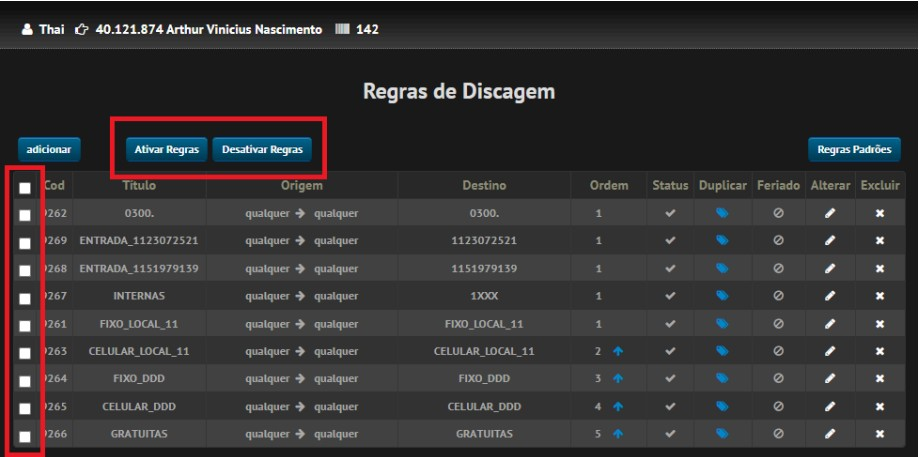
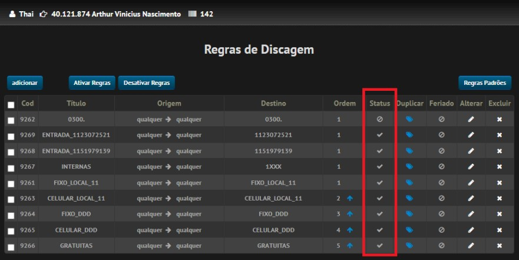

# Bloqueio e desbloqueio de ligações

## Como bloquear ou desbloquear ligações

1. Acesse o VIP e faça login.
2. No menu, acesse **Regras > Regras de Discagem**.
3. Na lista de regras, selecione o quadradinho das ligações que deseja bloquear ou desbloquear.

### Ligações de entrada

Selecione as regras de entrada.

### Ligações de saída

Selecione as regras de saída:

- Fixo local e DDD
- Celular local e DDD
- DDI
- 0300
- Gratuitas

Para **bloquear** as ligações, selecione as regras e clique em **Desativar Regras**.

Para **desbloquear** as ligações, selecione as regras que estão bloqueadas e clique em **Ativar Regras**.

> **Observação:** não é necessário entrar nas regras para ativar ou desativar. Basta selecionar o quadradinho e utilizar o botão correspondente.

## Como conferir o status da regra

No campo **Status**, você consegue identificar a situação da regra:

- **✓ (tique):** regra ativa ou desbloqueada.
- **⊘ (símbolo de bloqueio):** regra desativada ou bloqueada.

