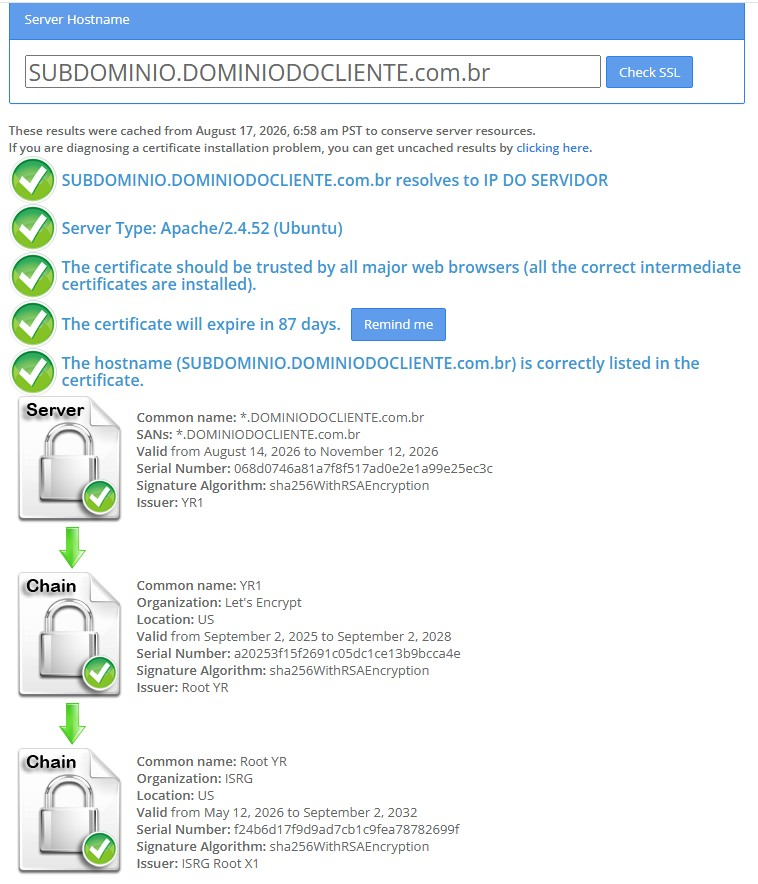

# Certificado SSL Wildcard

Clientes de perfil licenciado têm a possibilidade de acessar o VIP, logar no sistema de filas, utilizar o nosso sistema de WhatsApp (WIP) com endereços no domínio próprio e com sua a própria identidade visual (cores, logo, fav-icon, etc) e registrar ramais, por exemplo:

- `exemplo.vipsolutions.com.br`
- `login-exemplo.vipsolutions.com.br`
- `sip.exemplo.vipsolutions.com.br`

Para isso, o licenciado precisa adquirir um SSL Wildcard (certificado curinga), ele garante a segurança do domínio principal e dos subdomínios apontados para ele, como os exemplos acima.

Orientamos o cliente a adquirir o SSL Wildcard com o provedor GoGetSSL.

## Arquivos necessários

Após a aquisição na GoGetSSL, o cliente deve gerar os arquivos abaixo e nos enviar:

- `arquivocliente.crt`
- `arquivocliente.ca`
- `server.key` (private key)

Ou para certificados gerados na Let`s Encrypt:

- `fullchain.pem`
- `privatekey.pem` (private key)

Esses arquivos devem ser instalados nas pastas:

```bash
/etc/ssl/ssl.key/pastadocliente/server.key ou privatekey.pem
/etc/ssl/ssl.crt/pastadocliente/arquivocliente.crt ou fullchain.pem
/etc/ssl/ssl.crt/pastadocliente/arquivocliente.ca ou fullchain.pem
```

> Obs: é importante manter um backup dos arquivos originais caso algo na instalação dê errado. Assim, é possível manter o acesso no ar até que a configuração seja corrigida.

Se você não conseguir transferir os arquivos diretamente para as pastas acima via SFTP (FileZilla, WinSCP, etc.), transfira-os primeiro para a sua pasta `/home` e depois mova-os para os diretórios corretos pelo terminal do servidor.

## Ajuste do Apache

Agora é necessário ajustar o `ports.conf` dentro do diretório `/etc/apache2/`, apontando os arquivos de certificado () e fixando o domínio do cliente no `ServerAlias` nas portas `443` de https tanto para:

- acesso de admin (`/public`)
- acesso de login de filas (`/vip-agents/public`)

A estrutura do código deve ficar parecido com isso:

```
Certificados gerados na GoGetSSL

<VirtualHost *:443>
        ServerAlias *DOMINIO DO CLIENTE (exemplo: *dominio.com.br)
        DocumentRoot "/var/www/vip/public/"
        <Directory "/var/www/vip/public/">
            Options Indexes FollowSymLinks
            AllowOverride All
            Require all granted
        </Directory>
        XSendFile On
        XSendFilePath /var/www/vip/app/storage

        SSLEngine on
        SSLCertificateKeyFile /etc/ssl/ssl.key/server.key
        SSLCertificateFile /etc/ssl/ssl.crt/arquivocliente.crt
        SSLCertificateChainFile /etc/ssl/ssl.crt/arquivocliente.ca
</VirtualHost>
```

Ou para Let's Encrypt

```
<VirtualHost *:443>
        ServerAlias *DOMINIO DO CLIENTE (exemplo: *dominio.com.br)
        DocumentRoot "/var/www/vip/public/"
        <Directory "/var/www/vip/public/">
            Options Indexes FollowSymLinks
            AllowOverride All
            Require all granted
        </Directory>
        XSendFile On
        XSendFilePath /var/www/vip/app/storage

        SSLEngine on
        SSLCertificateKeyFile /etc/ssl/auto-cert/privkey.pem
        SSLCertificateFile /etc/ssl/auto-cert/fullchain.pem
        SSLCertificateChainFile /etc/ssl/auto-cert/fullchain.pem
</VirtualHost>
```

## Reload do Apache

Após a configuração, faça o reload no serviço do Apache com o comando:

```bash
sudo systemctl reload apache2.service
```

Depois disso, o novo certificado estará instalado e o acesso ao servidor VIP via HTTPS estará válido novamente. Ao acessar um endereço com o domínio do cliente, o navegador exibirá:

- Data de emissão e expiração
- Provedor do certificado gerado

## Verificar integridade do SSL instalado

Utilize esse site para verificar a instalação do SSL do servidor: <a href="https://www.sslshopper.com/ssl-checker.html" target="blank">SSL Checker</a>

Em uma instalação correta, a sequência de verificações deve ficar parecido com isso:



## Referências importantes

- O arquivo `.crt` contém apenas o certificado do domínio.
- O arquivo `.ca` ou `fullchain.pem` valída a autoridade certificadora e garante a conexão criptografada entre servidor e navegador.
- O arquivo `server.key` ou `privatekey.pem` é a chave privada do servidor, nunca deve ser compartilhada, é usada para descriptografar os dados enviados pelo usuário e é mais uma camada na conexão HTTPS.
