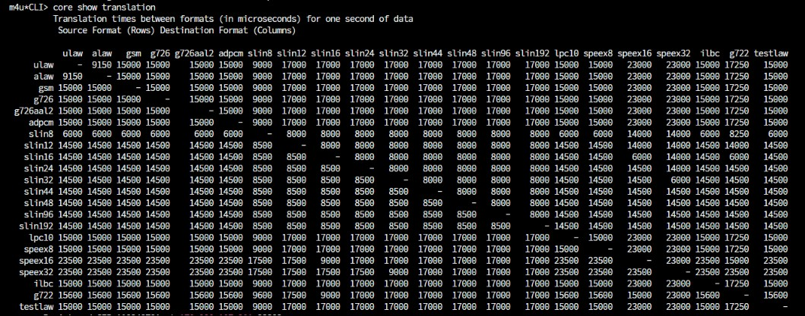
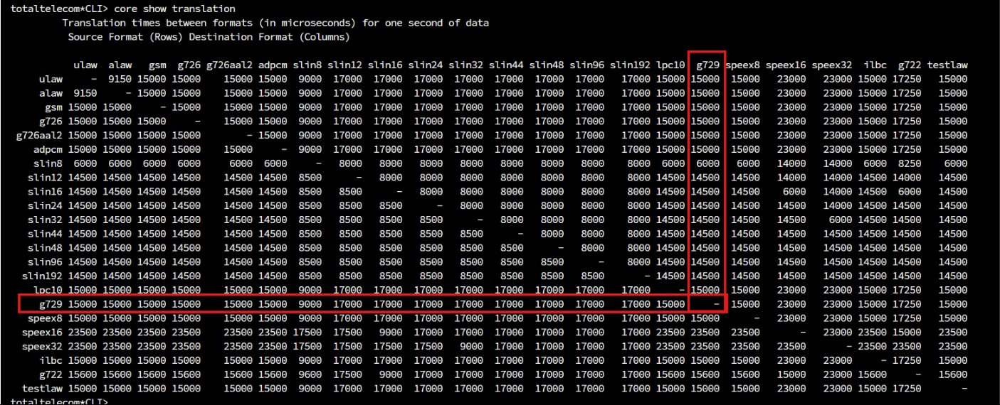

## Objetivo

Instruções de como instalar codecs no Asterisk.

# g729

Os servidores tem o codec g729 listado no VIP nas telas de configuração dos ramais ou troncos, mas pode acontecer do codec não estar instalado no asterisk e as chamadas que tentarem utiliza-lo não completarão corretamente.

# Como identificar os codecs instalados

Acesse o servidor via SSH, depois acesse o asterisk:

```
sudo rasterisk
```

No asterisk, faça o comando abaixo para identificar os codecs instalados:

```
core show translation
```

Nesse exemplo o servidor não tem o codec g729 instalado:



# Como instalar um novo codec

Ainda acessando o servidor via SSH, vá para a pasta `/usr/lib/asterisk/modules/`

```
cd /usr/lib/asterisk/modules/
```

Nessa pasta faça o comando wget a seguir para fazer o download do <a href="/assets/img/suporte/codec_g729.so" > codec g729 </a> daqui da Wiki:

```
sudo wget http://wiki.vipsolutions.com.br/assets/img/suporte/codec_g729.so
```

Com o download feito, o arquivo deve ficar com as permissões 755 usando o comando abaixo:

```
sudo chmod 755 codec_g729.so
```

Após isso, acesse o asterisk e execute o comando abaixo:

```
module load codec_g729.so
```

Após isso, você pode listar os codecs instalados com o comando abaixo:

```
core show translation
```

A imagem abaixo mostra o codec g729 instalado com sucesso:


