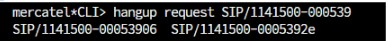

# Comandos Asterisk

## Objetivo

Listar comandos que possam ajudar em diagnósticos ou manutenções no serviço Asterisk.

## Derrubar ligação presa

Existem situaçoes em que o canal de uma ligação fica preso, seja uma ligação entre ramais, ativa ou receptiva, isso pode acontecer quando uma chamada é encerrada abruptamente por oscilações na conexão com a internet, por falha de rede elétrica direto no ramal (tomada, fonte ou falha no próprio aparelho), quedas de energia repentinas, quedas de internet, etc.

Quando isso acontece, o ramal fica com um canal preso e partir daí fica impedido de realizar ou receber novas chamadas.

### Como resolver

No VIP, precisamos acessar a tela de Suporte > Ramais Ativos, nela, selecionar o ramal com a ligação presa > Botão Desligar Chamada, só isso deve funcionar, caso contrário o ramal deve ter 2 ou mais ligações simultâneas liberadas no VIP.

Nesse é necessário acessar o servidor via SSH, e fazer os comandos abaixo:

Para acessar o asterisk:

```
sudo rasterisk > informe a sua senha > ENTER
```

Para localizar o ramal e derrubar o canal preso, o comando é `hangup request SIP/IDEMPRESAERAMAL-IDCANAL`, digite o comando até o `IDEMPRESAERAMAL-` e pressione TAB para mostrar os canais presos, no exemplo abaixo o ramal 1141500 tem 2 canais presos, o `00053906` e o `0005392e` : 



Preencha o comando com o canal inteiro e pressione ENTER, a partir dai o ramal estará livre para receber e efetuar chamadas.

### Observações

Caso o asterisk retorne a mensagem `is not a known channel`, a única forma de resolver é reiniciando o asterisk pós-horário, ação que deve ser realizada pela equipe de servidores VIP.


