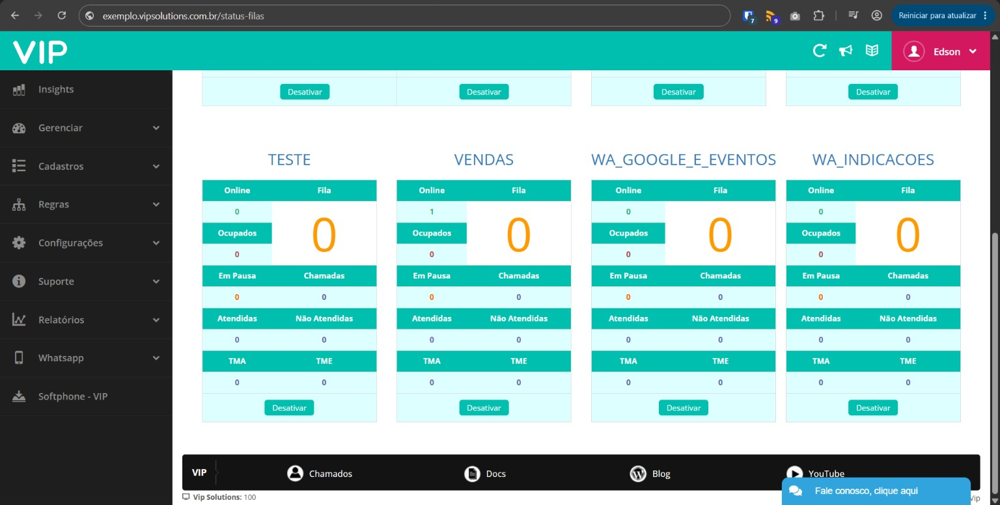
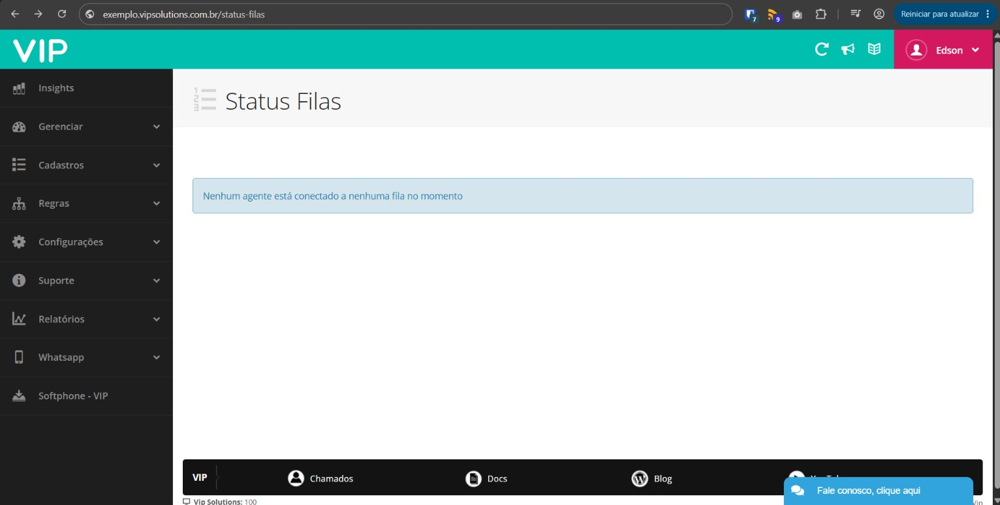

# Excluir filas

Ao excluir uma fila, a mesma permanece no VIP na tela Gerenciar > Gerenciar Filas.



Para remover a fila dessa tela, é necessário removê-la da memória do vip-manager, aplicação responsável pela gestão da tela de controle de ramais, gerenciamento de filas, bloquear e permitir acesso (IP tables do servidor) e da memória do asterisk.

#### Passo-a-passo

Execute o comando abaixo no SSH do servidor onde a fila foi excluída:

```bash
curl "http://localhost:8080/VipManager/DeleteQueue?company=CODIGODAEMPRESA&queue=NOMEDAFILA"
```

Exemplo:

```bash
curl "http://localhost:8080/VipManager/DeleteQueue?company=100&queue=TESTE"
```

Após a execução do comando acima, talvez seja necessário fazer o comando queue show dentro da CLI do asterisk para remove-la da memória do asterisk:

```bash
sudo rasterisk (para entrar no asterisk) > depois o comando queue show > ENTER
```

Após isso, a fila será removida da tela Gerenciar Filas.


