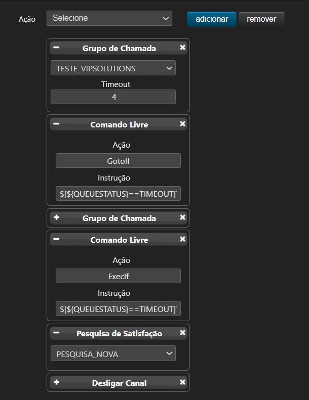

# Grupos de chamada e pesquisa de satisfação

## Visão geral

Este fluxo direciona a ligação entre dois grupos de chamada. Quando um grupo atende e encerra a ligação, o fluxo encaminha o cliente para a pesquisa de satisfação. Caso o primeiro grupo não atenda dentro do tempo limite, a ligação transborda para o segundo grupo.

## Fluxo de atendimento

```text
Grupo de Chamada 1
        |
        | Atendeu e desligou
        v
Pesquisa de Satisfação

        Grupo de Chamada 1 não atendeu (timeout)
        |
        v
Grupo de Chamada 2
        |
        | Atendeu e desligou
        v
Pesquisa de Satisfação

Grupo de Chamada 2 não atendeu (timeout)
        |
        v
      Desliga
```

## Exemplo de configuração de regra



## 1. Grupo de Chamada 1

### Comando livre

```asterisk
GotoIf

$[${QUEUESTATUS}==TIMEOUT]?:$[${PRIORITY}+3]
```

### Comportamento

- Se o grupo atender a ligação e o cliente desligar, o fluxo segue para a **Pesquisa de Satisfação**.
- Se o grupo não atender e ocorrer `TIMEOUT`, a ligação transborda para o **Grupo de Chamada 2**.

## 2. Grupo de Chamada 2

### Comando livre

```asterisk
ExecIf

$[${QUEUESTATUS}==TIMEOUT]?Hangup
```

### Comportamento

- Se o grupo atender a ligação e o cliente desligar, o fluxo segue para a **Pesquisa de Satisfação**.
- Se o grupo não atender dentro do tempo limite, a ligação é encerrada com `Hangup`.

## 3. Pesquisa de satisfação

Após o atendimento por qualquer um dos grupos, a ligação deve ser encaminhada para a **Pesquisa de Satisfação** quando for encerrada pelo ramal que fez o atendimento.

## 4. Desligamento

Se o **Grupo de Chamada 2** não atender a ligação antes do timeout, o fluxo executa o comando `Hangup` e encerra a chamada.
