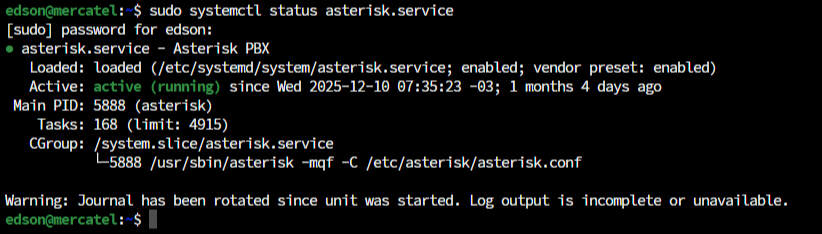
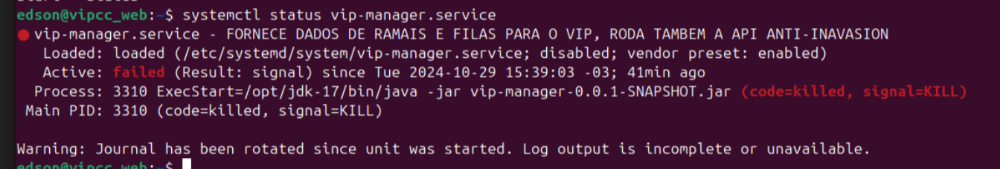

# Verificar status de serviços

Para verificar o status de um serviço no Ubuntu, execute o comando abaixo, substituindo `nomedoserviço` pelo nome do serviço:

```bash
sudo systemctl status nomedoserviço.service
```

Por exemplo:

```bash
sudo systemctl status asterisk.service
```
Ou
```
sudo systemctl status vip-manager.service
```


## Exemplo de serviço ativo e funcionando



## Exemplo de serviço com problema



No caso de um serviço falho, tente iniciá-lo novamente com o comando abaixo, substituindo `nome-do-serviço` pelo nome do serviço:

```bash
sudo systemctl start nome-do-serviço
```

Se o serviço continuar falhando, verifique os logs da aplicação para identificar a origem do problema.
