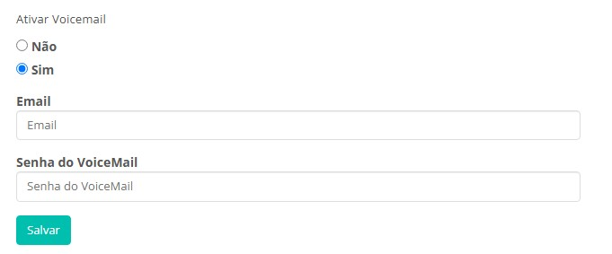
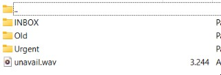
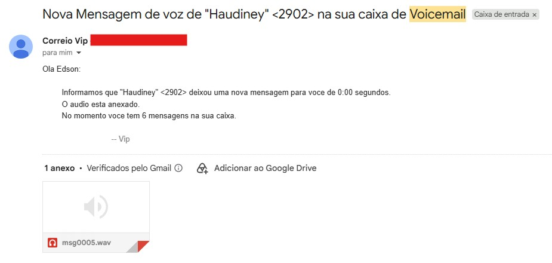

# Voicemail

## Objetivo

É o serviço de caixa postal que atende as chamadas quando o ramal está offline ou ocupado com outra chamada e envia os recados gravados por email.

## Como ativar no VIP

Para ativá-lo, o cliente que possui o login de acesso com o perfil `Usuário (Admin)` precisa ir no menu `Cadastros > Ramais > Botão Configurar` no ramal desejado.

Na tela abaixo é necessário cadastrar um email válido para receber as gravações e uma senha de facilidades (númerica) para ativar o serviço com o comando *30



## Configuração através do ramal

Quando o cliente disca `*30`, o asterisk pede a senha de facilidades cadastrada para o ramal no VIP, após digitar a senha de facilidades o cliente tem acesso ao menu do Voicemail onde terá algumas opções, a que nos interessa é a `opção 0 (Opções de correio de voz)`, depois a opção 1 que permite a gravação de uma mensagem de indisponibilidade (reproduzida quando o ramal está offline ou ocupado), ao discar 1 o canal de gravação será aberto, após gravar a mensagem o cliente precisa discar `quadrado (#)` para encerrar a gravação e depois pode discar: 

```
1 para aceitar a mensagem gravada
2 para ouvir a mensagem gravada
3 para regravar a mensagem
```

## Configurando através de SFTP

Caso o cliente não queira gravar a mensagem utilizando o método acima, ele pode disponibilizar a gravação, a mesma precisa estar em wave (.wav), frequência de 8000Hz, 16-Bit e em mono.

Utilize um client de SFTP de sua escolha (ex: FileZilla, CyberDuck, WinSCP, etc) para acessar o servidor onde o cliente está implantado, transfira a gravação para a sua pasta `/home` onde o seu usuário tem permissão de escrita, acesse o servidor por SSH e copie a gravação para a pasta `/var/spool/asterisk/voicemail/VIP_CODIGOEMPRESA/CODIGOEMPRESAERAMAL`, exemplo:

```bash
/var/spool/asterisk/voicemail/VIP_100/1001937
```

Obs: se a pasta não estiver criada, faça uma chamada para o ramal com o Voicemail ativo e recuse-a, assim a estrutura de pasta será criada.



O gravação precisa estar nomeada como `unavail.wav` para que funcione corretamente.

## Serviço ativo

Com a configuração finalizada, toda mensagem gravada no Voicemail é enviada para o email cadastrado no ramal, como no exemplo abaixo:



## Observações

O Voicemail por padrão aceita 99 mensagens, mas nós temos um script no servidor que faz a limpeza a cada 2 dias para que não ocorram problemas de Voicemail cheio.
