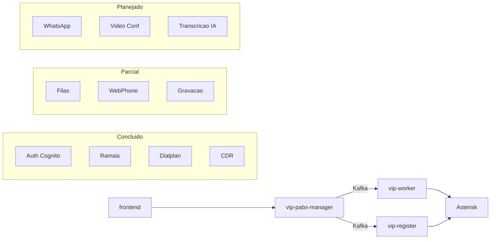

# Roadmap — VIP PABX Platform

Documento de acompanhamento do produto para o workspace multi-serviço (frontend, vip-pabx-manager, vip-register, vip-worker).

---

## Legenda

| Checkbox | Significado |
|----------|-------------|
| `- [x]` | Implementado e utilizável em produção/dev |
| `- [~]` | Parcialmente implementado (gaps conhecidos) |
| `- [ ]` | Planejado / não iniciado |

Serviços: **(manager)** vip-pabx-manager · **(worker)** vip-worker · **(register)** vip-register · **(frontend)** Angular

---

## Índice

1. [Visão geral](#visão-geral)
2. [Infraestrutura e Arquitetura](#infraestrutura-e-arquitetura)
3. [Autenticação e Usuários](#autenticação-e-usuários)
4. [Dashboards](#dashboards)
5. [PABX — Configuração](#pabx--configuração)
6. [Filas de Atendimento](#filas-de-atendimento)
7. [Telefonia em Tempo Real](#telefonia-em-tempo-real)
8. [WebPhone](#webphone)
9. [Relatórios](#relatórios)
10. [Funcionalidades Planejadas](#funcionalidades-planejadas)
11. [Melhorias Técnicas (backlog)](#melhorias-técnicas-backlog)

---

## Visão geral

| Serviço | Porta | Papel |
|---------|-------|-------|
| **frontend** | 4200 | UI web, WebPhone JsSIP, dashboards |
| **vip-pabx-manager** | 8080 | API central, CDR, admin, Cognito, Kafka producer/consumer |
| **vip-register** | 8081 | AMI, geração `pjsip-peers.conf`, anti-invasão |
| **vip-worker** | 8082 | ARI, orquestração de chamadas, filas, URA |

---

## Infraestrutura e Arquitetura

- [x] Arquitetura multi-serviço (4 repositórios)
- [x] Comunicação Kafka entre serviços (manager ↔ worker ↔ register)
- [x] STOMP/WebSocket tempo real (manager → frontend)
- [x] Flyway migrations versionadas (V1–V7) (manager)
- [~] Migrations não versionadas pendentes de consolidação (manager)
- [ ] CRUD de workers no manager (entidade existe; sem controller/service)

---

## Autenticação e Usuários

- [x] Login via AWS Cognito (manager) — `CognitoService.kt`
- [x] JWT para API + Spring Security (manager)
- [x] Guard de rotas + validação de token (frontend) — `auth-guard.ts`
- [x] Esqueci senha / confirmação de senha (manager + frontend)
- [x] Primeira senha (novo usuário) (manager + frontend)
- [x] CRUD de usuários — ADMIN/SUPER (manager + frontend)
- [x] CRUD de empresas — multi-tenancy (manager + frontend)
- [x] Impersonação de empresa — ROLE_SUPER (manager + frontend)
- [x] Perfil do usuário — `/pages/profile` (frontend)
- [x] Registro de ramal para WebPhone — `/users/webphone` (manager + frontend)

---

## Dashboards

- [x] Painel de Ramais — tempo real via STOMP + `/callstates/peerregistries` (frontend + manager)
- [~] Painel de Filas — UI e tempo real OK; métrica `globalTme` hardcoded; botão "ver agentes" sem ação (frontend)
- [ ] Widgets stats / call-overview / temperature — componentes existem, sem rota (frontend)

---

## PABX — Configuração

CRUD completo no manager (REST + Kafka sync) e frontend (rotas em `pabx.routes.ts`).

- [x] Ramais / Peers
- [x] Grupos de Chamada
- [x] Grupos de Captura
- [x] Regras de Discagem — editor com 15 componentes de ação
- [x] Calendários
- [x] Alias de Discagem
- [x] DDR (DIDs)
- [x] Centro de Custo (Account Codes)
- [x] Rotas de Chamada
- [x] Troncos
- [x] Áudios do Sistema / MOH — upload via S3 presigned URL (manager + frontend)
- [x] URA (IVR)
- [x] Definições Gerais da Empresa

---

## Filas de Atendimento

> Filas já são uma feature madura na plataforma. Itens abaixo refletem o estado granular por camada.

### Manager

- [x] CRUD de filas — `QueueController`
- [~] Login / pause / logout de agentes — `QueueStateController`
- [x] Estado em tempo real e dispatch — `QueueStateService`
- [x] Publicação de dispatch via Kafka — `KafkaService.sendQueueDispatch`
- [x] WebSocket `/topic/queuestates/{companyId}`

### Worker

- [x] Ação QUEUE no dialplan — `DialPlanActionEnum.QUEUE`
- [x] Espera com MOH, sessão em cache — `QueueService`, `QueueSessionCache`
- [~] Estratégias de dispatch — ALL, RANDOM, LEAST_RECENTLY, FEWEST_CALLS, EQUALLY
- [x] Eventos — entrada, abandono, atendimento, chamando membro
- [ ] Eventos — transferência, hangup por membro, hangup por caller

### Frontend

- [x] CRUD de filas — `/pabx/queues`
- [x] Detalhe em tempo real — `/pabx/queues/detail/:id`
- [x] Login de agente — `/pages/queue-login`
- [~] Dashboard de filas — `/pages/queues` (métricas incompletas)

---

## Telefonia em Tempo Real

### vip-worker

- [x] Fluxo ARI Stasis (inbound / outbound)
- [x] 12 ações de dialplan — `DialPlanActionEnum`
- [x] Discagem para peer e tronco (rota)
- [x] Grupos de chamada — ALL / SEQUENTIAL / RANDOM
- [x] URA com captura DTMF
- [x] Transferência cega e assistida (`*2` / `*3`)
- [x] Captura de chamada (`*8`)
- [x] Estacionamento de chamada (`*7`)
- [x] Calendário no dialplan
- [x] CDR → Kafka → manager
- [x] Estado de chamadas em tempo real → Kafka
- [x] Hot-reload de config via Kafka (troncos, dialplan, peers, filas, URA, etc.)
- [~] Gravação de chamadas — helpers existem; fluxo end-to-end e conversão MP3→S3 pendentes
- [~] App ARI inbound separado — config existe; startup conecta apenas outbound

### vip-register

- [x] Conexão AMI assíncrona
- [x] Geração dinâmica `pjsip-peers.conf` + `pjsip reload`
- [x] Peers WebRTC/WSS para softphone
- [x] Anti-invasão — bloqueio por IP via iptables
- [x] Monitoramento de estado de peers → Kafka
- [~] Eventos AMI expandidos — grande bloco comentado (filas, bridge, transfer)
- [ ] Escrita bidirecional de troncos no worker (TODO no `StartUp.kt`)

---

## WebPhone

- [x] JsSIP UA sobre WSS (porta 8089) (frontend)
- [x] Controles no topbar e discador na sidebar (frontend)
- [x] Ativação de ramal via diálogo (frontend)
- [x] Transporte WSS/WebRTC nos peers gerados (register)
- [~] Token de autenticação em chamadas outbound — `TOKEN_PLACEHOLDER` em `webphone.service.ts`
- [x] Sem Vídeo na chamada — `video: false` fixo no WebPhone

---

## Relatórios

- [~] Relatório de Chamadas — CDR por período (manager + frontend `/pabx/call-report`)
- [ ] Relatório DAC — item no menu sem rota nem backend
- [ ] Tarifação / billing avançado no CDR

---

## Funcionalidades Planejadas

Itens visíveis no menu (`app.menu.ts`) ou solicitados no roadmap do produto, sem implementação no backend.

### Integração WhatsApp

- [ ] Mensagens
- [ ] Registros / histórico

### Videoconferências

- [ ] Salas de videoconferência
- [ ] Integração com bridge de conferência (Jitsi meet)
- [ ] Integração WebRTC peer to peer (sem servidor)

### Inteligência Artificial

- [ ] Transcrição de gravações por IA (depende de gravação individual de canais)
- [ ] Análise de sentimento em atendimentos
- [ ] Agentes com prompts diferentes e tools

### Outros módulos (menu stub)

- [ ] CRM VIP — Clientes
- [ ] Integrações — hub vip

---

## Melhorias Técnicas (backlog)

- [ ] Consolidar migrations Flyway não versionadas em arquivos `V{n}__*.sql`
- [ ] Completar token de autenticação outbound no WebPhone
- [ ] Expandir eventos AMI no worker e register (código comentado)
- [ ] Tópico WebSocket para canais individuais (além de peer registry)
- [ ] Páginas órfãs de auth — register, lockscreen (componentes sem rota)
- [ ] CRUD de workers no manager (tabela + API)
- [ ] Conectar app ARI inbound no startup do worker
- [ ] Finalizar pipeline de gravação — snoop → MP3 → S3 → CDR

---

*Última revisão: junho de 2026*
